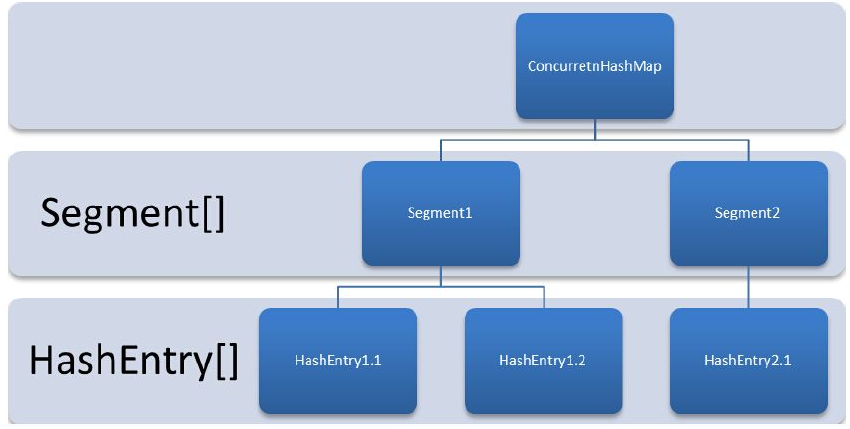
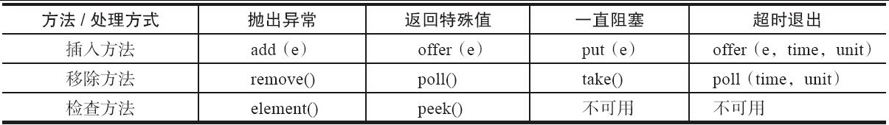
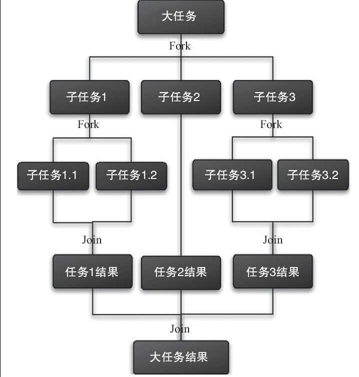
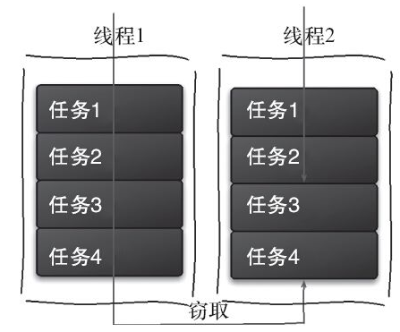

> 本文章仅用于本人学习笔记记录
> 来源《Java并发编程的艺术》
> 微信：A20991212A（如本文档内容侵权了您的权益，请您通过微信联系到我）

## ConcurrentHashMap的实现原理与使用

ConcurrentHashMap是线程安全且高效的HashMap。

### 为什么要使用ConcurrentHashMap

在并发编程中使用HashMap可能导致程序死循环。而使用线程安全的HashTable效率又非常低下，基于以上两个原因，便有了ConcurrentHashMap的登场机会。

#### 线程不安全的HashMap

在多线程环境下，使用HashMap进行put操作会引起死循环，导致CPU利用率接近100%，所以在并发情况下不能使用HashMap。例

HashMap在并发执行put操作时会引起死循环，是因为多线程会导致HashMap的Entry链表形成环形数据结构，一旦形成环形数据结构，Entry的next节点永远不为空，就会产生死循环获取Entry。

#### 效率低下的HashTable

HashTable容器使用synchronized来保证线程安全，但在线程竞争激烈的情况下HashTable的效率非常低下。因为当一个线程访问HashTable的同步方法，其他线程也访问HashTable的同步方法时，会进入阻塞或轮询状态。如线程1使用put进行元素添加，线程2不但不能使用put方法添加元素，也不能使用get方法来获取元素，所以竞争越激烈效率越低。

#### ConcurrentHashMap的锁分段技术可有效提升并发访问率

HashTable容器在竞争激烈的并发环境下表现出效率低下的原因是所有访问HashTable的线程都必须竞争同一把锁，假如容器里有多把锁，每一把锁用于锁容器其中一部分数据，那么当多线程访问容器里不同数据段的数据时，线程间就不会存在锁竞争，从而可以有效提高并发访问效率，这就是ConcurrentHashMap所使用的锁分段技术。首先将数据分成一段一段地存储，然后给每一段数据配一把锁，当一个线程占用锁访问其中一个段数据的时候，其他段的数据也能被其他线程访问。

### ConcurrentHashMap的结构

ConcurrentHashMap是由Segment数组结构和HashEntry数组结构组成。Segment是一种可重入锁（ReentrantLock），在ConcurrentHashMap里扮演锁的角色；HashEntry则用于存储键值对数据。一个ConcurrentHashMap里包含一个Segment数组。Segment的结构和HashMap类似，是一种数组和链表结构。一个Segment里包含一个HashEntry数组，每个HashEntry是一个链表结构的元素，每个Segment守护着一个HashEntry数组里的元素，当对HashEntry数组的数据进行修改时，必须首先获得与它对应的Segment锁，



### ConcurrentHashMap的初始化

ConcurrentHashMap初始化方法是通过initialCapacity、loadFactor和concurrencyLevel等几个参数来初始化segment数组、段偏移量segmentShift、段掩码segmentMask和每个segment里的HashEntry数组来实现的。

1. 初始化segments数组

segments数组的长度ssize是通过concurrencyLevel计算得出的。为了能通过按位与的散列算法来定位segments数组的索引，必须保证segments数组的长度是2的N次方（power-of-two size），所以必须计算出一个大于或等于concurrencyLevel的最小的2的N次方值来作为segments数组的长度。假如concurrencyLevel等于14、15或16，ssize都会等于16，即容器里锁的个数也是16。

2. 初始化segmentShift和segmentMask

3. 初始化每个segment

输入参数initialCapacity是ConcurrentHashMap的初始化容量，loadfactor是每个segment的负载因子，在构造方法里需要通过这两个参数来初始化数组中的每个segment。

### 定位Segment

既然ConcurrentHashMap使用分段锁Segment来保护不同段的数据，那么在插入和获取元素的时候，必须先通过散列算法定位到Segment。可以看到ConcurrentHashMap会首先使用Wang/Jenkins hash的变种算法对元素的hashCode进行一次再散列。

之所以进行再散列，目的是减少散列冲突，使元素能够均匀地分布在不同的Segment上，从而提高容器的存取效率。假如散列的质量差到极点，那么所有的元素都在一个Segment中，不仅存取元素缓慢，分段锁也会失去意义。

### ConcurrentHashMap的操作

#### get操作

Segment的get操作实现非常简单和高效。先经过一次再散列，然后使用这个散列值通过散列运算定位到Segment，再通过散列算法定位到元素，代码如下

```
public V get(Object key) {
    int hash = hash(key.hashCode());
    return segmentFor(hash).get(key, hash);
}
```

get操作的高效之处在于整个get过程不需要加锁，除非读到的值是空才会加锁重读。我们知道HashTable容器的get方法是需要加锁的，那么ConcurrentHashMap的get操作是如何做到不加锁的呢？原因是它的get方法里将要使用的共享变量都定义成volatile类型，如用于统计当前Segement大小的count字段和用于存储值的HashEntry的value。定义成volatile的变量，能够在线程之间保持可见性，能够被多线程同时读，并且保证不会读到过期的值，但是只能被单线程写（有一种情况可以被多线程写，就是写入的值不依赖于原值），在get操作里只需要读不需要写共享变量count和value，所以可以不用加锁。

#### put操作

由于put方法里需要对共享变量进行写入操作，所以为了线程安全，在操作共享变量时必须加锁。put方法首先定位到Segment，然后在Segment里进行插入操作。插入操作需要经历两个步骤，第一步判断是否需要对Segment里的HashEntry数组进行扩容，第二步定位添加元素的位置，然后将其放在HashEntry数组里。

1. 是否需要扩容

在插入元素前会先判断Segment里的HashEntry数组是否超过容量（threshold），如果超过阈值，则对数组进行扩容。值得一提的是，Segment的扩容判断比HashMap更恰当，因为HashMap是在插入元素后判断元素是否已经到达容量的，如果到达了就进行扩容，但是很有可能扩容之后没有新元素插入，这时HashMap就进行了一次无效的扩容。

2. 如何扩容

在扩容的时候，首先会创建一个容量是原来容量两倍的数组，然后将原数组里的元素进行再散列后插入到新的数组里。为了高效，ConcurrentHashMap不会对整个容器进行扩容，而只对某个segment进行扩容。

#### size操作

如果要统计整个ConcurrentHashMap里元素的大小，就必须统计所有Segment里元素的大小后求和。Segment里的全局变量count是一个volatile变量，那么在多线程场景下，是不是直接把所有Segment的count相加就可以得到整个ConcurrentHashMap大小了呢？不是的，虽然相加时可以获取每个Segment的count的最新值，但是可能累加前使用的count发生了变化，那么统计结果就不准了。所以，最安全的做法是在统计size的时候把所有Segment的put、remove和clean方法全部锁住，但是这种做法显然非常低效。

因为在累加count操作过程中，之前累加过的count发生变化的几率非常小，所以ConcurrentHashMap的做法是先尝试2次通过不锁住Segment的方式来统计各个Segment大小，如果统计的过程中，容器的count发生了变化，则再采用加锁的方式来统计所有Segment的大小。

那么ConcurrentHashMap是如何判断在统计的时候容器是否发生了变化呢？使用modCount变量，在put、remove和clean方法里操作元素前都会将变量modCount进行加1，那么在统计size前后比较modCount是否发生变化，从而得知容器的大小是否发生变化。

## ConcurrentLinkedQueue

在并发编程中，有时候需要使用线程安全的队列。如果要实现一个线程安全的队列有两种方式：一种是使用阻塞算法，另一种是使用非阻塞算法。使用阻塞算法的队列可以用一个锁（入队和出队用同一把锁）或两个锁（入队和出队用不同的锁）等方式来实现。非阻塞的实现方式则可以使用循环CAS的方式来实现。

ConcurrentLinkedQueue是一个基于链接节点的无界线程安全队列，它采用先进先出的规则对节点进行排序，当我们添加一个元素的时候，它会添加到队列的尾部；当我们获取一个元素时，它会返回队列头部的元素。它采用了“wait-free”算法（即CAS算法）来实现

### ConcurrentLinkedQueue的结构

ConcurrentLinkedQueue由head节点和tail节点组成，每个节点（Node）由节点元素（item）和指向下一个节点（next）的引用组成，节点与节点之间就是通过这个next关联起来，从而组成一张链表结构的队列。默认情况下head节点存储的元素为空，tail节点等于head节点。

### 入队列


入队列就是将入队节点添加到队列的尾部。

整个入队过程主要做两件事情：第一是定位出尾节点；第二是使用CAS算法将入队节点设置成尾节点的next节点，如不成功则重试。

### 出队列

出队列的就是从队列里返回一个节点元素，并清空该节点对元素的引用。

## Java中的阻塞队列

阻塞队列（BlockingQueue）是一个支持两个附加操作的队列。这两个附加的操作支持阻塞的插入和移除方法。

- 支持阻塞的插入方法：意思是当队列满时，队列会阻塞插入元素的线程，直到队列不满。
- 支持阻塞的移除方法：意思是在队列为空时，获取元素的线程会等待队列变为非空。

阻塞队列常用于生产者和消费者的场景，生产者是向队列里添加元素的线程，消费者是从队列里取元素的线程。阻塞队列就是生产者用来存放元素、消费者用来获取元素的容器。



- 抛出异常：当队列满时，如果再往队列里插入元素，会抛出IllegalStateException（"Queue full"）异常。当队列空时，从队列里获取元素会抛出NoSuchElementException异常。
- 返回特殊值：当往队列插入元素时，会返回元素是否插入成功，成功返回true。如果是移除方法，则是从队列里取出一个元素，如果没有则返回null。
- 一直阻塞：当阻塞队列满时，如果生产者线程往队列里put元素，队列会一直阻塞生产者线程，直到队列可用或者响应中断退出。当队列空时，如果消费者线程从队列里take元素，队列会阻塞住消费者线程，直到队列不为空。
- 超时退出：当阻塞队列满时，如果生产者线程往队列里插入元素，队列会阻塞生产者线程一段时间，如果超过了指定的时间，生产者线程就会退出。

### Java里的阻塞队列

JDK 7提供了7个阻塞队列，如下:

- ArrayBlockingQueue：一个由数组结构组成的有界阻塞队列。
- LinkedBlockingQueue：一个由链表结构组成的有界阻塞队列。
- PriorityBlockingQueue：一个支持优先级排序的无界阻塞队列。
- DelayQueue：一个使用优先级队列实现的无界阻塞队列。
- SynchronousQueue：一个不存储元素的阻塞队列。
- LinkedTransferQueue：一个由链表结构组成的无界阻塞队列。
- LinkedBlockingDeque：一个由链表结构组成的双向阻塞队列。

#### ArrayBlockingQueue

ArrayBlockingQueue是一个用数组实现的有界阻塞队列。此队列按照先进先出（FIFO）的原则对元素进行排序。

默认情况下不保证线程公平的访问队列，所谓公平访问队列是指阻塞的线程，可以按照阻塞的先后顺序访问队列，即先阻塞线程先访问队列。非公平性是对先等待的线程是非公平的，当队列可用时，阻塞的线程都可以争夺访问队列的资格，有可能先阻塞的线程最后才访问队列。为了保证公平性，通常会降低吞吐量。

#### LinkedBlockingQueue

LinkedBlockingQueue是一个用链表实现的有界阻塞队列。此队列的默认和最大长度为Integer.MAX_VALUE。此队列按照先进先出的原则对元素进行排序。

#### PriorityBlockingQueue

PriorityBlockingQueue是一个支持优先级的无界阻塞队列。默认情况下元素采取自然顺序升序排列。也可以自定义类实现compareTo()方法来指定元素排序规则，或者初始化PriorityBlockingQueue时，指定构造参数Comparator来对元素进行排序。需要注意的是不能保证同优先级元素的顺序。

#### DelayQueue

DelayQueue是一个支持延时获取元素的无界阻塞队列。队列使用PriorityQueue来实现。队列中的元素必须实现Delayed接口，在创建元素时可以指定多久才能从队列中获取当前元素。只有在延迟期满时才能从队列中提取元素。

#### SynchronousQueue

SynchronousQueue是一个不存储元素的阻塞队列。每一个put操作必须等待一个take操作，否则不能继续添加元素。

它支持公平访问队列。默认情况下线程采用非公平性策略访问队列。

#### LinkedTransferQueue

LinkedTransferQueue是一个由链表结构组成的无界阻塞TransferQueue队列。相对于其他阻塞队列，LinkedTransferQueue多了tryTransfer和transfer方法。

如果当前有消费者正在等待接收元素（消费者使用take()方法或带时间限制的poll()方法时），transfer方法可以把生产者传入的元素立刻transfer（传输）给消费者。如果没有消费者在等待接收元素，transfer方法会将元素存放在队列的tail节点，并等到该元素被消费者消费了才返回。

tryTransfer方法是用来试探生产者传入的元素是否能直接传给消费者。如果没有消费者等待接收元素，则返回false。和transfer方法的区别是tryTransfer方法无论消费者是否接收，方法立即返回，而transfer方法是必须等到消费者消费了才返回。

#### LinkedBlockingDeque

LinkedBlockingDeque是一个由链表结构组成的双向阻塞队列。所谓双向队列指的是可以从队列的两端插入和移出元素。双向队列因为多了一个操作队列的入口，在多线程同时入队时，也就减少了一半的竞争。相比其他的阻塞队列，LinkedBlockingDeque多了addFirst、addLast、offerFirst、offerLast、peekFirst和peekLast等方法，以First单词结尾的方法，表示插入、获取（peek）或移除双端队列的第一个元素。以Last单词结尾的方法，表示插入、获取或移除双端队列的最后一个元素。另外，插入方法add等同于addLast，移除方法remove等效于removeFirst。但是take方法却等同于takeFirst，不知道是不是JDK的bug，使用时还是用带有First和Last后缀的方法更清楚。

### 阻塞队列的实现原理

使用通知模式实现。所谓通知模式，就是当生产者往满的队列里添加元素时会阻塞住生产者，当消费者消费了一个队列中的元素后，会通知生产者当前队列可用。

当往队列里插入一个元素时，如果队列不可用，那么阻塞生产者主要通过LockSupport.park（this）来实现。

发现调用setBlocker先保存一下将要阻塞的线程，然后调用unsafe.park阻塞当前线程。

## Fork/Join框架

### 什么是Fork/Join框架

Fork/Join框架是Java 7提供的一个用于并行执行任务的框架，是一个把大任务分割成若干个小任务，最终汇总每个小任务结果后得到大任务结果的框架。

我们再通过Fork和Join这两个单词来理解一下Fork/Join框架。Fork就是把一个大任务切分为若干子任务并行的执行，Join就是合并这些子任务的执行结果，最后得到这个大任务的结果。比如计算1+2+…+10000，可以分割成10个子任务，每个子任务分别对1000个数进行求和，最终汇总这10个子任务的结果。



### 工作窃取算法

工作窃取（work-stealing）算法是指某个线程从其他队列里窃取任务来执行。那么，为什么需要使用工作窃取算法呢？假如我们需要做一个比较大的任务，可以把这个任务分割为若干互不依赖的子任务，为了减少线程间的竞争，把这些子任务分别放到不同的队列里，并为每个队列创建一个单独的线程来执行队列里的任务，线程和队列一一对应。比如A线程负责处理A队列里的任务。但是，有的线程会先把自己队列里的任务干完，而其他线程对应的队列里还有任务等待处理。干完活的线程与其等着，不如去帮其他线程干活，于是它就去其他线程的队列里窃取一个任务来执行。而在这时它们会访问同一个队列，所以为了减少窃取任务线程和被窃取任务线程之间的竞争，通常会使用双端队列，被窃取任务线程永远从双端队列的头部拿任务执行，而窃取任务的线程永远从双端队列的尾部拿任务执行。



工作窃取算法的优点：充分利用线程进行并行计算，减少了线程间的竞争。

工作窃取算法的缺点：在某些情况下还是存在竞争，比如双端队列里只有一个任务时。并且该算法会消耗了更多的系统资源，比如创建多个线程和多个双端队列。

### Fork/Join框架的设计

#### 分割任务

首先我们需要有一个fork类来把大任务分割成子任务，有可能子任务还是很大，所以还需要不停地分割，直到分割出的子任务足够小。

#### 执行任务并合并结果

分割的子任务分别放在双端队列里，然后几个启动线程分别从双端队列里获取任务执行。子任务执行完的结果都统一放在一个队列里，启动一个线程从队列里拿数据，然后合并这些数据。

### 使用Fork/Join框架

#### ForkJoinTask

我们要使用ForkJoin框架，必须首先创建一个ForkJoin任务。它提供在任务中执行fork()和join()操作的机制。通常情况下，我们不需要直接继承ForkJoinTask类，只需要继承它的子类，Fork/Join框架提供了以下两个子类。

- RecursiveAction：用于没有返回结果的任务。
- RecursiveTask：用于有返回结果的任务。

#### ForkJoinPool

ForkJoinTask需要通过ForkJoinPool来执行。

### Fork/Join框架的异常处理

ForkJoinTask在执行的时候可能会抛出异常，但是我们没办法在主线程里直接捕获异常，所以ForkJoinTask提供了isCompletedAbnormally()方法来检查任务是否已经抛出异常或已经被取消了，并且可以通过ForkJoinTask的getException方法获取异常。使用如下代码。

getException方法返回Throwable对象，如果任务被取消了则返回CancellationException。如果任务没有完成或者没有抛出异常则返回null。

### Fork/Join框架的实现原理

ForkJoinPool由ForkJoinTask数组和ForkJoinWorkerThread数组组成，ForkJoinTask数组负责将存放程序提交给ForkJoinPool的任务，而ForkJoinWorkerThread数组负责执行这些任务。

#### ForkJoinTask的fork方法实现原理

当我们调用ForkJoinTask的fork方法时，程序会调用ForkJoinWorkerThread的pushTask方法异步地执行这个任务，然后立即返回结果。代码如下。

```
public final ForkJoinTask<V> fork() {
    ((ForkJoinWorkerThread) Thread.currentThread())
        .pushTask(this);
    return this;
}
```

pushTask方法把当前任务存放在ForkJoinTask数组队列里。然后再调用ForkJoinPool的signalWork()方法唤醒或创建一个工作线程来执行任务。

#### ForkJoinTask的join方法实现原理

Join方法的主要作用是阻塞当前线程并等待获取结果。

```
public final V join() {
    if (doJoin() != NORMAL)
        return reportResult();
    else
        return getRawResult();
}
private V reportResult() {
    int s; Throwable ex;
    if ((s = status) == CANCELLED)
        throw new CancellationException();
    if (s == EXCEPTIONAL && (ex = getThrowableException()) != null)
        UNSAFE.throwException(ex);
    return getRawResult();
}
```

首先，它调用了doJoin()方法，通过doJoin()方法得到当前任务的状态来判断返回什么结果，任务状态有4种：已完成（NORMAL）、被取消（CANCELLED）、信号（SIGNAL）和出现异常（EXCEPTIONAL）。

- 如果任务状态是已完成，则直接返回任务结果。
- 如果任务状态是被取消，则直接抛出CancellationException。
- 如果任务状态是抛出异常，则直接抛出对应的异常。

在doJoin()方法里，首先通过查看任务的状态，看任务是否已经执行完成，如果执行完成，则直接返回任务状态；如果没有执行完，则从任务数组里取出任务并执行。如果任务顺利执行完成，则设置任务状态为NORMAL，如果出现异常，则记录异常，并将任务状态设置为EXCEPTIONAL。