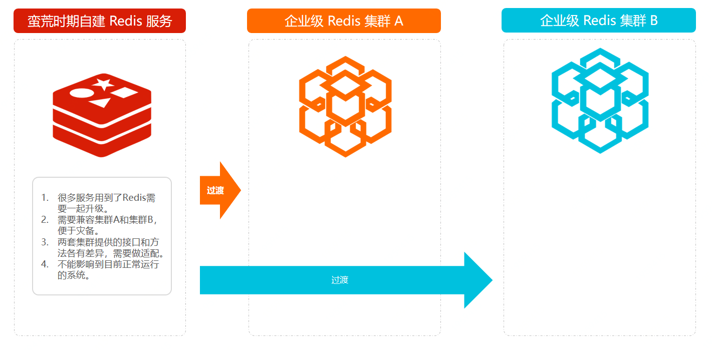
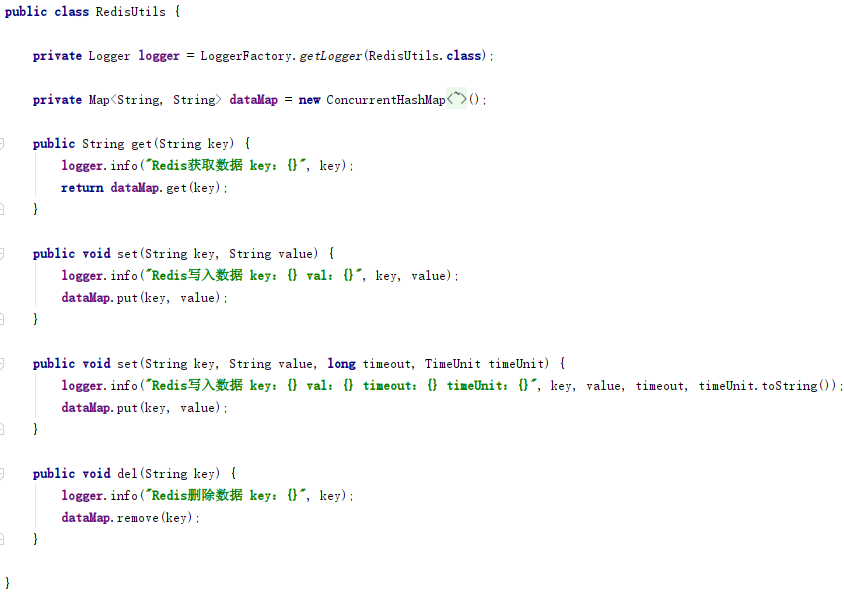
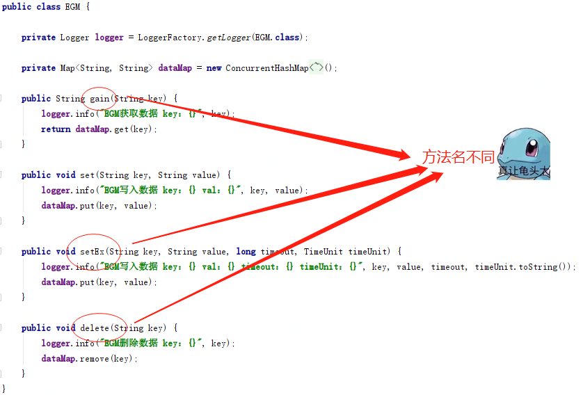
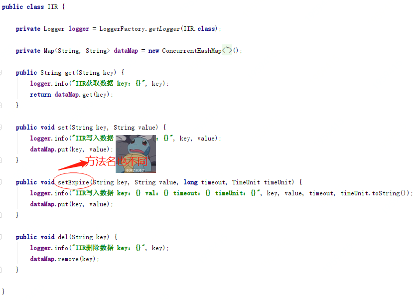
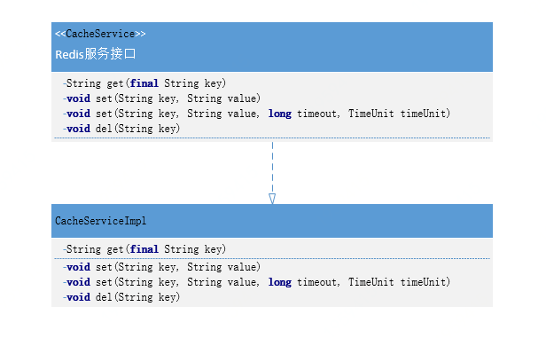

> 本文章仅用于本人学习笔记记录
> 微信：A20991212A（如本文档内容侵权了您的权益，请您通过微信联系到我）


## 抽象工厂模式介绍

抽象工厂模式与工厂方法模式虽然主要意图都是为了解决，接口选择问题。但在实现上，抽象工厂是一个中心工厂，创建其他工厂的模式。

可能在平常的业务开发中很少关注这样的设计模式或者类似的代码结构，但是这种场景确一直在我们身边，例如：

- 不同系统内的回车换行 

    Unix系统里，每行结尾只有 **<换行>**，即 `\n`；
    Windows系统里面，每行结尾是 **<换行><回车>**，即 `\n\r`；
    Mac系统里，每行结尾是 **<回车>**

- IDEA 开发工具的差异展示(Win\Mac)

    

我们的业务开发中时常也会遇到类似的问题，需要兼容做处理。

## 简单例子



预估QPS较低、系统压力较小、并发访问不大、近一年没有大动作等等，在考虑时间投入成本的前提前，并不会投入特别多的人力去构建非常完善的系统。就像对 Redis 的使用，往往可能只要是单机的就可以满足现状。

但随着业务超过预期的快速发展，系统的负载能力也要随着跟上。原有的单机 Redis 已经满足不了系统需求。这时候就需要更换为更为健壮的Redis集群服务，虽然需要修改但是不能影响目前系统的运行，还要平滑过渡过去。

随着这次的升级，可以预见的问题会有:

- 很多服务用到了Redis需要一起升级到集群。
- 需要兼容集群A和集群B，便于后续的灾备。
- 两套集群提供的接口和方法各有差异，需要做适配。
- 不能影响到目前正常运行的系统。

### 场景模拟工程

```
itstack-demo-design-2-00
└── src
    └── main
        └── java
            └── org.itstack.demo.design
                ├── matter
                │   ├── EGM.java
                │   └── IIR.java
                └── RedisUtils.java
```

### 场景简述

#### 模拟单机服务 RedisUtils



- 模拟Redis功能，也就是假定目前所有的系统都在使用的服务
- 类和方法名次都固定写死到各个业务系统中，改动略微麻烦

#### 模拟集群 EGM



模拟一个集群服务，但是方法名与各业务系统中使用的方法名不同。有点像你mac，我用win。做一样的事，但有不同的操作。

#### 模拟集群 IIR



这是另外一套集群服务，有时候在企业开发中就很有可能出现两套服务，这里我们也是为了做模拟案例，所以添加两套实现同样功能的不同服务，来学习抽象工厂模式。

综上可以看到，我们目前的系统中已经在大量的使用redis服务，但是因为系统不能满足业务的快速发展，因此需要迁移到集群服务中。而这时有两套集群服务需要兼容使用，又要满足所有的业务系统改造的同时不影响线上使用。

### 单集群代码使用

以下是案例模拟中原有的单集群Redis使用方式，后续会通过对这里的代码进行改造。



#### 定义使用接口

```
public interface CacheService {

    String get(final String key);

    void set(String key, String value);

    void set(String key, String value, long timeout, TimeUnit timeUnit);

    void del(String key);

}
```

#### 实现调用代码

```
public class CacheServiceImpl implements CacheService {

    private RedisUtils redisUtils = new RedisUtils();

    public String get(String key) {
        return redisUtils.get(key);
    }

    public void set(String key, String value) {
        redisUtils.set(key, value);
    }

    public void set(String key, String value, long timeout, TimeUnit timeUnit) {
        redisUtils.set(key, value, timeout, timeUnit);
    }

    public void del(String key) {
        redisUtils.del(key);
    }

}
```

## 用一坨坨代码实现

> 讲道理没有ifelse解决不了的逻辑，不行就在加一行！哈哈

此时的实现方式并不会修改类结构图，也就是与上面给出的类层级关系一致。通过在接口中添加类型字段区分当前使用的是哪个集群，来作为使用的判断。可以说目前的方式非常难用，其他使用方改动颇多，这里只是做为例子。

### 工程结构

```
itstack-demo-design-2-01
└── src
    └── main
        └── java
            └── org.itstack.demo.design
                ├── impl
                │   └── CacheServiceImpl.java
                └── CacheService.java
```

此时的只有两个类，类结构非常简单。而我们需要的补充扩展功能也只是在 CacheServiceImpl 中实现。

### ifelse实现需求

```
public class CacheServiceImpl implements CacheService {

    private RedisUtils redisUtils = new RedisUtils();

    private EGM egm = new EGM();

    private IIR iir = new IIR();

    public String get(String key, int redisType) {

        if (1 == redisType) {
            return egm.gain(key);
        }

        if (2 == redisType) {
            return iir.get(key);
        }

        return redisUtils.get(key);
    }

    public void set(String key, String value, int redisType) {

        if (1 == redisType) {
            egm.set(key, value);
            return;
        }

        if (2 == redisType) {
            iir.set(key, value);
            return;
        }

        redisUtils.set(key, value);
    }

    //... 同类不做太多展示

}
```

这里的实现过程非常简单，主要根据类型判断是哪个Redis集群。

虽然实现是简单了，但是对使用者来说就麻烦了，并且也很难应对后期的拓展和不停的维护。

## 抽象工厂模式重构代码

这里的抽象工厂的创建和获取方式，会采用代理类的方式进行实现。所被代理的类就是目前的Redis操作方法类，让这个类在不需要任何修改下，就可以实现调用集群A和集群B的数据服务。

并且这里还有一点非常重要，由于集群A和集群B在部分方法提供上是不同的，因此需要做一个接口适配，而这个适配类就相当于工厂中的工厂，用于创建把不同的服务抽象为统一的接口做相同的业务。

### 工程结构

```
itstack-demo-design-2-02
└── src
    ├── main
    │   └── java
    │       └── org.itstack.demo.design
    │           ├── factory    
    │           │   ├── impl
    │           │   │   ├── EGMCacheAdapter.java 
    │           │   │   └── IIRCacheAdapter.java
    │           │   ├── ICacheAdapter.java
    │           │   ├── JDKInvocationHandler.java
    │           │   └── JDKProxy.java
    │           ├── impl
    │           │   └── CacheServiceImpl.java    
    │           └── CacheService.java 
    └── test
         └── java
             └── org.itstack.demo.design.test
                 └── ApiTest.java
```

### 抽象工厂模型结构


- ICacheAdapter，定义了适配接口，分别包装两个集群中差异化的接口名称。EGMCacheAdapter、IIRCacheAdapter
- JDKProxy、JDKInvocationHandler，是代理类的定义和实现，这部分也就是抽象工厂的另外一种实现方式。通过这样的方式可以很好的把原有操作Redis的方法进行代理操作，通过控制不同的入参对象，控制缓存的使用。

### 代码实现

#### 定义适配接口

```
public interface ICacheAdapter {

    String get(String key);

    void set(String key, String value);

    void set(String key, String value, long timeout, TimeUnit timeUnit);

    void del(String key);

}
```

这个类的主要作用是让所有集群的提供方，能在统一的方法名称下进行操作。也方面后续的拓展。

#### 实现集群使用服务

```
public class EGMCacheAdapter implements ICacheAdapter {

    private EGM egm = new EGM();

    public String get(String key) {
        return egm.gain(key);
    }

    public void set(String key, String value) {
        egm.set(key, value);
    }

    public void set(String key, String value, long timeout, TimeUnit timeUnit) {
        egm.setEx(key, value, timeout, timeUnit);
    }

    public void del(String key) {
        egm.delete(key);
    }
}
```

```
public class IIRCacheAdapter implements ICacheAdapter {

    private IIR iir = new IIR();

    public String get(String key) {
        return iir.get(key);
    }

    public void set(String key, String value) {
        iir.set(key, value);
    }

    public void set(String key, String value, long timeout, TimeUnit timeUnit) {
        iir.setExpire(key, value, timeout, timeUnit);
    }

    public void del(String key) {
        iir.del(key);
    }

}
```

以上两个实现都非常容易，在统一方法名下进行包装。

#### 定义抽象工程代理类和实现

JDKProxy:

```
public static <T> T getProxy(Class<T> interfaceClass, ICacheAdapter cacheAdapter) throws Exception {
    InvocationHandler handler = new JDKInvocationHandler(cacheAdapter);
    ClassLoader classLoader = Thread.currentThread().getContextClassLoader();
    Class<?>[] classes = interfaceClass.getInterfaces();
    return (T) Proxy.newProxyInstance(classLoader, new Class[]{classes[0]}, handler);
}
```

这里主要的作用就是完成代理类，同时对于使用哪个集群有外部通过入参进行传递。

JDKInvocationHandler:

```
public class JDKInvocationHandler implements InvocationHandler {

    private ICacheAdapter cacheAdapter;

    public JDKInvocationHandler(ICacheAdapter cacheAdapter) {
        this.cacheAdapter = cacheAdapter;
    }

    public Object invoke(Object proxy, Method method, Object[] args) throws Throwable {
        return ICacheAdapter.class.getMethod(method.getName(), ClassLoaderUtils.getClazzByArgs(args)).invoke(cacheAdapter, args);
    }

}
```

在代理类的实现中其实也非常简单，通过穿透进来的集群服务进行方法操作。

另外在invoke中通过使用获取方法名称反射方式，调用对应的方法功能，也就简化了整体的使用。

### 测试验证

```
@Test
public void test_CacheService() throws Exception {
    CacheService proxy_EGM = JDKProxy.getProxy(CacheServiceImpl.class, new EGMCacheAdapter());
    proxy_EGM.set("user_name_01","小哥");
    String val01 = proxy_EGM.get("user_name_01");
    System.out.println(val01);
    
    CacheService proxy_IIR = JDKProxy.getProxy(CacheServiceImpl.class, new IIRCacheAdapter());
    proxy_IIR.set("user_name_01","小哥");
    String val02 = proxy_IIR.get("user_name_01");
    System.out.println(val02);
}
```

## 总结

- 抽象工厂模式，所要解决的问题就是在一个产品族，存在多个不同类型的产品(Redis集群、操作系统)情况下，接口选择的问题。而这种场景在业务开发中也是非常多见的，只不过可能有时候没有将它们抽象化出来。

- 当你知道什么场景下何时可以被抽象工程优化代码，那么你的代码层级结构以及满足业务需求上，都可以得到很好的完成功能实现并提升扩展性和优雅度。
- 那么这个设计模式满足了；单一职责、开闭原则、解耦等优点，但如果说随着业务的不断拓展，可能会造成类实现上的复杂度。但也可以说算不上缺点，因为可以随着其他设计方式的引入和代理类以及自动生成加载的方式降低此项缺点。
- 抽象工厂模式与工厂方法模式虽然主要意图都是为了解决，接口选择问题。但在实现上，抽象工厂是一个中心工厂，创建其他工厂的模式。