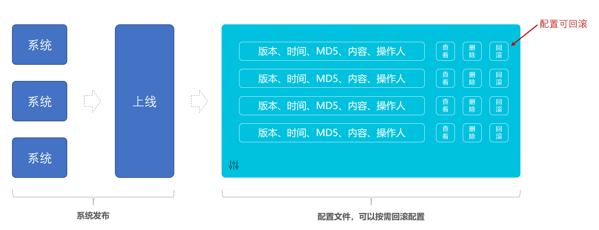
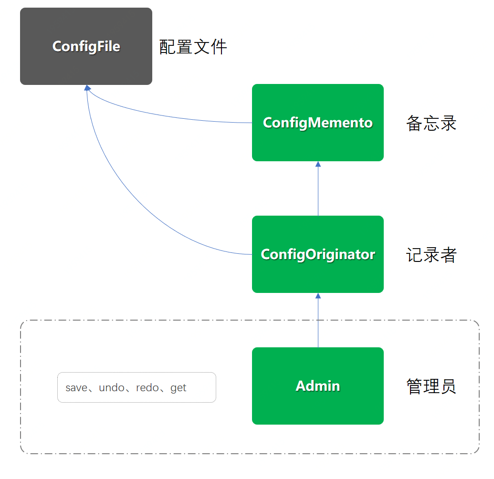

> 本文章仅用于本人学习笔记记录
> 微信：A20991212A（如本文档内容侵权了您的权益，请您通过微信联系到我）

## 备忘录模式介绍

备忘录模式是以可以恢复或者说回滚，配置、版本、悔棋为核心功能的设计模式，而这种设计模式属于行为模式。在功能实现上是以不破坏原对象为基础增加备忘录操作类，记录原对象的行为从而实现备忘录模式。

这个设计在我们平常的生活或者开发中也是比较常见的，比如：后悔药、孟婆汤(一下回滚到0)，IDEA编辑和撤销、小霸王游戏机存档。


## 备忘录模式记录配置文件版本信息

备忘录的设计模式实现方式，重点在于不更改原有类的基础上，增加备忘录类存放记录。可能平时虽然不一定非得按照这个设计模式的代码结构来实现自己的需求，但是对于功能上可能也完成过类似的功能，记录系统的信息。


## 简单例子



### 工程结构

```
itstack-demo-design-17-00
└── src
    ├── main
    │   └── java
    │       └── org.itstack.demo.design
    │           ├── Admin.java
    │           ├── ConfigFile.java
    │           ├── ConfigMemento.java
    │           └── ConfigOriginator.java
    └── test
        └── java
            └── org.itstack.demo.design.test
                └── ApiTest.java

```

备忘录模式模型结构



- 以上是工程结构的一个类图，其实相对来说并不复杂，除了原有的配置类(ConfigFile)以外，只新增加了三个类。
- ConfigMemento：备忘录类，相当于是对原有配置类的扩展
- ConfigOriginator：记录者类，获取和返回备忘录类对象信息
- Admin：管理员类，用于操作记录备忘信息，比如你一些列的顺序执行了什么或者某个版本下的内容信息

### 代码实现

#### 配置信息类

```
public class ConfigFile {

    private String versionNo; // 版本号
    private String content;   // 内容
    private Date dateTime;    // 时间
    private String operator;  // 操作人
    
    // ...get/set
}

```

配置类可以是任何形式的，这里只是简单的描述了一个基本的配置内容信息。


#### 备忘录类

```
public class ConfigMemento {

    private ConfigFile configFile;

    public ConfigMemento(ConfigFile configFile) {
        this.configFile = configFile;
    }

    public ConfigFile getConfigFile() {
        return configFile;
    }

    public void setConfigFile(ConfigFile configFile) {
        this.configFile = configFile;
    }
    
}

```

备忘录是对原有配置类的扩展，可以设置和获取配置信息。

#### 记录者类

```
public class ConfigOriginator {

    private ConfigFile configFile;

    public ConfigFile getConfigFile() {
        return configFile;
    }

    public void setConfigFile(ConfigFile configFile) {
        this.configFile = configFile;
    }

    public ConfigMemento saveMemento(){
        return new ConfigMemento(configFile);
    }

    public void getMemento(ConfigMemento memento){
        this.configFile = memento.getConfigFile();
    }

}

```

- 记录者类除了对ConfigFile配置类增加了获取和设置方法外，还增加了保存saveMemento()、获取getMemento(ConfigMemento memento)。

- saveMemento：保存备忘录的时候会创建一个备忘录信息，并返回回去，交给管理者处理。

- getMemento：获取的之后并不是直接返回，而是把备忘录的信息交给现在的配置文件this.configFile，这部分需要注意。

#### 管理员类

```
public class Admin {

    private int cursorIdx = 0;
    private List<ConfigMemento> mementoList = new ArrayList<ConfigMemento>();
    private Map<String, ConfigMemento> mementoMap = new ConcurrentHashMap<String, ConfigMemento>();

    public void append(ConfigMemento memento) {
        mementoList.add(memento);
        mementoMap.put(memento.getConfigFile().getVersionNo(), memento);
        cursorIdx++;
    }

    public ConfigMemento undo() {
        if (--cursorIdx <= 0) return mementoList.get(0);
        return mementoList.get(cursorIdx);
    }

    public ConfigMemento redo() {
        if (++cursorIdx > mementoList.size()) return mementoList.get(mementoList.size() - 1);
        return mementoList.get(cursorIdx);
    }

    public ConfigMemento get(String versionNo){
        return mementoMap.get(versionNo);
    }

}

```

- 在这个类中主要实现的核心功能就是记录配置文件信息，也就是备忘录的效果，之后提供可以回滚和获取的方法，拿到备忘录的具体内容。
- 同时这里设置了两个数据结构来存放备忘录，实际使用中可以按需设置。List<ConfigMemento>、Map<String, ConfigMemento>。
- 最后是提供的备忘录操作方法；存放(append)、回滚(undo)、返回(redo)、定向获取(get)，这样四个操作方法。

### 测试验证

```
@Test
public void test() {
    Admin admin = new Admin();
    ConfigOriginator configOriginator = new ConfigOriginator();
    configOriginator.setConfigFile(new ConfigFile("1000001", "配置内容A=哈哈", new Date(), "小傅哥"));
    admin.append(configOriginator.saveMemento()); // 保存配置
    configOriginator.setConfigFile(new ConfigFile("1000002", "配置内容A=嘻嘻", new Date(), "小傅哥"));
    admin.append(configOriginator.saveMemento()); // 保存配置
    configOriginator.setConfigFile(new ConfigFile("1000003", "配置内容A=么么", new Date(), "小傅哥"));
    admin.append(configOriginator.saveMemento()); // 保存配置
    configOriginator.setConfigFile(new ConfigFile("1000004", "配置内容A=嘿嘿", new Date(), "小傅哥"));
    admin.append(configOriginator.saveMemento()); // 保存配置  

    // 历史配置(回滚)
    configOriginator.getMemento(admin.undo());
    logger.info("历史配置(回滚)undo：{}", JSON.toJSONString(configOriginator.getConfigFile()));  

    // 历史配置(回滚)
    configOriginator.getMemento(admin.undo());
    logger.info("历史配置(回滚)undo：{}", JSON.toJSONString(configOriginator.getConfigFile()));  

    // 历史配置(前进)
    configOriginator.getMemento(admin.redo());
    logger.info("历史配置(前进)redo：{}", JSON.toJSONString(configOriginator.getConfigFile()));   

    // 历史配置(获取)
    configOriginator.getMemento(admin.get("1000002"));
    logger.info("历史配置(获取)get：{}", JSON.toJSONString(configOriginator.getConfigFile()));
}

```

上面添加了四次配置后，下面分别进行操作是；回滚1次、再回滚1次，之后向前进1次，最后是获取指定的版本配置。具体的效果可以参考测试结果。

```
23:12:09.512 [main] INFO  org.itstack.demo.design.test.ApiTest - 历史配置(回滚)undo：{"content":"配置内容A=嘿嘿","dateTime":159209829432,"operator":"小傅哥","versionNo":"1000004"}
23:12:09.514 [main] INFO  org.itstack.demo.design.test.ApiTest - 历史配置(回滚)undo：{"content":"配置内容A=么么","dateTime":159209829432,"operator":"小傅哥","versionNo":"1000003"}
23:12:09.514 [main] INFO  org.itstack.demo.design.test.ApiTest - 历史配置(前进)redo：{"content":"配置内容A=嘿嘿","dateTime":159209829432,"operator":"小傅哥","versionNo":"1000004"}
23:12:09.514 [main] INFO  org.itstack.demo.design.test.ApiTest - 历史配置(获取)get：{"content":"配置内容A=嘻嘻","dateTime":159320989432,"operator":"小傅哥","versionNo":"1000002"}

Process finished with exit code 0

```

## 总结

备忘录模式是以可以恢复或者说回滚，配置、版本、悔棋为核心功能的设计模式，而这种设计模式属于行为模式。在功能实现上是以不破坏原对象为基础增加备忘录操作类，记录原对象的行为从而实现备忘录模式。