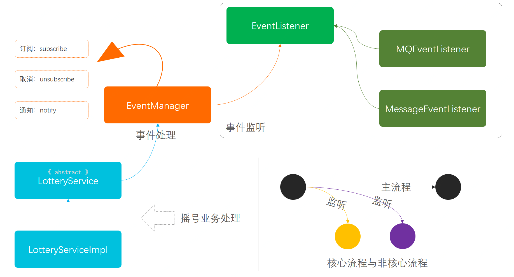

> 本文章仅用于本人学习笔记记录
> 微信：A20991212A（如本文档内容侵权了您的权益，请您通过微信联系到我）

## 观察者模式介绍

简单来讲观察者🕵模式，就是当一个行为发生时传递信息给另外一个用户接收做出相应的处理，两者之间没有直接的耦合关联。


除了生活中的场景外，在我们编程开发中也会常用到一些观察者的模式或者组件，例如我们经常使用的MQ服务，虽然MQ服务是有一个通知中心并不是每一个类服务进行通知，但整体上也可以算作是观察者模式的思路设计。再比如可能有做过的一些类似事件监听总线，让主线服务与其他辅线业务服务分离，为了使系统降低耦合和增强扩展性，也会使用观察者模式进行处理。


## 简单例子

```
itstack-demo-design-18-00
└── src
    └── main
        └── java
            └── org.itstack.demo.design
                └── MinibusTargetService.java

```

### 场景简述

#### 摇号服务接口

```
public class MinibusTargetService {

    /**
     * 模拟摇号，但不是摇号算法
     *
     * @param uId 用户编号
     * @return 结果
     */
    public String lottery(String uId) {
        return Math.abs(uId.hashCode()) % 2 == 0 ? "恭喜你，编码".concat(uId).concat("在本次摇号中签") : "很遗憾，编码".concat(uId).concat("在本次摇号未中签或摇号资格已过期");
    }

}

```

## 用一坨坨代码实现

按照需求需要在原有的摇号接口中添加MQ消息发送以及短消息通知功能，如果是最直接的方式那么可以直接在方法中补充功能即可。

### 工程结构

```
itstack-demo-design-18-01
└── src
    └── main
        └── java
            └── org.itstack.demo.design
                ├── LotteryResult.java
                ├── LotteryService.java
                └── LotteryServiceImpl.java

```

这段代码接口中包括了三部分内容；返回对象(LotteryResult)、定义接口(LotteryService)、具体实现(LotteryServiceImpl)。

### 代码实现

```
public class LotteryServiceImpl implements LotteryService {

    private Logger logger = LoggerFactory.getLogger(LotteryServiceImpl.class);

    private MinibusTargetService minibusTargetService = new MinibusTargetService();

    public LotteryResult doDraw(String uId) {
        // 摇号
        String lottery = minibusTargetService.lottery(uId);
        // 发短信
        logger.info("给用户 {} 发送短信通知(短信)：{}", uId, lottery);
        // 发MQ消息
        logger.info("记录用户 {} 摇号结果(MQ)：{}", uId, lottery);
        // 结果
        return new LotteryResult(uId, lottery, new Date());
    }

}

```

## 观察者模式重构代码

### 工程结构

```
itstack-demo-design-18-02
└── src
    └── main
        └── java
            └── org.itstack.demo.design
                ├── event
                │    ├── listener
                │    │    ├── EventListener.java
                │    │    ├── MessageEventListener.java
                │    │    └── MQEventListener.java
                │    └── EventManager.java
                ├── LotteryResult.java
                ├── LotteryService.java
                └── LotteryServiceImpl.java

```

观察者模式模型结构



- 从上图可以分为三大块看；事件监听、事件处理、具体的业务流程，另外在业务流程中 LotteryService 定义的是抽象类，因为这样可以通过抽象类将事件功能屏蔽，外部业务流程开发者不需要知道具体的通知操作。
- 右下角圆圈图表示的是核心流程与非核心流程的结构，一般在开发中会把主线流程开发完成后，再使用通知的方式处理辅助流程。他们可以是异步的，在MQ以及定时任务的处理下，保证最终一致性。

### 代码实现

#### 事件监听接口定义

```
public interface EventListener {

    void doEvent(LotteryResult result);

}

```

接口中定义了基本的事件类，这里如果方法的入参信息类型是变化的可以使用泛型<T>

#### 短消息事件

```
public class MessageEventListener implements EventListener {

    private Logger logger = LoggerFactory.getLogger(MessageEventListener.class);

    @Override
    public void doEvent(LotteryResult result) {
        logger.info("给用户 {} 发送短信通知(短信)：{}", result.getuId(), result.getMsg());
    }

}

```

#### MQ发送事件

```
public class MQEventListener implements EventListener {

    private Logger logger = LoggerFactory.getLogger(MQEventListener.class);

    @Override
    public void doEvent(LotteryResult result) {
        logger.info("记录用户 {} 摇号结果(MQ)：{}", result.getuId(), result.getMsg());
    }

}

```

#### 事件处理类

```
public class EventManager {

    Map<Enum<EventType>, List<EventListener>> listeners = new HashMap<>();

    public EventManager(Enum<EventType>... operations) {
        for (Enum<EventType> operation : operations) {
            this.listeners.put(operation, new ArrayList<>());
        }
    }

    public enum EventType {
        MQ, Message
    }

    /**
     * 订阅
     * @param eventType 事件类型
     * @param listener  监听
     */
    public void subscribe(Enum<EventType> eventType, EventListener listener) {
        List<EventListener> users = listeners.get(eventType);
        users.add(listener);
    }

    /**
     * 取消订阅
     * @param eventType 事件类型
     * @param listener  监听
     */
    public void unsubscribe(Enum<EventType> eventType, EventListener listener) {
        List<EventListener> users = listeners.get(eventType);
        users.remove(listener);
    }

    /**
     * 通知
     * @param eventType 事件类型
     * @param result    结果
     */
    public void notify(Enum<EventType> eventType, LotteryResult result) {
        List<EventListener> users = listeners.get(eventType);
        for (EventListener listener : users) {
            listener.doEvent(result);
        }
    }

}

```

- 整个处理的实现上提供了三个主要方法；订阅(subscribe)、取消订阅(unsubscribe)、通知(notify)。这三个方法分别用于对监听时间的添加和使用。
- 另外因为事件有不同的类型，这里使用了枚举的方式进行处理，也方便让外部在规定下使用事件，而不至于乱传信息(EventType.MQ、EventType.Message)。

#### 业务抽象类接口

```
public abstract class LotteryService {

    private EventManager eventManager;

    public LotteryService() {
        eventManager = new EventManager(EventManager.EventType.MQ, EventManager.EventType.Message);
        eventManager.subscribe(EventManager.EventType.MQ, new MQEventListener());
        eventManager.subscribe(EventManager.EventType.Message, new MessageEventListener());
    }

    public LotteryResult draw(String uId) {
        LotteryResult lotteryResult = doDraw(uId);
        // 需要什么通知就给调用什么方法
        eventManager.notify(EventManager.EventType.MQ, lotteryResult);
        eventManager.notify(EventManager.EventType.Message, lotteryResult);
        return lotteryResult;
    }

    protected abstract LotteryResult doDraw(String uId);

}

```

#### 业务接口实现类

```
public class LotteryServiceImpl extends LotteryService {

    private MinibusTargetService minibusTargetService = new MinibusTargetService();

    @Override
    protected LotteryResult doDraw(String uId) {
        // 摇号
        String lottery = minibusTargetService.lottery(uId);
        // 结果
        return new LotteryResult(uId, lottery, new Date());
    }

}

```

#### 测试验证

```
@Test
public void test() {
    LotteryService lotteryService = new LotteryServiceImpl();
    LotteryResult result = lotteryService.draw("2765789109876");
    logger.info("测试结果：{}", JSON.toJSONString(result));
}

```

## 总结

简单来讲观察者🕵模式，就是当一个行为发生时传递信息给另外一个用户接收做出相应的处理，两者之间没有直接的耦合关联。