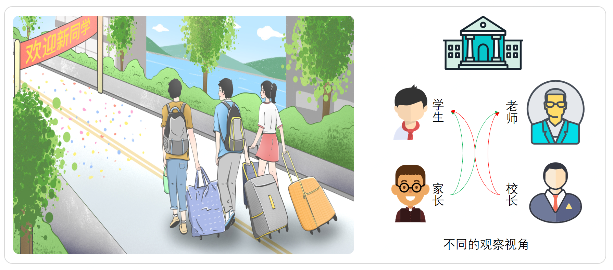

> 本文章仅用于本人学习笔记记录
> 微信：A20991212A（如本文档内容侵权了您的权益，请您通过微信联系到我）

## 访问者模式介绍

访问者要解决的核心事项是，在一个稳定的数据结构下，例如用户信息、雇员信息等，增加易变的业务访问逻辑。为了增强扩展性，将这两部分的业务解耦的一种设计模式。

为了通俗理解，简单来说，嘿嘿：


说白了访问者模式的核心在于同一个事物不同视角下的访问信息不同，比如一个美女手里拿个冰激凌。小朋友会注意冰激凌，大朋友会找自己喜欢的地方观测敌情。

## 简单例子



模拟校园中有学生和老师两种身份的用户，那么对于家长和校长关心的角度来看，他们的视角是不同的。家长更关心孩子的成绩和老师的能力，校长更关心老师所在班级学生的人数和升学率.

### 访问者模式模型结构


### 代码实现

#### 定义用户抽象类

```
// 基础用户信息
public abstract class User {

    public String name;      // 姓名
    public String identity;  // 身份；重点班、普通班 | 特级教师、普通教师、实习教师
    public String clazz;     // 班级

    public User(String name, String identity, String clazz) {
        this.name = name;
        this.identity = identity;
        this.clazz = clazz;
    }

    // 核心访问方法
    public abstract void accept(Visitor visitor);

}

```

#### 老师类

```
public class Teacher extends User {

    public Teacher(String name, String identity, String clazz) {
        super(name, identity, clazz);
    }

    public void accept(Visitor visitor) {
        visitor.visit(this);
    }

    // 升本率
    public double entranceRatio() {
        return BigDecimal.valueOf(Math.random() * 100).setScale(2, BigDecimal.ROUND_HALF_UP).doubleValue();
    }

}

```

#### 学生类

```
public class Student extends User {

    public Student(String name, String identity, String clazz) {
        super(name, identity, clazz);
    }

    public void accept(Visitor visitor) {
        visitor.visit(this);
    }

    public int ranking() {
        return (int) (Math.random() * 100);
    }

}

```

#### 定义访问数据接口

```
public interface Visitor {

    // 访问学生信息
    void visit(Student student);

    // 访问老师信息
    void visit(Teacher teacher);

}

```

#### 访问者:校长

```
public class Principal implements Visitor {

    private Logger logger = LoggerFactory.getLogger(Principal.class);

    public void visit(Student student) {
        logger.info("学生信息 姓名：{} 班级：{}", student.name, student.clazz);
    }

    public void visit(Teacher teacher) {
        logger.info("学生信息 姓名：{} 班级：{} 升学率：{}", teacher.name, teacher.clazz, teacher.entranceRatio());
    }

}

```

#### 访问者:家长

```
public class Parent implements Visitor {

    private Logger logger = LoggerFactory.getLogger(Parent.class);

    public void visit(Student student) {
        logger.info("学生信息 姓名：{} 班级：{} 排名：{}", student.name, student.clazz, student.ranking());
    }

    public void visit(Teacher teacher) {
        logger.info("老师信息 姓名：{} 班级：{} 级别：{}", teacher.name, teacher.clazz, teacher.identity);
    }

}

```

#### 数据看版

```
public class DataView {

    List<User> userList = new ArrayList<User>();

    public DataView() {
        userList.add(new Student("谢飞机", "重点班", "一年一班"));
        userList.add(new Student("windy", "重点班", "一年一班"));
        userList.add(new Student("大毛", "普通班", "二年三班"));
        userList.add(new Student("Shing", "普通班", "三年四班"));
        userList.add(new Teacher("BK", "特级教师", "一年一班"));
        userList.add(new Teacher("娜娜Goddess", "特级教师", "一年一班"));
        userList.add(new Teacher("dangdang", "普通教师", "二年三班"));
        userList.add(new Teacher("泽东", "实习教师", "三年四班"));
    }

    // 展示
    public void show(Visitor visitor) {
        for (User user : userList) {
            user.accept(visitor);
        }
    }

}

```

#### 测试验证

```
@Test
public void test(){
    DataView dataView = new DataView();      

    logger.info("\r\n家长视角访问：");
    dataView.show(new Parent());     // 家长

    logger.info("\r\n校长视角访问：");
    dataView.show(new Principal());  // 校长
}

```

#### 测试结果

```
23:00:39.726 [main] INFO  org.itstack.demo.design.test.ApiTest - 
家长视角访问：
23:00:39.730 [main] INFO  o.i.demo.design.visitor.impl.Parent - 学生信息 姓名：谢飞机 班级：一年一班 排名：62
23:00:39.730 [main] INFO  o.i.demo.design.visitor.impl.Parent - 学生信息 姓名：windy 班级：一年一班 排名：51
23:00:39.730 [main] INFO  o.i.demo.design.visitor.impl.Parent - 学生信息 姓名：大毛 班级：二年三班 排名：16
23:00:39.730 [main] INFO  o.i.demo.design.visitor.impl.Parent - 学生信息 姓名：Shing 班级：三年四班 排名：98
23:00:39.730 [main] INFO  o.i.demo.design.visitor.impl.Parent - 老师信息 姓名：BK 班级：一年一班 级别：特级教师
23:00:39.730 [main] INFO  o.i.demo.design.visitor.impl.Parent - 老师信息 姓名：娜娜Goddess 班级：一年一班 级别：特级教师
23:00:39.730 [main] INFO  o.i.demo.design.visitor.impl.Parent - 老师信息 姓名：dangdang 班级：二年三班 级别：普通教师
23:00:39.730 [main] INFO  o.i.demo.design.visitor.impl.Parent - 老师信息 姓名：泽东 班级：三年四班 级别：实习教师
23:00:39.730 [main] INFO  org.itstack.demo.design.test.ApiTest - 
校长视角访问：
23:00:39.731 [main] INFO  o.i.d.design.visitor.impl.Principal - 学生信息 姓名：谢飞机 班级：一年一班
23:00:39.731 [main] INFO  o.i.d.design.visitor.impl.Principal - 学生信息 姓名：windy 班级：一年一班
23:00:39.731 [main] INFO  o.i.d.design.visitor.impl.Principal - 学生信息 姓名：大毛 班级：二年三班
23:00:39.731 [main] INFO  o.i.d.design.visitor.impl.Principal - 学生信息 姓名：Shing 班级：三年四班
23:00:39.733 [main] INFO  o.i.d.design.visitor.impl.Principal - 学生信息 姓名：BK 班级：一年一班 升学率：70.62
23:00:39.733 [main] INFO  o.i.d.design.visitor.impl.Principal - 学生信息 姓名：娜娜Goddess 班级：一年一班 升学率：23.15
23:00:39.734 [main] INFO  o.i.d.design.visitor.impl.Principal - 学生信息 姓名：dangdang 班级：二年三班 升学率：70.98
23:00:39.734 [main] INFO  o.i.d.design.visitor.impl.Principal - 学生信息 姓名：泽东 班级：三年四班 升学率：90.14

Process finished with exit code 0

```

## 总结

- 在嵌入访问者模式后，可以让整个工程结构变得容易添加和修改。也就做到了系统服务之间的解耦，不至于为了不同类型信息的访问而增加很多多余的if判断或者类的强制转换。也就是通过这样的设计模式而让代码结构更加清晰。
- 说白了访问者模式的核心在于同一个事物不同视角下的访问信息不同。