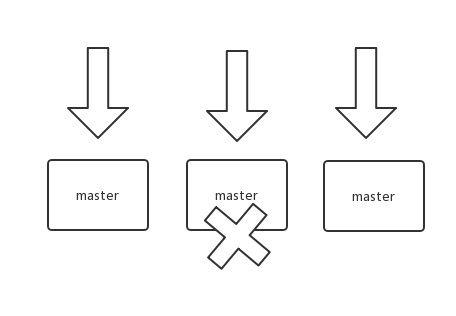
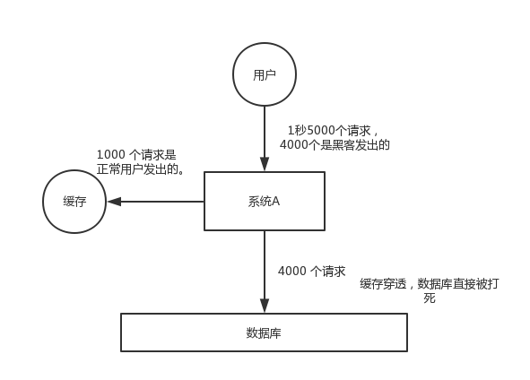

## 面试题

项目中缓存是如何使用的？为什么要用缓存？缓存使用不当会造成什么后果？

### 面试官心理分析

这个问题，互联网公司必问，要是一个人连缓存都不太清楚，那确实比较尴尬。

只要问到缓存，上来第一个问题，肯定是先问问你项目哪里用了缓存？为啥要用？不用行不行？如果用了以后可能会有什么不良的后果？

这就是看看你对缓存这个东西背后有没有思考，如果你就是傻乎乎的瞎用，没法给面试官一个合理的解答，那面试官对你印象肯定不太好，觉得你平时思考太少，就知道干活儿。

> 面试题剖析:
> 项目中缓存是如何使用的？这个，需要结合自己项目的业务来。

## * 为什么要用缓存？

用缓存，主要有两个用途：高性能、高并发。

### 高性能

假设这么个场景，你有个操作，一个请求过来，吭哧吭哧你各种乱七八糟操作 mysql，半天查出来一个结果，耗时 600ms。但是这个结果可能接下来几个小时都不会变了，或者变了也可以不用立即反馈给用户。那么此时咋办？

缓存啊，折腾 600ms 查出来的结果，扔缓存里，一个 key 对应一个 value，下次再有人查，别走 mysql 折腾 600ms 了，直接从缓存里，通过一个 key 查出来一个 value，2ms 搞定。性能提升 300 倍。

就是说对于一些需要复杂操作耗时查出来的结果，且确定后面不怎么变化，但是有很多读请求，那么直接将查询出来的结果放在缓存中，后面直接读缓存就好。

### 高并发

mysql 这么重的数据库，压根儿设计不是让你玩儿高并发的，虽然也可以玩儿，但是天然支持不好。mysql 单机支撑到 2000QPS 也开始容易报警了。

所以要是你有个系统，高峰期一秒钟过来的请求有 1万，那一个 mysql 单机绝对会死掉。你这个时候就只能上缓存，把很多数据放缓存，别放 mysql。缓存功能简单，说白了就是 key-value 式操作，单机支撑的并发量轻松一秒几万十几万，支撑高并发 so easy。单机承载并发量是 mysql 单机的几十倍。

**缓存是走内存的，内存天然就支撑高并发。**

## * 用了缓存之后会有什么不良后果？

常见的缓存问题有以下几个：

- 缓存与数据库双写不一致
- 缓存雪崩、缓存穿透、缓存击穿
- 缓存并发竞争

-----------------------------

## 面试题

Redis 和 Memcached 有什么区别？Redis 的线程模型是什么？为什么 Redis 单线程却能支撑高并发？

### 面试官心理分析

这个是问 Redis 的时候，最基本的问题吧，Redis 最基本的一个内部原理和特点，就是 Redis 实际上是个单线程工作模型，你要是这个都不知道，那后面玩儿 Redis 的时候，出了问题岂不是什么都不知道？

还有可能面试官会问问你 Redis 和 Memcached 的区别，但是 Memcached 是早些年各大互联网公司常用的缓存方案，但是现在近几年基本都是 Redis，没什么公司用 Memcached 了。

## * Redis 和 Memcached 有啥区别？

### Redis 支持复杂的数据结构

Redis 相比 Memcached 来说，拥有更多的数据结构，能支持更丰富的数据操作。如果需要缓存能够支持更复杂的结构和操作， Redis 会是不错的选择。

### Redis 原生支持集群模式

在 Redis3.x 版本中，便能支持 cluster 模式，而 Memcached 没有原生的集群模式，需要依靠客户端来实现往集群中分片写入数据。

### 性能对比

由于 Redis 只使用单核，而 Memcached 可以使用多核，所以平均每一个核上 Redis 在存储小数据时比 Memcached 性能更高。而在 100k 以上的数据中，Memcached 性能要高于 Redis。虽然 Redis 最近也在存储大数据的性能上进行优化，但是比起 Memcached，还是稍有逊色。

## * Redis 的线程模型(重要，灵魂之处)

Redis 内部使用**文件事件处理器** file event handler ，**这个文件事件处理器是单线程的，所以 Redis 才叫做单线程的模型**。**它采用 IO 多路复用机制同时监听多个 socket，将产生事件的 socket 压入内存队列中，事件分派器根据 socket 上的事件类型来选择对应的事件处理器进行处理**。

文件事件处理器的结构包含 4 个部分：

- 多个 socket
- IO 多路复用程序
- 文件事件分派器
- 事件处理器（连接应答处理器、命令请求处理器、命令回复处理器）

**多个 socket 可能会并发产生不同的操作，每个操作对应不同的文件事件，但是 IO 多路复用程序会监听多个 socket，会将产生事件的 socket 放入队列中排队，事件分派器每次从队列中取出一个 socket，根据 socket 的事件类型交给对应的事件处理器进行处理。**

来看客户端与 Redis 的一次通信过程：


要明白，通信是通过 socket 来完成的，不懂的同学可以先去看一看 socket 网络编程。

首先，Redis 服务端进程初始化的时候，会将 server socket 的 AE_READABLE 事件与连接应答处理器关联。

客户端 socket01 向 Redis 进程的 server socket 请求建立连接，此时 server socket 会产生一个 AE_READABLE 事件，IO 多路复用程序监听到 server socket 产生的事件后，将该 socket 压入队列中。文件事件分派器从队列中获取 socket，交给连接应答处理器。连接应答处理器会创建一个能与客户端通信的 socket01，并将该 socket01 后面产生的 AE_READABLE 事件与命令请求处理器关联。

假设此时客户端发送了一个 set key value 请求，此时 Redis 中的 socket01 会产生 AE_READABLE 事件，IO 多路复用程序将 socket01 压入队列，此时事件分派器从队列中获取到 socket01 产生的 AE_READABLE 事件，由于前面 socket01 的 AE_READABLE 事件已经与命令请求处理器关联，因此事件分派器将事件交给命令请求处理器来处理。命令请求处理器读取 socket01 的 key value 并在自己内存中完成 key value 的设置。操作完成后，它会将 socket01 的 AE_WRITABLE 事件与命令回复处理器关联。

如果此时客户端准备好接收返回结果了，那么 Redis 中的 socket01 会产生一个 AE_WRITABLE 事件，同样压入队列中，事件分派器找到相关联的命令回复处理器，由命令回复处理器对 socket01 输入本次操作的一个结果，比如 ok ，之后解除 socket01 的 AE_WRITABLE 事件与命令回复处理器的关联。

## * 为啥 Redis 单线程模型也能效率这么高？

- 纯内存操作。
- 核心是基于非阻塞的 IO 多路复用机制。
- C 语言实现，一般来说，C 语言实现的程序“距离”操作系统更近，执行速度相对会更快。
- 单线程反而避免了多线程的频繁上下文切换问题，预防了多线程可能产生的竞争问题。

-----------------

## 面试题

Redis 都有哪些数据类型？分别在哪些场景下使用比较合适？

### 面试官心理分析

除非是面试官感觉看你简历，是工作 3 年以内的比较初级的同学，可能对技术没有很深入的研究，面试官才会问这类问题。否则，在宝贵的面试时间里，面试官实在不想多问。

其实问这个问题，主要有两个原因：

- 看看你到底有没有全面的了解 Redis 有哪些功能，一般怎么来用，啥场景用什么，就怕你别就会最简单的 KV 操作；
- 看看你在实际项目里都怎么玩儿过 Redis。

要是你回答的不好，没说出几种数据类型，也没说什么场景，你完了，面试官对你印象肯定不好，觉得你平时就是做个简单的 set 和 get。

## * Redis 都有哪些数据类型？分别在哪些场景下使用比较合适？

Redis 主要有以下几种数据类型：

- Strings
- Hashes
- Lists
- Sets
- Sorted Sets

> Redis 除了这 5 种数据类型之外，还有 Bitmaps、HyperLogLogs、Streams 等。

### Strings

这是最简单的类型，就是普通的 set 和 get，做简单的 KV 缓存。

```
set key1 value1
```

### Hashes

这个是类似 map 的一种结构，这个一般就是可以将结构化的数据，比如一个对象（前提是这个对象没嵌套其他的对象）给缓存在 Redis 里，然后每次读写缓存的时候，可以就操作 hash 里的某个字段。

```
hset person name bingo
hset person age 20
hset person id 1
hget person name
```

```
person = {
    "name": "bingo",
    "age": 20,
    "id": 1
}
```

### Lists

Lists 是有序列表，这个可以玩儿出很多花样。

比如可以通过 list 存储一些列表型的数据结构，类似粉丝列表、文章的评论列表之类的东西。

比如可以通过 lrange 命令，读取某个闭区间内的元素，可以基于 list 实现分页查询，这个是很棒的一个功能，基于 Redis 实现简单的高性能分页，可以做类似微博那种下拉不断分页的东西，性能高，就一页一页走。

```
# 0开始位置，-1结束位置，结束位置为-1时，表示列表的最后一个位置，即查看所有。
lrange mylist 0 -1
```

比如可以搞个简单的消息队列，从 list 头怼进去，从 list 尾巴那里弄出来。

```
lpush mylist 1
lpush mylist 2
lpush mylist 3 4 5

# 1
rpop mylist
```

### Sets

Sets 是无序集合，自动去重。

直接基于 set 将系统里需要去重的数据扔进去，自动就给去重了，如果你需要对一些数据进行快速的全局去重，你当然也可以基于 jvm 内存里的 HashSet 进行去重，但是如果你的某个系统部署在多台机器上呢？得基于 Redis 进行全局的 set 去重。

可以基于 set 玩儿交集、并集、差集的操作，比如交集吧，可以把两个人的粉丝列表整一个交集，看看俩人的共同好友是谁？对吧。

把两个大 V 的粉丝都放在两个 set 中，对两个 set 做交集。

```
#-------操作一个set-------
# 添加元素
sadd mySet 1

# 查看全部元素
smembers mySet

# 判断是否包含某个值
sismember mySet 3

# 删除某个/些元素
srem mySet 1
srem mySet 2 4

# 查看元素个数
scard mySet

# 随机删除一个元素
spop mySet

#-------操作多个set-------
# 将一个set的元素移动到另外一个set
smove yourSet mySet 2

# 求两set的交集
sinter yourSet mySet

# 求两set的并集
sunion yourSet mySet

# 求在yourSet中而不在mySet中的元素
sdiff yourSet mySet
```

### Sorted Sets

Sorted Sets 是排序的 set，去重但可以排序，写进去的时候给一个分数，自动根据分数排序。

```
zadd board 85 zhangsan
zadd board 72 lisi
zadd board 96 wangwu
zadd board 63 zhaoliu

# 获取排名前三的用户（默认是升序，所以需要 rev 改为降序）
zrevrange board 0 3

# 获取某用户的排名
zrank board zhaoliu
```

------------------------------

## 面试题

Redis 的过期策略都有哪些？内存淘汰机制都有哪些？手写一下 LRU 代码实现？

### 面试官心理分析

如果你连这个问题都不知道，上来就懵了，回答不出来，那线上你写代码的时候，想当然的认为写进 Redis 的数据就一定会存在，后面导致系统各种 bug，谁来负责？

### 面试题剖析

- 往 Redis 写入的数据怎么没了？

    可能有同学会遇到，在生产环境的 Redis 经常会丢掉一些数据，写进去了，过一会儿可能就没了。我的天，同学，你问这个问题就说明 Redis 你就没用对啊。Redis 是缓存，你给当存储了是吧？

    啥叫缓存？用内存当缓存。内存是无限的吗，内存是很宝贵而且是有限的，磁盘是廉价而且是大量的。可能一台机器就几十个 G 的内存，但是可以有几个 T 的硬盘空间。Redis 主要是基于内存来进行高性能、高并发的读写操作的。

    那既然内存是有限的，比如 Redis 就只能用 10G，你要是往里面写了 20G 的数据，会咋办？当然会干掉 10G 的数据，然后就保留 10G 的数据了。那干掉哪些数据？保留哪些数据？当然是干掉不常用的数据，保留常用的数据了。

- 数据明明过期了，怎么还占用着内存？

    这是由 Redis 的过期策略来决定。

## * Redis 过期策略

**Redis 过期策略是：定期删除+惰性删除。**

所谓定期删除，指的是 Redis 默认是每隔 100ms 就随机抽取一些设置了过期时间的 key，检查其是否过期，如果过期就删除。

假设 Redis 里放了 10w 个 key，都设置了过期时间，你每隔几百毫秒，就检查 10w 个 key，那 Redis 基本上就死了，cpu 负载会很高的，消耗在你的检查过期 key 上了。注意，这里可不是每隔 100ms 就遍历所有的设置过期时间的 key，那样就是一场性能上的灾难。实际上 Redis 是每隔 100ms 随机抽取一些 key 来检查和删除的。

但是问题是，定期删除可能会导致很多过期 key 到了时间并没有被删除掉，那咋整呢？所以就是惰性删除了。这就是说，在你获取某个 key 的时候，Redis 会检查一下 ，这个 key 如果设置了过期时间那么是否过期了？如果过期了此时就会删除，不会给你返回任何东西。

> 获取 key 的时候，如果此时 key 已经过期，就删除，不会返回任何东西。

但是实际上这还是有问题的，如果定期删除漏掉了很多过期 key，然后你也没及时去查，也就没走惰性删除，此时会怎么样？如果大量过期 key 堆积在内存里，导致 Redis 内存块耗尽了，咋整？

答案是：走内存淘汰机制。

## * 内存淘汰机制

Redis 内存淘汰机制有以下几个：

- noeviction: 当内存不足以容纳新写入数据时，新写入操作会报错，这个一般没人用吧，实在是太恶心了。
- allkeys-lru：当内存不足以容纳新写入数据时，在键空间中，移除最近最少使用的 key（这个是最常用的）。
- allkeys-random：当内存不足以容纳新写入数据时，在键空间中，随机移除某个 key，这个一般没人用吧，为啥要随机，肯定是把最近最少使用的 key 给干掉啊。
- volatile-lru：当内存不足以容纳新写入数据时，在设置了过期时间的键空间中，移除最近最少使用的 key（这个一般不太合适）。
- volatile-random：当内存不足以容纳新写入数据时，在设置了过期时间的键空间中，随机移除某个 key。
- volatile-ttl：当内存不足以容纳新写入数据时，在设置了过期时间的键空间中，有更早过期时间的 key 优先移除。

## * 手写一个 LRU 算法

你可以现场手写最原始的 LRU 算法，那个代码量太大了，似乎不太现实。

不求自己纯手工从底层开始打造出自己的 LRU，但是起码要知道如何利用已有的 JDK 数据结构实现一个 Java 版的 LRU。

```
class LRUCache<K, V> extends LinkedHashMap<K, V> {
    private final int CACHE_SIZE;

    /**
     * 传递进来最多能缓存多少数据
     *
     * @param cacheSize 缓存大小
     */
    public LRUCache(int cacheSize) {
        // true 表示让 linkedHashMap 按照访问顺序来进行排序，最近访问的放在头部，最老访问的放在尾部。
        super((int) Math.ceil(cacheSize / 0.75) + 1, 0.75f, true);
        CACHE_SIZE = cacheSize;
    }

    /**
     * 钩子方法，通过put新增键值对的时候，若该方法返回true
     * 便移除该map中最老的键和值
     */
    @Override
    protected boolean removeEldestEntry(Map.Entry<K, V> eldest) {
        // 当 map中的数据量大于指定的缓存个数的时候，就自动删除最老的数据。
        return size() > CACHE_SIZE;
    }
}
```

----------------------------------------

## 面试题

如何保证 redis 的高并发和高可用？redis 的主从复制原理能介绍一下么？redis 的哨兵原理能介绍一下么？

### 面试官心理分析

其实问这个问题，主要是考考你，redis 单机能承载多高并发？如果单机扛不住如何扩容扛更多的并发？redis 会不会挂？既然 redis 会挂那怎么保证 redis 是高可用的？

其实针对的都是项目中你肯定要考虑的一些问题，如果你没考虑过，那确实你对生产系统中的问题思考太少。

## * 如何保证 redis 的高并发和高可用？

如果你用 redis 缓存技术的话，肯定要考虑如何用 redis 来加多台机器，保证 redis 是高并发的，还有就是如何让 redis 保证自己不是挂掉以后就直接死掉了，即 redis 高可用。

redis 实现高并发主要依靠主从架构，一主多从，一般来说，很多项目其实就足够了，单主用来写入数据，单机几万 QPS，多从用来查询数据，多个从实例可以提供每秒 10w 的 QPS。

如果想要在实现高并发的同时，容纳大量的数据，那么就需要 redis 集群，使用 redis 集群之后，可以提供每秒几十万的读写并发。

redis 高可用，如果是做主从架构部署，那么加上哨兵就可以了，就可以实现，任何一个实例宕机，可以进行主备切换。

由于此节内容较多，因此，会分为两个小节进行讲解。

- [redis 主从架构](2020-07-19-小李飞刀-Redis/https://adbo.gitee.io/2020/07/20/2020-07-20-redis-zhu-cong-jia-gou/)
- [redis 基于哨兵实现高可用](2020-07-19-小李飞刀-Redis/https://adbo.gitee.io/2020/07/21/2020-07-21-redis-shao-bing/)


------------------------------------------

## 面试题

Redis 的持久化有哪几种方式？不同的持久化机制都有什么优缺点？持久化机制具体底层是如何实现的？

### 面试官心理分析

Redis 如果仅仅只是将数据缓存在内存里面，如果 Redis 宕机了再重启，内存里的数据就全部都弄丢了啊。你必须得用 Redis 的持久化机制，将数据写入内存的同时，异步的慢慢的将数据写入磁盘文件里，进行持久化。

如果 Redis 宕机重启，自动从磁盘上加载之前持久化的一些数据就可以了，也许会丢失少许数据，但是至少不会将所有数据都弄丢。

这个其实一样，针对的都是 Redis 的生产环境可能遇到的一些问题，就是 Redis 要是挂了再重启，内存里的数据不就全丢了？能不能重启的时候把数据给恢复了？

### 面试题剖析

持久化主要是做灾难恢复、数据恢复，也可以归类到高可用的一个环节中去，比如你 Redis 整个挂了，然后 Redis 就不可用了，你要做的事情就是让 Redis 变得可用，尽快变得可用。

重启 Redis，尽快让它对外提供服务，如果没做数据备份，这时候 Redis 启动了，也不可用啊，数据都没了。

很可能说，大量的请求过来，缓存全部无法命中，在 Redis 里根本找不到数据，这个时候就死定了，出现缓存雪崩问题。所有请求没有在 Redis 命中，就会去 mysql 数据库这种数据源头中去找，一下子 mysql 承接高并发，然后就挂了...

如果你把 Redis 持久化做好，备份和恢复方案做到企业级的程度，那么即使你的 Redis 故障了，也可以通过备份数据，快速恢复，一旦恢复立即对外提供服务。

## * Redis 持久化的两种方式

- RDB：RDB 持久化机制，是对 Redis 中的数据执行周期性的持久化。
- AOF：AOF 机制对每条写入命令作为日志，以 append-only 的模式写入一个日志文件中，在 Redis 重启的时候，可以通过回放 AOF 日志中的写入指令来重新构建整个数据集。

通过 RDB 或 AOF，都可以将 Redis 内存中的数据给持久化到磁盘上面来，然后可以将这些数据备份到别的地方去，比如说阿里云等云服务。

如果 Redis 挂了，服务器上的内存和磁盘上的数据都丢了，可以从云服务上拷贝回来之前的数据，放到指定的目录中，然后重新启动 Redis，Redis 就会自动根据持久化数据文件中的数据，去恢复内存中的数据，继续对外提供服务。

**如果同时使用 RDB 和 AOF 两种持久化机制，那么在 Redis 重启的时候，会使用 AOF 来重新构建数据，因为 AOF 中的数据更加完整。**

## * Redis不同的持久化机制都有什么优缺点？

### RDB 优缺点

- RDB 会生成多个数据文件，每个数据文件都代表了某一个时刻中 Redis 的数据，这种多个数据文件的方式，非常适合做冷备，可以将这种完整的数据文件发送到一些远程的安全存储上去，比如说 Amazon 的 S3 云服务上去，在国内可以是阿里云的 ODPS 分布式存储上，以预定好的备份策略来定期备份 Redis 中的数据。
- RDB 对 Redis 对外提供的读写服务，影响非常小，可以让 Redis 保持高性能，因为 Redis 主进程只需要 fork 一个子进程，让子进程执行磁盘 IO 操作来进行 RDB 持久化即可。
- 相对于 AOF 持久化机制来说，直接基于 RDB 数据文件来重启和恢复 Redis 进程，更加快速。
- 如果想要在 Redis 故障时，尽可能少的丢失数据，那么 RDB 没有 AOF 好。一般来说，RDB 数据快照文件，都是每隔 5 分钟，或者更长时间生成一次，这个时候就得接受一旦 Redis 进程宕机，那么会丢失最近 5 分钟的数据。
- RDB 每次在 fork 子进程来执行 RDB 快照数据文件生成的时候，如果数据文件特别大，可能会导致对客户端提供的服务暂停数毫秒，或者甚至数秒。

### AOF 优缺点

- AOF 可以更好的保护数据不丢失，一般 AOF 会每隔 1 秒，通过一个后台线程执行一次 fsync 操作，最多丢失 1 秒钟的数据。
- AOF 日志文件以 append-only 模式写入，所以没有任何磁盘寻址的开销，写入性能非常高，而且文件不容易破损，即使文件尾部破损，也很容易修复。
- AOF 日志文件即使过大的时候，出现后台重写操作，也不会影响客户端的读写。因为在 rewrite log 的时候，会对其中的指令进行压缩，创建出一份需要恢复数据的最小日志出来。在创建新日志文件的时候，老的日志文件还是照常写入。当新的 merge 后的日志文件 ready 的时候，再交换新老日志文件即可。
- AOF 日志文件的命令通过可读较强的方式进行记录，这个特性非常适合做灾难性的误删除的紧急恢复。比如某人不小心用 flushall 命令清空了所有数据，只要这个时候后台 rewrite 还没有发生，那么就可以立即拷贝 AOF 文件，将最后一条 flushall 命令给删了，然后再将该 AOF 文件放回去，就可以通过恢复机制，自动恢复所有数据。
- 对于同一份数据来说，AOF 日志文件通常比 RDB 数据快照文件更大。
- AOF 开启后，支持的写 QPS 会比 RDB 支持的写 QPS 低，因为 AOF 一般会配置成每秒 fsync 一次日志文件，当然，每秒一次 fsync ，性能也还是很高的。（如果实时写入，那么 QPS 会大降，Redis 性能会大大降低）
- 以前 AOF 发生过 bug，就是通过 AOF 记录的日志，进行数据恢复的时候，没有恢复一模一样的数据出来。所以说，类似 AOF 这种较为复杂的基于命令日志 / merge / 回放的方式，比基于 RDB 每次持久化一份完整的数据快照文件的方式，更加脆弱一些，容易有 bug。不过 AOF 就是为了避免 rewrite 过程导致的 bug，因此每次 rewrite 并不是基于旧的指令日志进行 merge 的，而是基于当时内存中的数据进行指令的重新构建，这样健壮性会好很多。

## * RDB 和 AOF 到底该如何选择

- 不要仅仅使用 RDB，因为那样会导致你丢失很多数据；
- 也不要仅仅使用 AOF，因为那样有两个问题：第一，你通过 AOF 做冷备，没有 RDB 做冷备来的恢复速度更快；第二，RDB 每次简单粗暴生成数据快照，更加健壮，可以避免 AOF 这种复杂的备份和恢复机制的 bug；
- Redis 支持同时开启开启两种持久化方式，我们可以综合使用 AOF 和 RDB 两种持久化机制，用 AOF 来保证数据不丢失，作为数据恢复的第一选择; 用 RDB 来做不同程度的冷备，在 AOF 文件都丢失或损坏不可用的时候，还可以使用 RDB 来进行快速的数据恢复。
- 如果同时使用 RDB 和 AOF 两种持久化机制，那么在 Redis 重启的时候，会使用 AOF 来重新构建数据，因为 AOF 中的数据更加完整。

--------------------------------

## 面试题

Redis 集群模式的工作原理能说一下么？在集群模式下，Redis 的 key 是如何寻址的？分布式寻址都有哪些算法？了解一致性 hash 算法吗？

### 面试官心理分析

在前几年，Redis 如果要搞几个节点，每个节点存储一部分的数据，得借助一些中间件来实现，比如说有 codis ，或者 twemproxy ，都有。有一些 Redis 中间件，你读写 Redis 中间件，Redis 中间件负责将你的数据分布式存储在多台机器上的 Redis 实例中。

这两年，Redis 不断在发展，Redis 也不断有新的版本，现在的 Redis 集群模式，可以做到在多台机器上，部署多个 Redis 实例，每个实例存储一部分的数据，同时每个 Redis 主实例可以挂 Redis 从实例，自动确保说，如果 Redis 主实例挂了，会自动切换到 Redis 从实例上来。

现在 Redis 的新版本，大家都是用 Redis cluster 的，也就是 Redis 原生支持的 Redis 集群模式，那么面试官肯定会就 Redis cluster 对你来个几连炮。要是你没用过 Redis cluster，正常，以前很多人用 codis 之类的客户端来支持集群，但是起码你得研究一下 Redis cluster 吧。

如果你的数据量很少，主要是承载高并发高性能的场景，比如你的缓存一般就几个 G，单机就足够了，可以使用 replication，一个 master 多个 slaves，要几个 slave 跟你要求的读吞吐量有关，然后自己搭建一个 sentinel 集群去保证 Redis 主从架构的高可用性。

Redis cluster，主要是针对海量数据+高并发+高可用的场景。Redis cluster 支撑 N 个 Redis master node，每个 master node 都可以挂载多个 slave node。这样整个 Redis 就可以横向扩容了。如果你要支撑更大数据量的缓存，那就横向扩容更多的 master 节点，每个 master 节点就能存放更多的数据了。

## * Redis 集群模式的工作原理能说一下么？

### Redis cluster 介绍

- 自动将数据进行分片，每个 master 上放一部分数据
- 提供内置的高可用支持，部分 master 不可用时，还是可以继续工作的

在 Redis cluster 架构下，每个 Redis 要放开两个端口号，比如一个是 6379，另外一个就是 加1w 的端口号，比如 16379。

16379 端口号是用来进行节点间通信的，也就是 cluster bus 的东西，cluster bus 的通信，用来进行故障检测、配置更新、故障转移授权。cluster bus 用了另外一种二进制的协议， gossip 协议，用于节点间进行高效的数据交换，占用更少的网络带宽和处理时间。

### 节点间的内部通信机制

#### 基本通信原理

集群元数据的维护有两种方式：集中式、Gossip 协议。Redis cluster 节点间采用 gossip 协议进行通信。

集中式是将集群元数据（节点信息、故障等等）几种存储在某个节点上。集中式元数据集中存储的一个典型代表，就是大数据领域的 storm 。它是分布式的大数据实时计算引擎，是集中式的元数据存储的结构，底层基于 zookeeper（分布式协调的中间件）对所有元数据进行存储维护。


Redis 维护集群元数据采用另一个方式， gossip 协议，所有节点都持有一份元数据，不同的节点如果出现了元数据的变更，就不断将元数据发送给其它的节点，让其它节点也进行元数据的变更。


集中式的好处在于，元数据的读取和更新，时效性非常好，一旦元数据出现了变更，就立即更新到集中式的存储中，其它节点读取的时候就可以感知到；不好在于，所有的元数据的更新压力全部集中在一个地方，可能会导致元数据的存储有压力。

gossip 好处在于，元数据的更新比较分散，不是集中在一个地方，更新请求会陆陆续续打到所有节点上去更新，降低了压力；不好在于，元数据的更新有延时，可能导致集群中的一些操作会有一些滞后。

- 10000 端口：每个节点都有一个专门用于节点间通信的端口，就是自己提供服务的端口号+10000，比如 7001，那么用于节点间通信的就是 17001 端口。每个节点每隔一段时间都会往另外几个节点发送 ping 消息，同时其它几个节点接收到 ping 之后返回 pong 。
- 交换的信息：信息包括故障信息，节点的增加和删除，hash slot 信息等等。

#### gossip 协议

gossip 协议包含多种消息，包含 ping , pong , meet , fail 等等。

- meet：某个节点发送 meet 给新加入的节点，让新节点加入集群中，然后新节点就会开始与其它节点进行通信。

    ```
    Redis-trib.rb add-node
    ```

    其实内部就是发送了一个 gossip meet 消息给新加入的节点，通知那个节点去加入我们的集群。

- ping：每个节点都会频繁给其它节点发送 ping，其中包含自己的状态还有自己维护的集群元数据，互相通过 ping 交换元数据。
- pong：返回 ping 和 meeet，包含自己的状态和其它信息，也用于信息广播和更新。
- fail：某个节点判断另一个节点 fail 之后，就发送 fail 给其它节点，通知其它节点说，某个节点宕机啦。

#### ping 消息深入

ping 时要携带一些元数据，如果很频繁，可能会加重网络负担。

每个节点每秒会执行 10 次 ping，每次会选择 5 个最久没有通信的其它节点。当然如果发现某个节点通信延时达到了 cluster_node_timeout / 2 ，那么立即发送 ping，避免数据交换延时过长，落后的时间太长了。比如说，两个节点之间都 10 分钟没有交换数据了，那么整个集群处于严重的元数据不一致的情况，就会有问题。所以 cluster_node_timeout 可以调节，如果调得比较大，那么会降低 ping 的频率。

每次 ping，会带上自己节点的信息，还有就是带上 1/10 其它节点的信息，发送出去，进行交换。至少包含 3 个其它节点的信息，最多包含 总节点数减 2 个其它节点的信息。

### Redis cluster 的高可用与主备切换原理

Redis cluster 的高可用的原理，几乎跟哨兵是类似的。

##### 从节点过滤

对宕机的 master node，从其所有的 slave node 中，选择一个切换成 master node。

检查每个 slave node 与 master node 断开连接的时间，如果超过了 cluster-node-timeout * cluster-slave-validity-factor ，那么就没有资格切换成 master 。

#### 从节点选举

每个从节点，都根据自己对 master 复制数据的 offset，来设置一个选举时间，offset 越大（复制数据越多）的从节点，选举时间越靠前，优先进行选举。

所有的 master node 开始 slave 选举投票，给要进行选举的 slave 进行投票，如果大部分 master node （N/2 + 1） 都投票给了某个从节点，那么选举通过，那个从节点可以切换成 master。

从节点执行主备切换，从节点切换为主节点。

#### 与哨兵比较

整个流程跟哨兵相比，非常类似，所以说，Redis cluster 功能强大，直接集成了 replication 和 sentinel 的功能。

## * 分布式寻址算法

- hash 算法（大量缓存重建）
- 一致性 hash 算法（自动缓存迁移）+ 虚拟节点（自动负载均衡）
- Redis cluster 的 hash slot 算法

### hash 算法

来了一个 key，首先计算 hash 值，然后对节点数取模。然后打在不同的 master 节点上。一旦某一个 master 节点宕机，所有请求过来，都会基于最新的剩余 master 节点数去取模，尝试去取数据。这会导致大部分的请求过来，全部无法拿到有效的缓存，导致大量的流量涌入数据库。



### 一致性 hash 算法

一致性 hash 算法将整个 hash 值空间组织成一个虚拟的圆环，整个空间按顺时针方向组织，下一步将各个 master 节点（使用服务器的 ip 或主机名）进行 hash。这样就能确定每个节点在其哈希环上的位置。

来了一个 key，首先计算 hash 值，并确定此数据在环上的位置，从此位置沿环顺时针“行走”，遇到的第一个 master 节点就是 key 所在位置。

在一致性哈希算法中，如果一个节点挂了，受影响的数据仅仅是此节点到环空间前一个节点（沿着逆时针方向行走遇到的第一个节点）之间的数据，其它不受影响。增加一个节点也同理。

燃鹅，一致性哈希算法在节点太少时，容易因为节点分布不均匀而造成缓存热点的问题。为了解决这种热点问题，一致性 hash 算法引入了虚拟节点机制，即对每一个节点计算多个 hash，每个计算结果位置都放置一个虚拟节点。这样就实现了数据的均匀分布，负载均衡。


### Redis cluster 的 hash slot 算法

Redis cluster 有固定的 16384 个 hash slot，对每个 key 计算 CRC16 值，然后对 16384 取模，可以获取 key 对应的 hash slot。

Redis cluster 中每个 master 都会持有部分 slot，比如有 3 个 master，那么可能每个 master 持有 5000 多个 hash slot。hash slot 让 node 的增加和移除很简单，增加一个 master，就将其他 master 的 hash slot 移动部分过去，减少一个 master，就将它的 hash slot 移动到其他 master 上去。移动 hash slot 的成本是非常低的。客户端的 api，可以对指定的数据，让他们走同一个 hash slot，通过 hash tag 来实现。

任何一台机器宕机，另外两个节点，不影响的。因为 key 找的是 hash slot，不是机器。


--------------------------------

## 面试题

了解什么是 Redis 的雪崩、穿透和击穿？Redis 崩溃之后会怎么样？系统该如何应对这种情况？如何处理 Redis 的穿透？

### 面试官心理分析

其实这是问到缓存必问的，因为缓存雪崩和穿透，是缓存最大的两个问题，要么不出现，一旦出现就是致命性的问题，所以面试官一定会问你。

## * 缓存雪崩(重要)

对于系统 A，假设每天高峰期每秒 5000 个请求，本来缓存在高峰期可以扛住每秒 4000 个请求，但是缓存机器意外发生了全盘宕机。缓存挂了，此时 1 秒 5000 个请求全部落数据库，数据库必然扛不住，它会报一下警，然后就挂了。此时，如果没有采用什么特别的方案来处理这个故障，DBA 很着急，重启数据库，但是数据库立马又被新的流量给打死了。

这就是缓存雪崩。


大约在 3 年前，国内比较知名的一个互联网公司，曾因为缓存事故，导致雪崩，后台系统全部崩溃，事故从当天下午持续到晚上凌晨 3~4 点，公司损失了几千万。

缓存雪崩的事前事中事后的解决方案如下：

- 事前：Redis 高可用，主从+哨兵，Redis cluster，避免全盘崩溃。
- 事中：本地 ehcache 缓存 + hystrix 限流&降级，避免 MySQL 被打死。
- 事后：Redis 持久化，一旦重启，自动从磁盘上加载数据，快速恢复缓存数据。


用户发送一个请求，系统 A 收到请求后，先查本地 ehcache 缓存，如果没查到再查 Redis。如果 ehcache 和 Redis 都没有，再查数据库，将数据库中的结果，写入 ehcache 和 Redis 中。

限流组件，可以设置每秒的请求，有多少能通过组件，剩余的未通过的请求，怎么办？走降级！可以返回一些默认的值，或者友情提示，或者空值。

好处：

- 数据库绝对不会死，限流组件确保了每秒只有多少个请求能通过。
- 只要数据库不死，就是说，对用户来说，2/5 的请求都是可以被处理的。
- 只要有 2/5 的请求可以被处理，就意味着你的系统没死，对用户来说，可能就是点击几次刷不出来页面，但是多点几次，就可以刷出来了。

## * 缓存穿透(重要)

对于系统A，假设一秒 5000 个请求，结果其中 4000 个请求是黑客发出的恶意攻击。

黑客发出的那 4000 个攻击，缓存中查不到，每次你去数据库里查，也查不到。

举个栗子。数据库 id 是从 1 开始的，结果黑客发过来的请求 id 全部都是负数。这样的话，缓存中不会有，请求每次都“视缓存于无物”，直接查询数据库。这种恶意攻击场景的缓存穿透就会直接把数据库给打死。



- 缓存无效 key : 如果缓存和数据库都查不到某个 key 的数据就写一个到 redis 中去并设置过期时间，具体命令如下：SET key value EX 10086。这种方式可以解决请求的 key 变化不频繁的情况，如果黑客恶意攻击，每次构建不同的请求key，会导致 redis 中缓存大量无效的 key 。很明显，这种方案并不能从根本上解决此问题。如果非要用这种方式来解决穿透问题的话，尽量将无效的 key 的过期时间设置短一点比如 1 分钟。
- 布隆过滤器：布隆过滤器是一个非常神奇的数据结构，通过它我们可以非常方便地判断一个给定数据是否存在与海量数据中。具体是这样做的：把所有可能存在的请求的值都存放在布隆过滤器中，当用户请求过来，我会先判断用户发来的请求的值是否存在于布隆过滤器中。不存在的话，直接返回请求参数错误信息给客户端，存在的话才会走下面的流程

    

    [布隆过滤器详解](2020-07-19-小李飞刀-Redis/https://adbo.gitee.io/2020/07/22/2020-07-22-bu-long-guo-lu-qi/)

## * 缓存击穿(重要)

缓存击穿，就是说某个 key 非常热点，访问非常频繁，处于集中式高并发访问的情况，当这个 key 在失效的瞬间，大量的请求就击穿了缓存，直接请求数据库，就像是在一道屏障上凿开了一个洞。

不同场景下的解决方式可如下：

- 若缓存的数据是基本不会发生更新的，则可尝试将该热点数据设置为永不过期。
- 若缓存的数据更新不频繁，且缓存刷新的整个流程耗时较少的情况下，则可以采用基于 Redis、zookeeper 等分布式中间件的分布式互斥锁，或者本地互斥锁以保证仅少量的请求能请求数据库并重新构建缓存，其余线程则在锁释放后能访问到新缓存。
- 若缓存的数据更新频繁或者在缓存刷新的流程耗时较长的情况下，可以利用定时线程在缓存过期前主动地重新构建缓存或者延后缓存的过期时间，以保证所有的请求能一直访问到对应的缓存。

------------------

## 面试题

如何保证缓存与数据库的双写一致性？

### 面试官心理分析

你只要用缓存，就可能会涉及到缓存与数据库双存储双写，你只要是双写，就一定会有数据一致性的问题，那么你如何解决一致性问题？

### 面试题剖析

一般来说，如果允许缓存可以稍微的跟数据库偶尔有不一致的情况，也就是说如果你的系统不是严格要求 “缓存+数据库” 必须保持一致性的话，最好不要做这个方案，即：读请求和写请求串行化，串到一个内存队列里去。

串行化可以保证一定不会出现不一致的情况，但是它也会导致系统的吞吐量大幅度降低，用比正常情况下多几倍的机器去支撑线上的一个请求。

## * 如何保证缓存与数据库的双写一致性？

### Cache Aside Pattern

最经典的缓存+数据库读写的模式，就是 Cache Aside Pattern。

- 读的时候，先读缓存，缓存没有的话，就读数据库，然后取出数据后放入缓存，同时返回响应。
- 更新的时候，先更新数据库，然后再删除缓存。

为什么是删除缓存，而不是更新缓存？

原因很简单，很多时候，在复杂点的缓存场景，缓存不单单是数据库中直接取出来的值。

比如可能更新了某个表的一个字段，然后其对应的缓存，是需要查询另外两个表的数据并进行运算，才能计算出缓存最新的值的。

另外更新缓存的代价有时候是很高的。是不是说，每次修改数据库的时候，都一定要将其对应的缓存更新一份？也许有的场景是这样，但是对于比较复杂的缓存数据计算的场景，就不是这样了。如果你频繁修改一个缓存涉及的多个表，缓存也频繁更新。但是问题在于，这个缓存到底会不会被频繁访问到？

举个栗子，一个缓存涉及的表的字段，在 1 分钟内就修改了 20 次，或者是 100 次，那么缓存更新 20 次、100 次；但是这个缓存在 1 分钟内只被读取了 1 次，有大量的冷数据。实际上，如果你只是删除缓存的话，那么在 1 分钟内，这个缓存不过就重新计算一次而已，开销大幅度降低。用到缓存才去算缓存。

其实删除缓存，而不是更新缓存，就是一个 lazy 计算的思想，不要每次都重新做复杂的计算，不管它会不会用到，而是让它到需要被使用的时候再重新计算。像 mybatis，hibernate，都有懒加载思想。查询一个部门，部门带了一个员工的 list，没有必要说每次查询部门，都把里面的 1000 个员工的数据也同时查出来啊。80% 的情况，查这个部门，就只是要访问这个部门的信息就可以了。先查部门，同时要访问里面的员工，那么这个时候只有在你要访问里面的员工的时候，才会去数据库里面查询 1000 个员工。

### 最初级的缓存不一致问题及解决方案

问题：先更新数据库，再删除缓存。如果删除缓存失败了，那么会导致数据库中是新数据，缓存中是旧数据，数据就出现了不一致。


解决思路：先删除缓存，再更新数据库。如果数据库更新失败了，那么数据库中是旧数据，缓存中是空的，那么数据不会不一致。因为读的时候缓存没有，所以去读了数据库中的旧数据，然后更新到缓存中。

### 比较复杂的数据不一致问题分析

数据发生了变更，先删除了缓存，然后要去修改数据库，此时还没修改。一个请求过来，去读缓存，发现缓存空了，去查询数据库，查到了修改前的旧数据，放到了缓存中。随后数据变更的程序完成了数据库的修改。完了，数据库和缓存中的数据不一样了...

为什么上亿流量高并发场景下，缓存会出现这个问题？

只有在对一个数据在并发的进行读写的时候，才可能会出现这种问题。其实如果说你的并发量很低的话，特别是读并发很低，每天访问量就 1 万次，那么很少的情况下，会出现刚才描述的那种不一致的场景。但是问题是，如果每天的是上亿的流量，每秒并发读是几万，每秒只要有数据更新的请求，就可能会出现上述的数据库+缓存不一致的情况。

**解决方案如下：**

更新数据的时候，根据数据的唯一标识，将操作路由之后，发送到一个 jvm 内部队列中。读取数据的时候，如果发现数据不在缓存中，那么将重新执行“读取数据+更新缓存”的操作，根据唯一标识路由之后，也发送到同一个 jvm 内部队列中。

一个队列对应一个工作线程，每个工作线程串行拿到对应的操作，然后一条一条的执行。这样的话，一个数据变更的操作，先删除缓存，然后再去更新数据库，但是还没完成更新。此时如果一个读请求过来，没有读到缓存，那么可以先将缓存更新的请求发送到队列中，此时会在队列中积压，然后同步等待缓存更新完成。

这里有一个优化点，一个队列中，其实多个更新缓存请求串在一起是没意义的，因此可以做过滤，如果发现队列中已经有一个更新缓存的请求了，那么就不用再放个更新请求操作进去了，直接等待前面的更新操作请求完成即可。

待那个队列对应的工作线程完成了上一个操作的数据库的修改之后，才会去执行下一个操作，也就是缓存更新的操作，此时会从数据库中读取最新的值，然后写入缓存中。

如果请求还在等待时间范围内，不断轮询发现可以取到值了，那么就直接返回；如果请求等待的时间超过一定时长，那么这一次直接从数据库中读取当前的旧值。

高并发的场景下，该解决方案要注意的问题：

- 读请求长时阻塞

由于读请求进行了非常轻度的异步化，所以一定要注意读超时的问题，每个读请求必须在超时时间范围内返回。

该解决方案，最大的风险点在于说，可能数据更新很频繁，导致队列中积压了大量更新操作在里面，然后读请求会发生大量的超时，最后导致大量的请求直接走数据库。务必通过一些模拟真实的测试，看看更新数据的频率是怎样的。

另外一点，因为一个队列中，可能会积压针对多个数据项的更新操作，因此需要根据自己的业务情况进行测试，可能需要部署多个服务，每个服务分摊一些数据的更新操作。如果一个内存队列里居然会挤压 100 个商品的库存修改操作，每个库存修改操作要耗费 10ms 去完成，那么最后一个商品的读请求，可能等待 10 * 100 = 1000ms = 1s 后，才能得到数据，这个时候就导致读请求的长时阻塞。

一定要做根据实际业务系统的运行情况，去进行一些压力测试，和模拟线上环境，去看看最繁忙的时候，内存队列可能会挤压多少更新操作，可能会导致最后一个更新操作对应的读请求，会 hang 多少时间，如果读请求在 200ms 返回，如果你计算过后，哪怕是最繁忙的时候，积压 10 个更新操作，最多等待 200ms，那还可以的。

如果一个内存队列中可能积压的更新操作特别多，那么你就要加机器，让每个机器上部署的服务实例处理更少的数据，那么每个内存队列中积压的更新操作就会越少。

其实根据之前的项目经验，一般来说，数据的写频率是很低的，因此实际上正常来说，在队列中积压的更新操作应该是很少的。像这种针对读高并发、读缓存架构的项目，一般来说写请求是非常少的，每秒的 QPS 能到几百就不错了。

我们来实际粗略测算一下。

如果一秒有 500 的写操作，如果分成 5 个时间片，每 200ms 就 100 个写操作，放到 20 个内存队列中，每个内存队列，可能就积压 5 个写操作。每个写操作性能测试后，一般是在 20ms 左右就完成，那么针对每个内存队列的数据的读请求，也就最多 hang 一会儿，200ms 以内肯定能返回了。

经过刚才简单的测算，我们知道，单机支撑的写 QPS 在几百是没问题的，如果写 QPS 扩大了 10 倍，那么就扩容机器，扩容 10 倍的机器，每个机器 20 个队列。

- 读请求并发量过高

这里还必须做好压力测试，确保恰巧碰上上述情况的时候，还有一个风险，就是突然间大量读请求会在几十毫秒的延时 hang 在服务上，看服务能不能扛的住，需要多少机器才能扛住最大的极限情况的峰值。

但是因为并不是所有的数据都在同一时间更新，缓存也不会同一时间失效，所以每次可能也就是少数数据的缓存失效了，然后那些数据对应的读请求过来，并发量应该也不会特别大。

- 多服务实例部署的请求路由

可能这个服务部署了多个实例，那么必须保证说，执行数据更新操作，以及执行缓存更新操作的请求，都通过 Nginx 服务器路由到相同的服务实例上。

比如说，对同一个商品的读写请求，全部路由到同一台机器上。可以自己去做服务间的按照某个请求参数的 hash 路由，也可以用 Nginx 的 hash 路由功能等等。

- 热点商品的路由问题，导致请求的倾斜

万一某个商品的读写请求特别高，全部打到相同的机器的相同的队列里面去了，可能会造成某台机器的压力过大。就是说，因为只有在商品数据更新的时候才会清空缓存，然后才会导致读写并发，所以其实要根据业务系统去看，如果更新频率不是太高的话，这个问题的影响并不是特别大，但是的确可能某些机器的负载会高一些。

---------------------

## 面试题

Redis 的并发竞争问题是什么？如何解决这个问题？了解 Redis 事务的 CAS 方案吗？

### 面试官心理分析

这个也是线上非常常见的一个问题，就是多客户端同时并发写一个 key，可能本来应该先到的数据后到了，导致数据版本错了；或者是多客户端同时获取一个 key，修改值之后再写回去，只要顺序错了，数据就错了。

而且 Redis 自己就有天然解决这个问题的 CAS 类的乐观锁方案。

## * Redis 的并发竞争问题是什么？如何解决这个问题？

某个时刻，多个系统实例都去更新某个 key。可以基于 zookeeper 实现分布式锁。每个系统通过 zookeeper 获取分布式锁，确保同一时间，只能有一个系统实例在操作某个 key，别人都不允许读和写。


你要写入缓存的数据，都是从 mysql 里查出来的，都得写入 mysql 中，写入 mysql 中的时候必须保存一个时间戳，从 mysql 查出来的时候，时间戳也查出来。

每次要写之前，先判断一下当前这个 value 的时间戳是否比缓存里的 value 的时间戳要新。如果是的话，那么可以写，否则，就不能用旧的数据覆盖新的数据。

------------------------------

## 面试题

生产环境中的 Redis 是怎么部署的？

### 面试官心理分析

看看你了解不了解你们公司的 Redis 生产集群的部署架构，如果你不了解，那么确实你就很失职了，你的 Redis 是主从架构？集群架构？用了哪种集群方案？有没有做高可用保证？有没有开启持久化机制确保可以进行数据恢复？线上 Redis 给几个 G 的内存？设置了哪些参数？压测后你们 Redis 集群承载多少 QPS？

兄弟，这些你必须是门儿清的，否则你确实是没好好思考过。

## * 生产环境中的 Redis 是怎么部署的？

Redis cluster，10 台机器，5 台机器部署了 Redis 主实例，另外 5 台机器部署了 Redis 的从实例，每个主实例挂了一个从实例，5 个节点对外提供读写服务，每个节点的读写高峰 QPS 可能可以达到每秒 5 万，5 台机器最多是 25 万读写请求每秒。

机器是什么配置？32G 内存+ 8 核 CPU + 1T 磁盘，但是分配给 Redis 进程的是 10g 内存，一般线上生产环境，Redis 的内存尽量不要超过 10g，超过 10g 可能会有问题。

5 台机器对外提供读写，一共有 50g 内存。

因为每个主实例都挂了一个从实例，所以是高可用的，任何一个主实例宕机，都会自动故障迁移，Redis 从实例会自动变成主实例继续提供读写服务。

你往内存里写的是什么数据？每条数据的大小是多少？商品数据，每条数据是 10kb。100 条数据是 1mb，10 万条数据是 1g。常驻内存的是 200 万条商品数据，占用内存是 20g，仅仅不到总内存的 50%。目前高峰期每秒就是 3500 左右的请求量。

其实大型的公司，会有基础架构的 team 负责缓存集群的运维。

