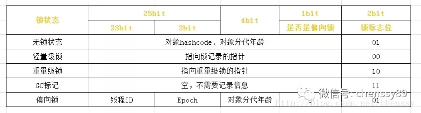
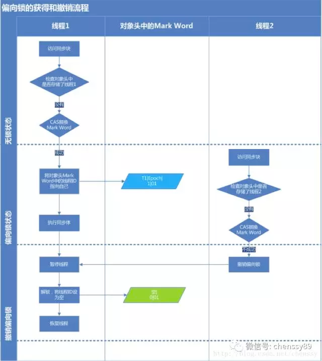
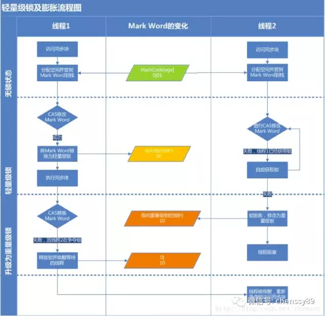
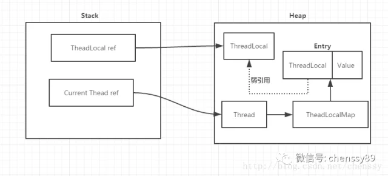
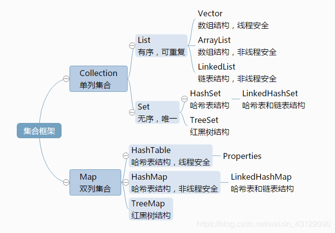
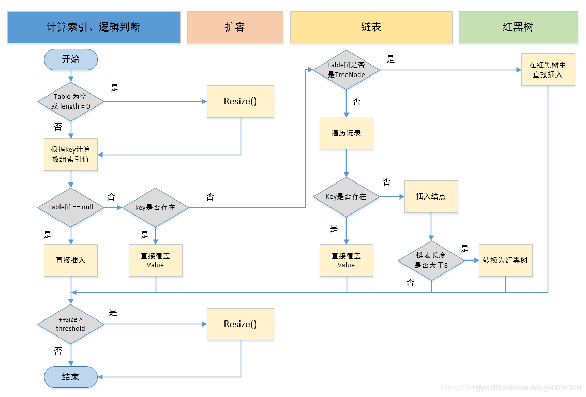
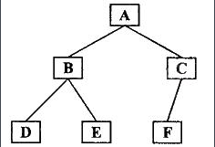
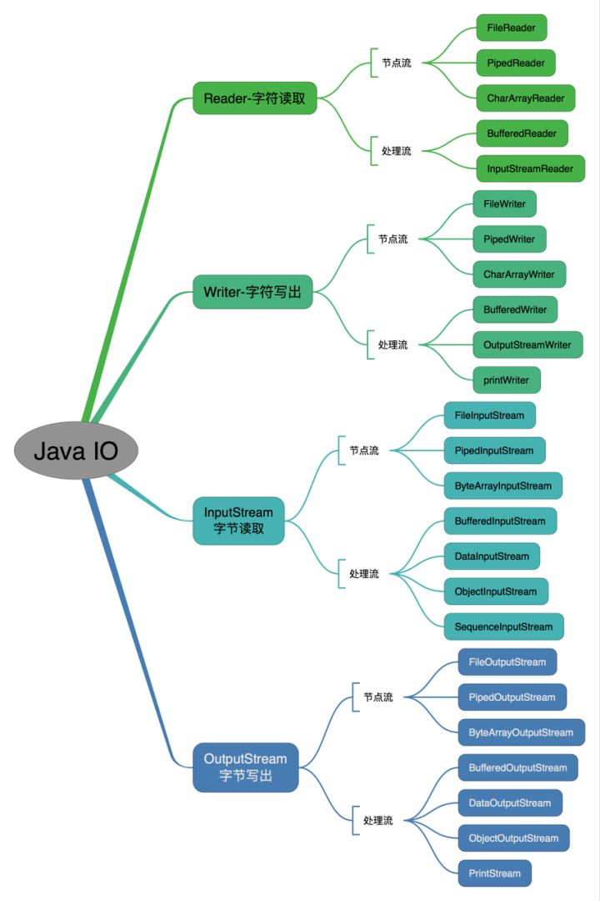
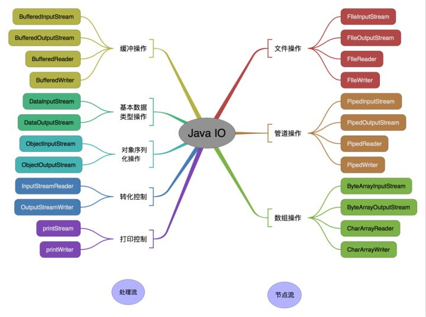

## AQS

### AQS实现原理：

- CountDownLatch、CyclicBarriar、Semaphore信号量、ReentrantLock、ReentrantReadWriteLock读写锁底层都有Sync类继承AQS类，都属于AQS框架。
- AQS中 维护了一个volatile int state（代表共享资源）和一个FIFO双向等待CLH队列（多线程争用资源被阻塞时会进入此队列）。
- 另外state的操作都是通过CAS来保证其并发修改的安全性。
- 这里volatile能够保证多线程下的可见性，当state=1则代表当前对象锁已经被占有，其他线程来加锁时则会失败，加锁失败的线程会被放入一个FIFO的等待队列中，比列会被LockSupport.park()操作挂起，等待其他获取锁的线程释放锁才能够被唤醒。
- 当线程执行完逻辑后，会释放同步状态，释放后会唤醒其后继节点，使其再次尝试获取同步状态。

### 加锁和挂起线程流程：


1. 首先调用nonfairTryAcquire()获取`state`的值。如果为0，利用`CAS`尝试抢占锁compareAndSetState(0, 1)，且设置对象独占锁线程为当前线程setExclusiveOwnerThread(Thread.currentThread())；如果不为0则说明当前对象的锁已经被其他线程所占有，接着判断占有锁的线程是否为当前线程，如果是则累加`state`值。获取锁成功。

2. 如果获取锁失败：首先执行`addWaiter(Node.EXCLUSIVE)`，加入到一个`FIFO`   CLH等待队列中。`addWaiter()`方法执行完后，会返回当前线程创建的节点信息。继续往后执行`acquireQueued(addWaiter(Node.EXCLUSIVE), arg)`逻辑。`acquireQueued()`这个方法会先判断当前传入的`Node`对应的前置节点是否为`head`，如果是则尝试加锁。加锁成功过则将当前节点设置为`head`节点，然后空置之前的`head`节点，方便后续被垃圾回收掉。如果加锁失败或者`Node`的前置节点不是`head`节点，就会通过`shouldParkAfterFailedAcquire`方法 将前一个节点的`waitStatus`变为了`SIGNAL=-1`，最后执行`parkAndChecknIterrupt`方法，调用`LockSupport.park()`挂起当前线程，等着其他线程释放锁来唤醒它。

### 释放锁和唤醒线程流程：

1. 首先是拥有锁的线程释放锁，释放锁后会唤醒`head`节点的后置节点。
2. 首先会执行`tryRelease()`方法，执行完`ReentrantLock.tryRelease()`后，`state`被设置成0，Lock对象的独占锁被设置为null。如果`tryRelease`执行成功，则继续判断`head`节点的`waitStatus`是否为0，就会执行`unparkSuccessor()`方法来唤醒`head`的后置节点。`unparkSuccessor()`主要是将`head`节点的`waitStatus`设置为0，然后解除`head`节点`next`的指向，使`head`节点空置，等待着被垃圾回收。然后唤醒的节点就可以执行加锁流程了。

--------------------

## CAS

- CAS，Compare And Swap，即比较和交换。
- 在CAS中有三个参数：内存值V、旧的预期值A、要更新的值B，当且仅当内存值V的值等于旧的预期值A时才会将内存值V的值修改为B，否则什么都不干。
- CAS虽然高效地解决了原子操作，但是还是存在一些缺陷的，主要表现在三个方法：循环时间太长、只能保证一个共享变量原子操作、ABA问题。
    - 循环时间太长：如果自旋CAS长时间地不成功，则会给CPU带来非常大的开销。在JUC中有些地方就限制了CAS自旋的次数，例如BlockingQueue的SynchronousQueue。Java 8 推出了一个新的类，LongAdder，他就是尝试使用分段 CAS 以及自动分段迁移的方式来大幅度提升多线程高并发执行 CAS 操作的性能.
    - 只能保证一个共享变量原子操作：看了CAS的实现就知道这只能针对一个共享变量，如果是多个共享变量就只能使用锁了，当然如果你有办法把多个变量整成一个变量，利用CAS也不错。
    - ABA问题：对于ABA问题其解决方案是加上版本号，即在每个变量都加上一个版本号，每次改变时加1，即A —> B —> A，变成1A —> 2B —> 3A。

------------------

## JMM(内存模型)

- Java采用内存共享的模式来实现线程之间的通信。
- 并发编程模式中，势必会遇到三个概念：
    - 原子性：一个操作或者多个操作要么全部执行要么全部不执行；
    - 可见性：当多个线程同时访问一个共享变量时，如果其中某个线程更改了该共享变量，其他线程应该可以立刻看到这个改变；
    - 有序性：程序的执行要按照代码的先后顺序执行；


-----------

## DCL（中卫双重检查锁定）

```
public class Singleton {
    // 通过volatile关键字来确保创建对象的三个步骤的指令不重排
    private volatile static Singleton singleton;

    private Singleton(){}

    public static Singleton getInstance(){
        if(singleton == null){
            synchronized (Singleton.class){
                if(singleton == null){
                    singleton = new Singleton();
                }
            }
        }
        return singleton;
    }
}
```
---------------------

## volatile

- 在JMM（内存模型）中，线程之间的通信采用共享内存来实现的。
- volatile的写内存语义是直接刷新到主内存中，读的内存语义是直接从主内存中读取。
- 实现volatile的内存语义JMM会限制重排序，其重排序规则如下：
    - 如果当前为volatile读时，后面的操作不能重排序。（这个操作确保volatile读之后的操作不会被编译器重排序到volatile读之前）；
    - 如果当前为volatile写时，前面的操作不能重排序。（这个操作确保volatile写之前的操作不会被编译器重排序到volatile写之后）；
    - 如果当前为volatile写时，紧接操作为volatile读时，不能重排序。
- volatile的底层是通过插入内存屏障实现的。

    - 在每一个volatile写操作前面插入一个StoreStore屏障
    - 在每一个volatile写操作后面插入一个StoreLoad屏障
    - 在每一个volatile读操作后面插入一个LoadLoad屏障
    - 在每一个volatile读操作后面插入一个LoadStore屏障

    1. StoreStore屏障可以保证在volatile写之前，其前面的所有普通写操作都已经刷新到主内存中。
    2. StoreLoad屏障的作用是避免volatile写与后面可能有的volatile读/写操作重排序。
    3. LoadLoad屏障用来禁止处理器把上面的volatile读与下面的普通读重排序。
    4. LoadStore屏障用来禁止处理器把上面的volatile读与下面的普通写重排序。

- volatile可以保证可见性，对一个volatile的读，总可以看到对这个变量最终的写；
- volatile不可以保证原子性，volatile对单个读/写具有原子性（32位Long、Double），但是复合操作除外，例如i++;
- volatile可以保证有序性，JVM底层采用“内存屏障”来实现。
- volatile 主要解决的是一个线程修改变量值之后，其他线程立马可以读到最新的值，是解决这个问题的，也就是可见性！但是如果是多个线程同时修改一个变量的值，那还是可能出现多线程并发的安全问题，导致数据值修改错乱，volatile 是不负责解决这个问题的，也就是不负责解决原子性问题！原子性问题，得依赖 synchronized、ReentrantLock 等加锁机制来解决。
- 对一个变量加了 volatile 关键字修饰之后，只要一个线程修改了这个变量的值，立马强制刷回主内存。接着强制过期其他线程的本地工作内存中的缓存，最后其他线程读取变量值的时候，强制重新从主内存来加载最新的值！

### 概述

- 在JMM（内存模型）中，线程之间的通信采用共享内存来实现的。
- volatile保证了可见性。因为volatile写时，强制刷新数据回主内存；volatile读时，强制从主内存读数据。
- volatile保证了有序性。JVM底层采用“内存屏障”来实现。在每一个volatile写操作前面插入一个StoreStore屏障；在每一个volatile写操作后面插入一个StoreLoad屏障；在每一个volatile读操作后面插入一个LoadLoad屏障；在每一个volatile读操作后面插入一个LoadStore屏障。这些内存屏障主要解决了普通读写和volatile读写的重排序问题。
- volatile无法保证原子性。volatile对单个读/写具有原子性，但是复合操作除外，例如i++。原子性问题，得依赖 synchronized、ReentrantLock 等加锁机制来解决。

-------------------

## synchronized

- 普通同步方法，锁是当前实例对象；静态同步方法，锁是当前类的class对象；同步代码块，锁是括号里面的对象。
- 同步代码块：同步代码块是使用monitorenter和monitorexit指令实现的。monitorenter指令插入到同步代码块的开始位置，monitorexit指令插入到同步代码块的结束位置，JVM需要保证每一个monitorenter都有一个monitorexit与之相对应。任何对象都有一个monitor与之相关联，当且一个monitor被持有之后，他将处于锁定状态。线程执行到monitorenter指令时，将会尝试获取对象所对应的monitor所有权，即尝试获取对象的锁。
- 同步方法：在Class文件的方法表中将该方法的accessflags字段中的synchronized标志位置1，表示该方法是同步方法，并使用调用该方法的对象或该方法所属的Class在JVM的内部对象做为锁对象。
- Java对象头和monitor是实现synchronized的基础，synchronized用的锁是存在Java对象头里的。对象头包含哈希码（HashCode）、GC分代年龄、锁状态标志、线程持有的锁、偏向线程 ID等等。

- jdk1.6对锁的实现引入了大量的优化，如自旋锁、适应性自旋锁、锁消除、锁粗化、偏向锁、轻量级锁等技术来减少锁操作的开销。
- 锁消除：JVM检测到不可能存在共享数据竞争，这是JVM会对这些同步锁进行锁消除。锁消除的依据是逃逸分析的数据支持。例如方法中定义的局部变量没有逃逸出方法之外，可以加锁操作消除。
- 锁粗化：如果一系列的连续加锁解锁操作，可能会导致不必要的性能损耗，所以引入锁粗化的概念。锁粗化概念比较好理解，就是将多个连续的加锁、解锁操作连接在一起，扩展成一个范围更大的锁。例如一个for不断枷锁解锁，可以把锁放到for循环外。

- 锁主要存在四种状态，依次是：无锁状态、偏向锁状态、轻量级锁状态、重量级锁状态，他们会随着竞争的激烈而逐渐升级。锁只可以升级不可降级，这种策略是为了提高获得锁和释放锁的效率。
- 自旋锁：就是让该线程等待一段时间，不断循环去尝试获取锁。
- 自适应自旋锁：自旋的次数不再是固定的，它是由前一次在同一个锁上的自旋时间及锁的拥有者的状态来决定。线程如果自旋成功了，那么下次自旋的次数会更加多，反之，如果对于某个锁，很少有自旋能够成功的，那么在以后要或者这个锁的时候自旋的次数会减少。
- 对象头的Mark Word结构图
    
- 偏向锁
    

    - 获取锁
        1. 检测Mark Word是否为可偏向状态，即是否为偏向锁1，锁标识位为01；
        2. 若为可偏向状态，则测试线程ID是否为当前线程ID，如果是，执行同步代码块；
        3. 如果线程ID不为当前线程ID，则通过CAS操作竞争锁，竞争成功，则将Mark Word的线程ID替换为当前线程ID，执行同步代码块；
        4. 通过CAS竞争锁失败，证明当前存在多线程竞争情况，获得偏向锁的线程被挂起，偏向锁升级为轻量级锁，然后被阻塞的线程继续往下执行同步代码块；

    - 释放锁：偏向锁的释放采用了一种只有竞争才会释放锁的机制，线程是不会主动去释放偏向锁，需要等待其他线程来竞争。
        1. 暂停拥有偏向锁的线程，判断锁对象是否还处于被锁定状态；
        2. 撤销偏向锁，恢复到无锁状态（01）或者轻量级锁的状态。
- 轻量级锁
    
    

    - 获取锁

        1. 判断当前对象是否处于无锁状态（hashcode、0、01），若是，则JVM首先将在当前线程的栈帧中建立一个名为锁记录（Lock Record）的空间，用于存储锁对象目前的Mark Word的拷贝；
        2. JVM利用CAS操作尝试将对象的Mark Word更新为指向Lock Record的指针，如果成功表示竞争到锁，则将锁标志位变成00（表示此对象处于轻量级锁状态），执行同步代码块；
        3. 否则只能说明该锁对象已经被其他线程抢占了，这时轻量级锁需要膨胀为重量级锁，锁标志位变成10，后面等待的线程将会进入阻塞状态。

    - 释放锁
        1. 取出在获取轻量级锁保存在栈中的数据；
        2. 用CAS操作将取出的数据替换当前对象的Mark Word中，如果成功，则说明释放锁成功；
        3. 如果CAS操作替换失败，说明有其他线程尝试获取该锁，则需要在释放锁的同时需要唤醒被挂起的线程。

- 重量级锁：重量级锁通过对象内部的监视器（monitor）实现，操作系统实现线程之间的切换需要从用户态到内核态的切换，切换成本非常高。

### 概述

- 普通同步方法，锁是当前实例对象；静态同步方法，锁是当前类的class对象；同步代码块，锁是括号里面的对象。
- 同步方法：将该方法的accessflags字段中的synchronized标志位置1，表示该方法是同步方法，并使用调用该方法的对象或该方法所属的Class在JVM的内部对象做为锁对象。
- 同步代码块：同步代码块是通过monitor来实现的，在同步代码块的开始位置插入monitorenter指令，同步代码块的结束位置插入monitorexit指令。
- synchronized用的锁是存在Java对象头里的。对象头包含哈希码（HashCode）、GC分代年龄、锁状态标志、线程持有的锁、偏向线程 ID等等。
- jdk1.6对锁的实现引入了大量的优化，如自旋锁、适应性自旋锁、锁消除、锁粗化、偏向锁、轻量级锁等技术来减少锁操作的开销。
- 锁主要存在四种状态，依次是：无锁状态、偏向锁状态、轻量级锁状态、重量级锁状态，他们会随着竞争的激烈而逐渐升级。锁只可以升级不可降级，这种策略是为了提高获得锁和释放锁的效率。
- 偏向锁：检测Mark Word锁标志位是否为可偏向状态，若为可偏向状态，则测试线程ID是否为当前线程ID，如果是，执行同步代码块；如果线程ID不为当前线程ID，则通过CAS操作竞争锁，竞争成功，则将Mark Word的线程ID替换为当前线程ID，执行同步代码块；通过CAS竞争锁失败，证明当前存在多线程竞争情况，获得偏向锁的线程被挂起，偏向锁升级为轻量级锁，然后被阻塞的线程继续往下执行同步代码块；
- 轻量级锁：判断当前对象是否处于无锁状态，若是，则JVM首先将在当前线程的栈帧中建立一个名为锁记录（Lock Record）的空间，用于存储锁对象目前的Mark Word的拷贝；JVM利用CAS操作尝试将对象的Mark Word更新为指向Lock Record的指针，如果成功表示竞争到锁，则将锁标志位变成00（表示此对象处于轻量级锁状态），执行同步代码块；否则只能说明该锁对象已经被其他线程抢占了，这时轻量级锁需要膨胀为重量级锁，锁标志位变成10，后面等待的线程将会进入阻塞状态。
- 重量级锁：重量级锁通过对象内部的监视器（monitor）实现，操作系统实现线程之间的切换需要从用户态到内核态的切换，切换成本非常高。


---------------------

## as-if-serial语义

as-if-serial语义的意思是，所有的操作均可以为了优化而被重排序，但是你必须要保证重排序后执行的结果不能被改变，编译器、runtime、处理器都必须遵守as-if-serial语义。注意as-if-serial只保证单线程环境，多线程环境下无效。

## happens-before原则

- 如果一个操作happens-before另一个操作，那么第一个操作的执行结果将对第二个操作可见，而且第一个操作的执行顺序排在第二个操作之前。
- 两个操作之间存在happens-before关系，并不意味着一定要按照happens-before原则制定的顺序来执行。如果重排序之后的执行结果与按照happens-before关系来执行的结果一致，那么这种重排序并不非法。

---------------

## ThreadLoacal



- ThreadLocal与线程同步机制不同，线程同步机制是多个线程共享同一个变量，而ThreadLocal是为每一个线程创建一个单独的变量副本，故而每个线程都可以独立地改变自己所拥有的变量副本，而不会影响其他线程所对应的副本。（ThreadLocal在多线程下，每个线程对共享变量都会创建一份变量副本去操作，不会影响其他线程的变量副本）
- ThreadLocal内部还有一个静态内部类ThreadLocalMap，该内部类才是实现线程隔离机制的关键。ThreadLocalMap提供了一种用键值对方式存储每一个线程的变量副本的方法，key为当前ThreadLocal对象，value则是对应线程的变量副本。
- ThreadLocal为什么会内存泄漏？每个Thread都有一个ThreadLocal.ThreadLocalMap的map，该map的key为ThreadLocal实例，它为一个弱引用，我们知道弱引用有利于GC回收。当ThreadLocal的key == null时，GC就会回收这部分空间，但是value却不一定能够被回收，因为他还与Current Thread存在一个强引用关系。由于存在这个强引用关系，会导致value无法回收。如果这个线程对象不会销毁那么这个强引用关系则会一直存在，就会出现内存泄漏情况。那么要怎么避免这个问题呢？在ThreadLocalMap中的setEntry()、getEntry()，如果遇到key == null的情况，会对value设置为null。当然我们也可以显示调用ThreadLocal的remove()方法进行处理。

个人术语：

- ThreadLocal在多线程下，每个线程对共享变量都会创建一份变量副本去操作，不会影响其他线程的变量副本。
- ThreadLocal内部有一个静态内部类ThreadLocalMap，该内部类才是实现线程隔离机制的关键。ThreadLocalMap是以key/value的形式存在的，key为当前ThreadLocal对象，value则是对应线程的变量副本。
- key为ThreadLocal实例，它为一个弱引用，弱引用有利于GC回收。当ThreadLocal的key == null时，GC就会回收这部分空间，但是value却不一定能够被回收，因为变量副本还与当前线程存在一个强引用关系，如果这个线程对象不会销毁那么这个强引用关系则会一直存在，可能出现内存泄漏情况。在ThreadLocalMap中的set/get方法中，当key == null的情况，会对value设置为null，有利于GC回收。当然我们也可以显示调用ThreadLocal的remove()方法进行处理。

-----------------

## 什么是线程和进程

- 进程：进程是程序的一次执行过程，是系统运行程序的基本单位。当我们启动 main 函数时其实就是启动了一个 JVM 的进程，而 main 函数所在的线程就是这个进程中的一个线程，也称主线程。
- 线程：一个进程在其执行的过程中可以产生多个线程。多个线程共享进程的堆和方法区资源，但每个线程有自己的程序计数器、虚拟机栈和本地方法栈。

-----------------

## 多线程

并发编程的目的就是为了能提高程序的执行效率提高程序运行速度，但并发编程可能会遇到很多问题，比如：内存泄漏、上下文切换、死锁还有受限于硬件和软件的资源闲置问题。

-----------

## 线程的生命周期和状态

当线程被创建并启动以后，它既不是一启动就进入了执行状态，也不是一直处于执行状态。在线程的生命周期中，它要经过新建(New)、就绪（Runnable）、运行（Running）、阻塞(Blocked)和死亡(Dead)5 种状态。尤其是当线程启动以后，它不可能一直"霸占"着 CPU 独自运行，所以 CPU 需要在多条线程之间切换，于是线程状态也会多次在运行、阻塞之间切换。

### 新建状态（NEW）

当程序使用 new 关键字创建了一个线程之后，该线程就处于新建状态，此时仅由 JVM 为其分配内存，并初始化其成员变量的值

### 就绪状态（RUNNABLE）

当线程对象调用了 start()方法之后，该线程处于就绪状态。Java 虚拟机会为其创建方法调用栈和程序计数器，等待调度运行。

### 运行状态（RUNNING）

如果处于就绪状态的线程获得了 CPU，开始执行 run()方法的线程执行体，则该线程处于运行状态。

### 阻塞状态（BLOCKED）

阻塞状态是指线程因为某种原因放弃了 cpu 使用权，也即让出了 cpu timeslice，暂时停止运行。直到线程进入可运行(runnable)状态，才有机会再次获得 cpu timeslice 转到运行(running)状态。阻塞的情况分三种：等待阻塞（o.wait->等待对列），同步阻塞(lock->锁池)，其他阻塞(sleep/join)。

### 线程死亡（DEAD）

线程结束后就是死亡状态。


----------------

## start 与 run 区别

start（）方法来启动线程，真正实现了多线程运行。这时无需等待 run 方法体代码执行完毕，可以直接继续执行下面的代码。

通过调用 Thread 类的 start()方法来启动一个线程， 这时此线程是处于就绪状态， 并没有运行。

方法 run()称为线程体，它包含了要执行的这个线程的内容，线程就进入了运行状态，开始运行 run 函数当中的代码。 Run 方法运行结束， 此线程终止。然后 CPU 再调度其它线程（就是一个方法）。


---------------

## sleep() 方法和 wait() 方法区别和共同点

- **两者最主要的区别在于：sleep 方法没有释放锁，而 wait 方法释放了锁 。**
- 两者都可以暂停线程的执行。
- Wait 通常被用于线程间交互/通信，sleep 通常被用于暂停执行。
- **wait() 方法被调用后，线程不会自动苏醒，需要别的线程调用同一个对象上的 notify() 或者 notifyAll() 方法。sleep() 方法执行完成后，线程会自动苏醒。或者可以使用 wait(long timeout)超时后线程会自动苏醒。**

------------------

## 线程池的主要参数

- corePoolSize（线程池核心线程大小）：线程池中会维护一个最小的线程数量，即使这些线程处理空闲状态，他们也不会 被销毁，除非设置了allowCoreThreadTimeOut。这里的最小线程数量即是corePoolSize。
- maximumPoolSize（线程池最大线程数量）：一个任务被提交到线程池后，首先会缓存到工作队列（后面会介绍）中，如果工作队列满了，则会创建一个新线程，然后从工作队列中的取出一个任务交由新线程来处理，而将刚提交的任务放入工作队列。线程池不会无限制的去创建新线程，它会有一个最大线程数量的限制，这个数量即由maximunPoolSize来指定。
- keepAliveTime（空闲线程存活时间）：一个线程如果处于空闲状态，并且当前的线程数量大于corePoolSize，那么在指定时间后，这个空闲线程会被销毁，这里的指定时间由keepAliveTime来设定
- unit（空间线程存活时间单位）：keepAliveTime的计量单位
- workQueue（工作队列）：新任务被提交后，会先进入到此工作队列中，任务调度时再从队列中取出任务。jdk中提供了四种工作队列：
    - ArrayBlockingQueue：基于数组的有界阻塞队列，按FIFO排序。新任务进来后，会放到该队列的队尾，有界的数组可以防止资源耗尽问题。当线程池中线程数量达到corePoolSize后，再有新任务进来，则会将任务放入该队列的队尾，等待被调度。如果队列已经是满的，则创建一个新线程，如果线程数量已经达到maxPoolSize，则会执行拒绝策略。
    - LinkedBlockingQuene：基于链表的无界阻塞队列（其实最大容量为Interger.MAX），按照FIFO排序。由于该队列的近似无界性，当线程池中线程数量达到corePoolSize后，再有新任务进来，会一直存入该队列，而不会去创建新线程直到maxPoolSize，因此使用该工作队列时，参数maxPoolSize其实是不起作用的。
    - SynchronousQuene：一个不缓存任务的阻塞队列，生产者放入一个任务必须等到消费者取出这个任务。也就是说新任务进来时，不会缓存，而是直接被调度执行该任务，如果没有可用线程，则创建新线程，如果线程数量达到maxPoolSize，则执行拒绝策略。
    - PriorityBlockingQueue：具有优先级的无界阻塞队列，优先级通过参数Comparator实现。
- threadFactory（线程工厂）：创建一个新线程时使用的工厂，可以用来设定线程名、是否为daemon线程等等
- handler（拒绝策略）：当工作队列中的任务已到达最大限制，并且线程池中的线程数量也达到最大限制，这时如果有新任务提交进来，该如何处理呢。这里的拒绝策略，就是解决这个问题的，jdk中提供了4中拒绝策略：
    - CallerRunsPolicy：该策略下，在调用者线程中直接执行被拒绝任务的run方法，除非线程池已经shutdown，则直接抛弃任务。
    - AbortPolicy：该策略下，直接丢弃任务，并抛出RejectedExecutionException异常。
    - DiscardPolicy：该策略下，直接丢弃任务，什么都不做。
    - DiscardOldestPolicy：该策略下，抛弃进入队列最早的那个任务，然后尝试把这次拒绝的任务放入队列


个人术语：

- corePoolSize（线程池核心线程大小）：线程池中会维护一个最小的线程数量，即使这些线程处理空闲状态，他们也不会 被销毁。
- maximumPoolSize（线程池最大线程数量）：最大线程数量。一个任务被提交到线程池后，首先会缓存到工作队列中，如果工作队列满了，则会创建一个新线程来处理最早的一个任务。线程池不会无限制的去创建新线程，它会有一个最大线程数量的限制。
- keepAliveTime（空闲线程存活时间）：一个线程如果处于空闲状态，并且当前的线程数量大于corePoolSize，那么在指定时间后，这个空闲线程会被销毁
- unit（空间线程存活时间单位）：空闲线程存活时间的计量单位
- threadFactory（线程工厂）：创建一个新线程时使用的工厂，可以用来设定线程名等
- workQueue（工作队列）：新任务被提交后，会先进入到此工作队列中，任务调度时再从队列中取出任务。jdk中提供了四种工作队列：
    - ArrayBlockingQueue：基于数组的有界阻塞队列，按FIFO排序。新任务进来后，会放到该队列的队尾，有界的数组可以防止资源耗尽问题。当线程池中线程数量达到corePoolSize后，再有新任务进来，则会将任务放入该队列的队尾，等待被调度。如果队列已经是满的，则创建一个新线程，如果线程数量已经达到maxPoolSize，则会执行拒绝策略。
    - LinkedBlockingQuene：基于链表的无界阻塞队列，按照FIFO排序。由于该队列的近似无界性，当线程池中线程数量达到corePoolSize后，再有新任务进来，会一直存入该队列，而不会去创建新线程，因此使用该工作队列时，参数maxPoolSize其实是不起作用的。
    - SynchronousQuene：一个不缓存任务的阻塞队列，生产者放入一个任务必须等到消费者取出这个任务。也就是说新任务进来时，不会缓存，而是直接被调度执行该任务，如果没有可用线程，则创建新线程，如果线程数量达到maxPoolSize，则执行拒绝策略。
    - PriorityBlockingQueue：具有优先级的无界阻塞队列，优先级通过参数Comparator实现。
- handler（拒绝策略）：当工作队列中的任务已到达最大限制，并且线程池中的线程数量也达到最大限制，这时如果有新任务提交进来，该如何处理呢。这里的拒绝策略，就是解决这个问题的，jdk中提供了4中拒绝策略：
    - CallerRunsPolicy：该策略下，在调用者线程中直接执行被拒绝任务的run方法，除非线程池已经shutdown，则直接抛弃任务。
    - AbortPolicy：该策略下，直接丢弃任务，并抛出RejectedExecutionException异常。
    - DiscardPolicy：该策略下，直接丢弃任务，什么都不做。
    - DiscardOldestPolicy：该策略下，抛弃进入队列最早的那个任务，然后尝试把这次拒绝的任务放入队列

--------------------

## 线程池的优势

- 降低系统资源消耗，通过重用已存在的线程，降低线程创建和销毁造成的消耗；
- 提高系统响应速度，当有任务到达时，通过复用已存在的线程，无需等待新线程的创建便能立即执行；
- 方便线程并发数的管控。因为线程若是无限制的创建，可能会导致内存占用过多而产生OOM，并且会造成cpu过度切换。

--------

## 线程池为什么要使用阻塞队列而不使用非阻塞队列

- 因为线程若是无限制的创建，可能会导致内存占用过多而产生OOM，并且会造成cpu过度切换。
- 阻塞队列可以保证任务队列中没有任务时阻塞获取任务的线程，使得线程进入wait状态，释放cpu资源。当队列中有任务时才唤醒对应线程从队列中取出消息进行执行。
- 使得在线程不至于一直占用cpu资源。

---------


## 如何配置线程池

- CPU密集型任务：尽量使用较小的线程池，一般为CPU核心数+1。 因为CPU密集型任务使得CPU使用率很高，若开过多的线程数，会造成CPU过度切换。
- IO密集型任务：可以使用稍大的线程池，一般为2*CPU核心数。 IO密集型任务CPU使用率并不高，因此可以让CPU在等待IO的时候有其他线程去处理别的任务，充分利用CPU时间。

---------

## 线程池的execute()和submit()方法

- execute()，执行一个任务，没有返回值。
- submit()，提交一个线程任务，有返回值。submit(Callable<T> task)能获取到它的返回值，通过future.get()获取（阻塞直到任务执行完）。

--------------------

## 获取 Class 对象的 3 种方法

### 调用某个对象的 getClass()方法

```
Person p = new Person();
Class clazz = p.getClass();
```

### 调用某个类的 class 属性来获取该类对应的 Class 对象

```
Class clazz = Person.class;
```

### 使用 Class 类中的 forName()静态方法(最安全/性能最好)

```
Class clazz=Class.forName("类的全路径"); (最常用)
```
-----------------

## 创建对象的两种方法

```
//获取 Person 类的 Class 对象
 Class clazz=Class.forName("reflection.Person");
 //使用.newInstane 方法创建对象
 Person p=(Person) clazz.newInstance();
//获取构造方法并创建对象
 Constructor c=clazz.getDeclaredConstructor(String.class,String.class,int.class);
 //创建对象并设置属性
 Person p1=(Person) c.newInstance("李四","男",20);
```

### Class 对象的 newInstance()

使用 Class 对象的 newInstance()方法来创建该 Class 对象对应类的实例，但是这种方法要求该 Class 对象对应的类有默认的空构造器。

### 调用 Constructor 对象的 newInstance()

先使用 Class 对象获取指定的 Constructor 对象，再调用 Constructor 对象的 newInstance()方法来创建 Class 对象对应类的实例,通过这种方法可以选定构造方法创建实例。


--------------

## 集合框架



-----------------

## ArrayList 和 LinkedList 的区别

- 数据结构实现：ArrayList 是动态数组的数据结构实现，而 LinkedList 是双向链表的数据结构实现。
- 随机访问效率：ArrayList 比 LinkedList 在随机访问的时候效率要高，因为 LinkedList 是线性的数据存储方式，所以需要移动指针从前往后依次查找。
- 增加和删除效率：在非首尾的增加和删除操作，LinkedList 要比 ArrayList 效率要高，因为 ArrayList 增删操作要影响数组内的其他数据的下标。
- 内存空间占用：LinkedList 比 ArrayList 更占内存，因为 LinkedList 的节点除了存储数据，还存储了两个引用，一个指向前一个元素，一个指向后一个元素。
- 线程安全：ArrayList 和 LinkedList 都是不同步的，也就是不保证线程安全；
- 综合来说，在需要频繁读取集合中的元素时，更推荐使用 ArrayList，而在插入和删除操作较多时，更推荐使用 LinkedList。
- LinkedList 的双向链表也叫双链表，是链表的一种，它的每个数据结点中都有两个指针，分别指向直接后继和直接前驱。所以，从双向链表中的任意一个结点开始，都可以很方便地访问它的前驱结点和后继结点。

----------------
## ArrayList 和 Vector 的区别

- 这两个类都实现了 List 接口（List 接口继承了 Collection 接口），他们都是有序集合
    - 线程安全：Vector 使用了 Synchronized 来实现线程同步，是线程安全的，而 ArrayList 是非线程安全的。
    - 性能：ArrayList 在性能方面要优于 Vector。
    - 扩容：ArrayList 和 Vector 都会根据实际的需要动态的调整容量，只不过在 Vector 扩容每次会增加 1 倍，而 ArrayList 只会增加 50%。
- Vector类的所有方法都是同步的。可以由两个线程安全地访问一个Vector对象、但是一个线程访问Vector的话代码要在同步操作上耗费大量的时间。
- Arraylist不是同步的，所以在不需要保证线程安全时时建议使用Arraylist。

-------------

## CopyOnWriteArrayList的底层原理

- CopyOnWriteArrayList是线程安全的，写操作的时候会加锁，防止出现并发写入丢失数据的问题
- CopyOnWriteArrayList底层也是数组实现的，在添加元素的时候，会复制一个新的数组，写操作在新数组上进行，读操作在原数组经行，写操作结束之后会把原数组指向新数组
- CopyOnWriteArrayList允许在写操作时来读取数据，大大提高了读的性能，因此适合读多写少的应用场景，但是CopyOnWriteArrayList会比较占内存，同时可能读到的数据不是实时最新的数据，所以不适合实时性要求很高的场景


--------------

## HashSet的实现原理

HashSet 是基于 HashMap 实现的，HashSet的值存放于HashMap的key上，HashMap的value统一为present，因此 HashSet 的实现比较简单，相关 HashSet 的操作，基本上都是直接调用底层 HashMap 的相关方法来完成，HashSet 不允许重复的值。

--------------------

## HashSet如何检查重复

当把对象加入HashSet时，HashSet会先计算对象的hashcode值来判断对象加入的位置，同时也会与其他加入的对象的hashcode值作比较，如果没有相符的hashcode，HashSet会假设对象没有重复出现。但是如果发现有相同hashcode值的对象，这时会调用equals（）方法来检查hashcode相等的对象是否真的相同。如果两者相同，HashSet就不会让加入操作成功。

-----------------

## HashMap 的长度为什么是2的幂次方

为了能让 HashMap 存取高效，尽量减少hash冲突，也就是要尽量把数据分配均匀，每个链表/红黑树长度大致相同。

--------

## HashMap 与 HashTable 的区别

- 线程安全： HashMap 是非线程安全的，HashTable 是线程安全的；HashTable 内部的方法基本都经过 synchronized 修饰。（如果你要保证线程安全的话就使用 ConcurrentHashMap ）；
- 效率： 因为线程安全的问题，HashMap 要比 HashTable 效率高一点。另外，HashTable 基本被淘汰，不要在代码中使用它；（如果你要保证线程安全的话就使用 ConcurrentHashMap ）；
- 对Null key 和Null value的支持： HashMap 中，null 可以作为键，这样的键只有一个，可以有一个或多个键所对应的值为 null。但是在 HashTable 中 put 进的键值只要有一个 null，直接抛NullPointerException。
- 初始容量大小和每次扩充容量大小的不同 ：创建时如果不指定容量初始值，Hashtable 默认的初始大小为11，之后每次扩充，容量变为原来的2n+1。HashMap 默认的初始化大小为16。之后每次扩充，容量变为原来的2倍。创建时如果给定了容量初始值，那么 Hashtable 会直接使用你给定的大小，而 HashMap 会将其扩充为2的幂次方大小。也就是说 HashMap 总是使用2的幂作为哈希表的大小.
- 底层数据结构： JDK1.8 以后的 HashMap 在解决哈希冲突时有了较大的变化，当链表长度大于阈值（默认为8）时，将链表转化为红黑树，以减少搜索时间。Hashtable 没有这样的机制。
- 推荐使用：在 Hashtable 的类注释可以看到，Hashtable 是保留类不建议使用，推荐在单线程环境下使用 HashMap 替代，如果需要多线程使用则用 ConcurrentHashMap 替代。

---------------------

## HashMap的put方法的具体流程



1. 判断键值对数组table[i]是否为空或为null，否则执行resize()进行扩容；
2. 根据键值key计算hash值得到插入的数组索引i，如果table[i]==null，直接新建节点添加，转向⑥，如果table[i]不为空，转向③；
3. 判断table[i]的首个元素是否和key一样，如果相同直接覆盖value，否则转向④，这里的相同指的是hashCode以及equals；
4. 判断table[i] 是否为treeNode，即table[i] 是否是红黑树，如果是红黑树，则直接在树中插入键值对，否则转向⑤；
5. 遍历table[i]，判断链表长度是否大于8，大于8的话把链表转换为红黑树，在红黑树中执行插入操作，否则进行链表的插入操作；遍历过程中若发现key已经存在直接覆盖value即可；
6. 插入成功后，判断实际存在的键值对数量size是否超多了最大容量threshold，如果超过，进行扩容。

----------------------

## ConcurrentHashMap 和 Hashtable 的区别

ConcurrentHashMap 和 Hashtable 的区别主要体现在实现线程安全的方式上不同。

- 底层数据结构： JDK1.7的 ConcurrentHashMap 底层采用 分段的数组+链表 实现，JDK1.8 采用的数据结构跟HashMap1.8的结构一样，数组+链表/红黑二叉树。Hashtable 和 JDK1.8 之前的 HashMap 的底层数据结构类似都是采用 数组+链表 的形式，数组是 HashMap 的主体，链表则是主要为了解决哈希冲突而存在的；
- 实现线程安全的方式：
    - 在JDK1.7的时候，ConcurrentHashMap（分段锁） 对整个桶数组进行了分割分段(Segment)，每一把锁只锁容器其中一部分数据，多线程访问容器里不同数据段的数据，就不会存在锁竞争，提高并发访问率。（默认分配16个Segment，比Hashtable效率提高16倍。） 到了 JDK1.8 的时候已经摒弃了Segment的概念，而是直接用 Node 数组+链表+红黑树的数据结构来实现，并发控制使用 synchronized 和 CAS 来操作。（JDK1.6以后 对 synchronized锁做了很多优化） 整个看起来就像是优化过且线程安全的 HashMap，虽然在JDK1.8中还能看到 Segment 的数据结构，但是已经简化了属性，只是为了兼容旧版本；
    - Hashtable(同一把锁) :使用 synchronized 来保证线程安全，效率非常低下。当一个线程访问同步方法时，其他线程也访问同步方法，可能会进入阻塞或轮询状态，如使用 put 添加元素，另一个线程不能使用 put 添加元素，也不能使用 get，竞争会越来越激烈效率越低。

----------

## ConcurrentHashMap 底层具体实现知道吗？实现原理是什么？

1. ConcurrentHashMap在JDK1.7时是按照分段锁Segment和HashEntry实现线程安全的。每个ConcurrentHashMap里面包含有一个Segment数组，Segment数组里面包含有HashEntry数组，hashEntry是一个链表结构的元素。当对某个 HashEntry 数组的数据进行修改时，必须首先获得对应的 Segment的锁。
2. ConcurrentHashMap在JDK1.8时取消了Segment分段锁，采用Node数组和CAS和synchronized来保证线程安全。synchronized只锁定当前链表或红黑二叉树的首节点，这样只要hash不冲突，就不会产生并发，效率又提升N倍。

---------------

## IoC

**IoC又叫控制反转，是一种设计思想。IoC的意思就是将原本在程序中手动创建对象的控制权，交给Spring框架来管理。IoC容器实际上就是个Map，以key，value的形式存在，map中存放的就是各种对象。IoC容器解决了各种对象之前复杂的依赖关系，只要加个注解引用就可以。**

---------------

## AOP

**AOP又叫面向切面编程，将那些与业务无关的公共调用的逻辑（如事务处理，日志管理，权限管理等）封装起来，减少代码的冗余度，也降低模块间的耦合度。Spring AOP是基于动态代理的。当被代理的对象，实现了某个接口，那么就会使用JDK Proxy，否则将会使用Cglib，这个时候Cglib会生成一个被代理对象的子类来代理。**

----------------

## Spring AOP 和 AspectJ AOP 区别

**Spring AOP 属于运行时增强，而 AspectJ 是编译时增强。 Spring AOP 基于代理(Proxying)，而 AspectJ 基于字节码操作(Bytecode Manipulation)。当切面太多的话，最好选择 AspectJ ，它比Spring AOP 快很多**。

--------------

## SpringMVC 工作原理

1. 客户端的所有请求都交给前端控制器DispatcherServlet来处理，DispatcherServlet会负责调用系统的其他模块来真正处理用户的请求；
2. DispatcherServlet收到请求后，将根据请求的信息（包括URL、请求参数等）以及映射处理器HandlerMapping的配置找到处理该请求的处理器；
3. 在这个地方Spring会通过适配器处理器HandlerAdapter对该处理器进行封装；
4. 处理器完成对用户请求的处理后，会返回一个ModelAndView对象给DispatcherServlet；
5. DispatcherServlet还要借助视图解析器ViewResolver完成从逻辑视图到真实视图对象的解析工作；
6. 当得到真正的视图对象后，DispatcherServlet会利用视图对象对模型数据进行渲染。

-------------------

## spring事务失效场景

### 数据库引擎不支持事务

MySQL 用的不是 InnoDB 引擎，而是用的 MyISAM 存储引擎

### 事务方法未被 Spring 容器管理

如果事务方法所在的类没有加载到 Spring IOC 容器中，也就是说，事务方法所在的类没有被 Spring 容器管理，则Spring事务会失效。

例如：你的方法所在类没有加@Component或者@Service注解。

### 方法没有被 public 修饰

如果事务所在的方法没有被 public 修饰，此时 Spring 的事务也会失效。

### 同一类中方法之间直接的调用

如果同一个类中有两个方法分别为 A 和 B，方法 A 没有添加事务注解，而方法 B 添加了 @Transactional 事务注解，此时方法 A 直接调用方法 B，则方法 B 的事务会失效。

因为声明式事务管理（@Transactional）是建立在 AOP 动态代理之上的。其本质是对方法执行前后进行拦截，然后在目标方法开始执行之前创建或者加入一个事务，在执行完目标方法之后根据执行情况提交或者回滚事务。同一类内方法之间的直接调用是不走代理的，这样就无法进行功能的增强处理，所以事务不起作用。

### 事务传播类型不支持事务

如果方法的事务传播类型为不支持事务的传播类型，则该方法的事务在 Spring 中会失效。
例如： A 方法的事务传播类型为 NOT_SUPPORTED，不支持事务，此时用带事务的方法 B 去调用 A 方法，则 A 方法的事务失效。

### 进行异常捕捉却没有抛出

比如对某一个新增数据代码段进行 try catch 异常，而 catch 里没有向外抛出异常，此时 spring 事务无法回滚。

### 错误的标注异常类型

如果在 @Transactional 注解中标注的异常类型不是我们抛出的异常类型，则Spring事务的回滚会失效。
例如： Spring 中默认回滚的异常类型为 RuntimeException，如果此时你抛出的异常是 Exception，那么Spring 事务中无法捕获到 Exception 异常，则事务回滚会失效。

### 开启多线程

开启一个线程去执行数据库操作，多线程内的方法将不被 spring 事务控制。
例如：一个带事务的方法 A 中开启线程去执行同类中的一个 insert 方法，即使这个操作失败了，也不会回滚 A 中的其他数据库操作。

-------------------

## @PostConstruct

@PostConstruct注解的方法在项目启动的时候执行这个方法，也可以理解为在spring容器启动的时候执行，可作为一些数据的常规化加载，比如初始化成员变量之类的。

Constructor >> @Autowired >> @PostConstruct


-------------------

## Spring 事务

### Spring 管理事务的方式有几种？

1. 编程式事务，在代码中硬编码。(不推荐使用)
2. 声明式事务，在配置文件中配置（推荐使用）

声明式事务又分为两种：

1. 基于XML的声明式事务
2. 基于注解的声明式事务

### Spring 事务中的隔离级别有哪几种?

TransactionDefinition 接口中定义了五个表示隔离级别的常量：

- TransactionDefinition.ISOLATION_DEFAULT: 使用后端数据库默认的隔离级别，Mysql 默认采用的 REPEATABLE_READ隔离级别 Oracle 默认采用的 READ_COMMITTED隔离级别.
- TransactionDefinition.ISOLATION_READ_UNCOMMITTED: 最低的隔离级别，允许读取尚未提交的数据变更，可能会导致脏读、幻读或不可重复读
- TransactionDefinition.ISOLATION_READ_COMMITTED: 允许读取并发事务已经提交的数据，可以阻止脏读，但是幻读或不可重复读仍有可能发生
- TransactionDefinition.ISOLATION_REPEATABLE_READ: 对同一字段的多次读取结果都是一致的，除非数据是被本身事务自己所修改，可以阻止脏读和不可重复读，但幻读仍有可能发生。
- TransactionDefinition.ISOLATION_SERIALIZABLE: 最高的隔离级别，完全服从ACID的隔离级别。所有的事务依次逐个执行，这样事务之间就完全不可能产生干扰，也就是说，该级别可以防止脏读、不可重复读以及幻读。但是这将严重影响程序的性能。通常情况下也不会用到该级别。

### Spring 事务中哪几种事务传播行为?

支持当前事务的情况：

- TransactionDefinition.PROPAGATION_REQUIRED： 如果当前存在事务，则加入该事务；如果当前没有事务，则创建一个新的事务。
- TransactionDefinition.PROPAGATION_SUPPORTS： 如果当前存在事务，则加入该事务；如果当前没有事务，则以非事务的方式继续运行。
- TransactionDefinition.PROPAGATION_MANDATORY： 如果当前存在事务，则加入该事务；如果当前没有事务，则抛出异常。（mandatory：强制性）

不支持当前事务的情况：

- TransactionDefinition.PROPAGATION_REQUIRES_NEW： 如果当前存在事务，则把当前事务挂起,创建一个新的事务。
- TransactionDefinition.PROPAGATION_NOT_SUPPORTED： 如果当前存在事务，则把当前事务挂起,以非事务方式运行。
- TransactionDefinition.PROPAGATION_NEVER： 以非事务方式运行，如果当前存在事务，则抛出异常。

其他情况：

- ransactionDefinition.PROPAGATION_NESTED： 如果当前存在事务，则创建一个事务作为当前事务的嵌套事务来运行；如果当前没有事务，则该取值等价于TransactionDefinition.PROPAGATION_REQUIRED。

------------------

## spring boot自动装配

Spring Boot启动类里面有个@SpringBootApplication注解，这个注解是@Configuration、@EnableAutoConfiguration、@ComponentScan 注解的集合。

@EnableAutoConfiguration注解里面@Import({AutoConfigurationImportSelector.class}) //加载自动装配类 xxxAutoconfiguration。AutoConfigurationImportSelector 类实现了 ImportSelector接口，也就实现了这个接口中的 selectImports方法，该方法主要用于获取所有符合条件的类的全限定类名，这些类需要被加载到 IoC 容器中。

不光是这个依赖下的META-INF/spring.factories被读取到，所有 Spring Boot Starter 下的META-INF/spring.factories都会被读取到。但需要过滤，@ConditionalOnXXX。

Spring Boot 通过@EnableAutoConfiguration开启自动装配，通过 SpringFactoriesLoader 最终加载META-INF/spring.factories中的自动配置类实现自动装配，自动配置类其实就是通过@Conditional按需加载的配置类，想要其生效必须引入spring-boot-starter-xxx包实现起步依赖

-------------------------

## 二叉树的遍历规则

树的遍历顺序大体分为三种：前序遍历（先根遍历、先序遍历），中序遍历（中根遍历），后序遍历（后根遍历）。



- 前序遍历的规则：
    1. 访问根节点
    2. 前序遍历左子树
    3. 前序遍历右子树

    前序遍历的输出结果：ABDECF

- 中序遍历的规则：
    1. 中序遍历左子树
    2. 访问根节点
    3. 中序遍历右子树

    中序遍历的输出结果：DBEAFC

- 后序遍历二叉树的规则：

    1. 后序遍历左子树
    2. 后序遍历右子树
    3. 访问根节点

    后序遍历的输出顺序：DEBFCA

------------------

## 冒泡排序

举例说明：要排序数组：int[] arr={6,3,8,2,9,1};   

第一趟排序：

　　　　第一次排序：6和3比较，6大于3，交换位置：  3  6  8  2  9  1

　　　　第二次排序：6和8比较，6小于8，不交换位置：3  6  8  2  9  1

　　　　第三次排序：8和2比较，8大于2，交换位置：  3  6  2  8  9  1

　　　　第四次排序：8和9比较，8小于9，不交换位置：3  6  2  8  9  1

　　　　第五次排序：9和1比较：9大于1，交换位置：  3  6  2  8  1  9

　　　　第一趟总共进行了5次比较， 排序结果：      3  6  2  8  1  9


第二趟排序：

　　　　第一次排序：3和6比较，3小于6，不交换位置：3  6  2  8  1  9

　　　　第二次排序：6和2比较，6大于2，交换位置：  3  2  6  8  1  9

　　　　第三次排序：6和8比较，6大于8，不交换位置：3  2  6  8  1  9

　　　　第四次排序：8和1比较，8大于1，交换位置：  3  2  6  1  8  9

　　　　第二趟总共进行了4次比较， 排序结果：      3  2  6  1  8  9


第三趟排序：

　　　　第一次排序：3和2比较，3大于2，交换位置：  2  3  6  1  8  9

　　　　第二次排序：3和6比较，3小于6，不交换位置：2  3  6  1  8  9

　　　　第三次排序：6和1比较，6大于1，交换位置：  2  3  1  6  8  9

　　　　第二趟总共进行了3次比较， 排序结果：         2  3  1  6  8  9


第四趟排序：

　　　　第一次排序：2和3比较，2小于3，不交换位置：2  3  1  6  8  9

　　　　第二次排序：3和1比较，3大于1，交换位置：  2  1  3  6  8  9

　　　　第二趟总共进行了2次比较， 排序结果：        2  1  3  6  8  9


第五趟排序：

　　　　第一次排序：2和1比较，2大于1，交换位置：  1  2  3  6  8  9

　　　　第二趟总共进行了1次比较， 排序结果：  1  2  3  6  8  9


最终结果：1  2  3  6  8  9

```
for(int i=0;i<arr.length-1;i++){//外层循环控制排序趟数
　　for(int j=0;j<arr.length-1-i;j++){//内层循环控制每一趟排序多少次
　　　　if(arr[j]>arr[j+1]){
　　　　　　int temp=arr[j];
　　　　　　arr[j]=arr[j+1];
　　　　　　arr[j+1]=temp;
　　　　}
　　}
} 
```

------------------

## StringBuffer 和 StringBuilder 的区别

String 中的对象是不可变的，也就可以理解为常量，线程安全。StringBuffer 对方法加了同步锁或者对调用的方法加了同步锁，所以是线程安全的。StringBuilder 并没有对方法进行加同步锁，所以是非线程安全的。

----------------

## == 与 equals(重要)

- == : 它的作用是判断两个对象的地址是不是相等。即，判断两个对象是不是同一个对象(基本数据类型==比较的是值，引用数据类型==比较的是内存地址)。
- equals() : 它的作用也是判断两个对象是否相等。但它一般有两种使用情况：
1. 情况 1：类没有覆盖 equals() 方法。则通过 equals() 比较该类的两个对象时，等价于通过“==”比较这两个对象。
2. 情况 2：类覆盖了 equals() 方法。一般，我们都覆盖 equals() 方法来比较两个对象的内容是否相等；若它们的内容相等，则返回 true (即，认为这两个对象相等)。

```
public class test1 {
    public static void main(String[] args) {
        String a = new String("ab"); // a 为一个引用
        String b = new String("ab"); // b为另一个引用,对象的内容一样
        String aa = "ab"; // 放在常量池中
        String bb = "ab"; // 从常量池中查找
        if (aa == bb) // true
            System.out.println("aa==bb");
        if (a == b) // false，非同一对象
            System.out.println("a==b");
        if (a.equals(b)) // true
            System.out.println("aEQb");
        if (42 == 42.0) { // true
            System.out.println("true");
        }
    }
}
```

----------------

## IO 流

1. Java 中 IO 流分为几种?
- 按照流的流向分，可以分为输入流和输出流；
- 按照操作单元划分，可以划分为字节流和字符流；
- 按照流的角色划分为节点流和处理流。
2. Java I0 流的 40 多个类都是从如下 4 个抽象类基类中派生出来的。
- **InputStream/Reader: 所有的输入流的基类，前者是字节输入流，后者是字符输入流。**
- **OutputStream/Writer: 所有输出流的基类，前者是字节输出流，后者是字符输出流。**





-------------

## BIO,NIO,AIO 区别

- BIO (Blocking I/O): 同步阻塞 I/O 模式，数据的读取写入必须阻塞在一个线程内等待其完成。
- NIO (Non-blocking/New I/O): NIO 是一种同步非阻塞的 I/O 模型.
- AIO (Asynchronous I/O): AIO 是异步非阻塞的 IO 模型。异步 IO 是基于事件和回调机制实现的，也就是应用操作之后会直接返回，不会堵塞在那里，当后台处理完成，操作系统会通知相应的线程进行后续的操作。


--------------

## synchronized和lock的区别


区别如下：

- 来源：lock是一个接口，而synchronized是java的一个关键字，synchronized是内置的语言实现；
- 异常是否释放锁：synchronized在发生异常时候会自动释放占有的锁，因此不会出现死锁；而lock发生异常时候，不会主动释放占有的锁，必须手动unlock来释放锁，可能引起死锁的发生。（所以最好将同步代码块用try catch包起来，finally中写入unlock，避免死锁的发生。）
- 是否响应中断：lock等待锁过程中可以用interrupt来中断等待，而synchronized只能等待锁的释放，不能响应中断
- 是否知道获取锁：Lock可以通过trylock来知道有没有获取锁，而synchronized不能；
- Lock可以提高多个线程进行读操作的效率。（可以通过readwritelock实现读写分离）
- 在性能上来说，如果竞争资源不激烈，两者的性能是差不多的，而当竞争资源非常激烈时（即有大量线程同时竞争），此时Lock的性能要远远优于synchronized。所以说，在具体使用时要根据适当情况选择。
- synchronized使用Object对象本身的wait 、notify、notifyAll调度机制，而Lock可以使用Condition进行线程之间的调度

    ```
    //Condition定义了等待/通知两种类型的方法
    Lock lock=new ReentrantLock();
    Condition condition=lock.newCondition();
    ...
    condition.await();
    ...
    condition.signal();
    condition.signalAll();
    ```


---------------------

## ZooKeeper的工作原理

Zookeeper的核心是原子广播，这个机制保证了各个Server之间的同步。实现这个机制的协议叫做Zab协议。Zab协议有两种模式，它们分别是恢复模式（选主）和广播模式（同步）。当服务启动或者在领导者崩溃后，Zab就进入了恢复模式，当领导者被选举出来，且大多数Server完成了和 leader的状态同步以后，恢复模式就结束了。状态同步保证了leader和Server具有相同的系统状态。

-----------------

## zookeeper提供了什么

简单的说，zookeeper=文件系统+通知机制。