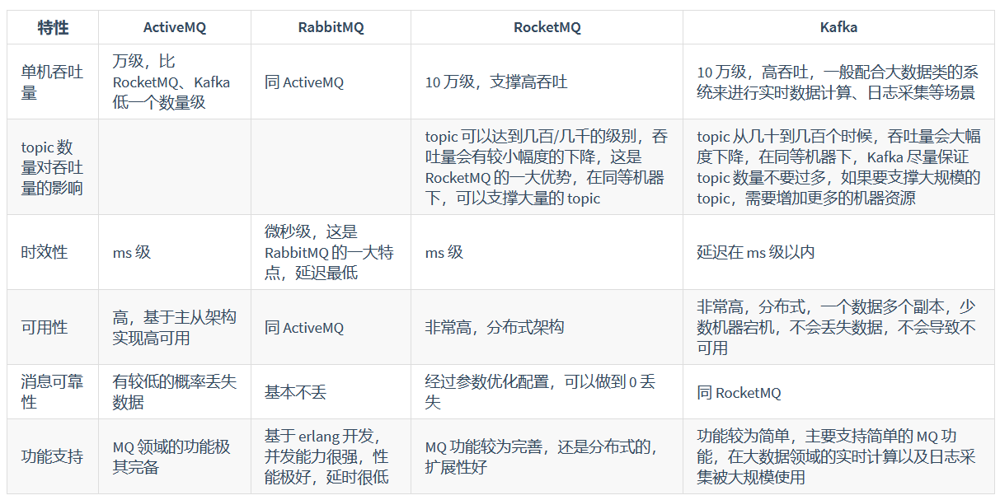
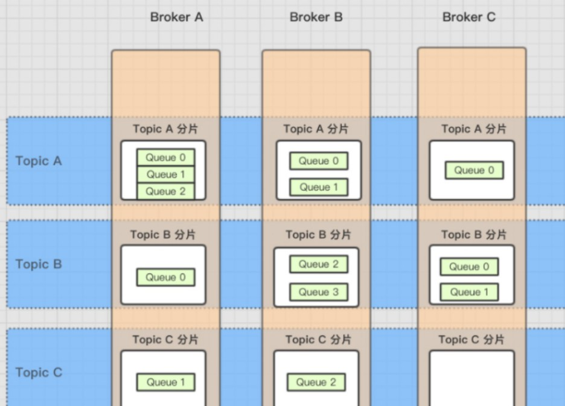
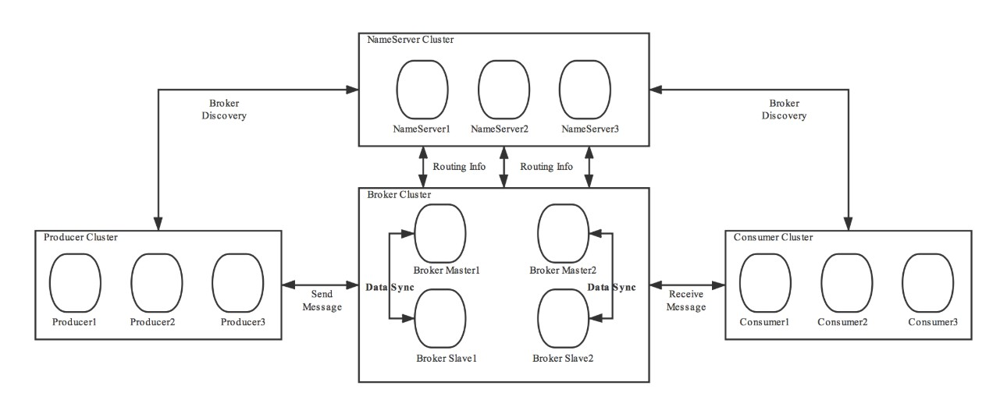

## * 消息队列的用处

### 异步

例如发短信或邮件，直接发个短信或邮件mq，让消费者统一去消费发短信或邮件。异步发送消息，这样可以减少主流程的耗时，让用户更快的接收到响应。

### 解耦

例如用户修改了信息，需要上报到各出款渠道，调用各渠道的修改信息接口。这个时候就可以发个修改用户信息的mq，让各渠道自己去消费调用修改信息的接口。主流程中就不仅不用写各种渠道冗余的RPC调用接口代码，而且也不用处理各渠道调用接口的异常，一切让各渠道自己去处理。

### 削峰

例如入账的时候，在某个时间段拉取到很多入账信息，数据量众多数据库可能处理不过来，甚至可能导致数据库崩。可以在每拉取到一笔入账信息时，就发个入账的mq，然后消费者可以慢慢的从mq中消费入账信息，可能会导致短时间内的mq堆积，但当其他空闲的时间段时候，没有那么多入账信息拉取，就会逐步消费完这些mq，逐渐恢复正常。

## * Kafka、ActiveMQ、RabbitMQ、RocketMQ 对比

反正我现在一直用的是RocketMQ，吞吐量10万级别，消息基本0丢失，时效性ms级别。

## * 如何保证消息队列的高可用？

### RabbitMQ

镜像集群模式（高可用性）

在镜像集群模式下，你创建的 queue，无论元数据还是 queue 里的消息都会存在于多个实例上，就是说，每个 RabbitMQ 节点都有这个 queue 的一个完整镜像，包含 queue 的全部数据的意思。然后每次你写消息到 queue 的时候，都会自动把消息同步到多个实例的 queue 上。

- 好处：任何一个机器宕机了，没事，其它机器（节点）还包含了这个 queue 的完整数据，别的 consumer 都可以到其它节点上去消费数据。
- 坏处：第一，性能开销也太大了吧，消息需要同步到所有机器上，导致网络带宽压力和消耗很重！第二，不是分布式的，就没有扩展性可言了，如果某个 queue 负载很重，你加机器，新增的机器也包含了这个 queue 的所有数据，并没有办法线性扩展你的 queue。

### Kafka

Kafka 一个最基本的架构认识：由多个 broker 组成，每个 broker 是一个节点；你创建一个 topic，这个 topic 可以划分为多个 partition，每个 partition 可以存在于不同的 broker 上，每个 partition 就放一部分数据。

**这就是天然的分布式消息队列，就是说一个 topic 的数据，是分散放在多个机器上的，每个机器就放一部分数据。**

Kafka 0.8 以后，提供了 HA 机制，就是 replica（复制品） 副本机制。每个 partition 的数据都会同步到其它机器上，形成自己的多个 replica 副本。所有 replica 会选举一个 leader 出来，那么生产和消费都跟这个 leader 打交道，然后其他 replica 就是 follower。写的时候，leader 会负责把数据同步到所有 follower 上去，读的时候就直接读 leader 上的数据即可。只能读写 leader？很简单，要是你可以随意读写每个 follower，那么就要 care 数据一致性的问题，系统复杂度太高，很容易出问题。Kafka 会均匀地将一个 partition 的所有 replica 分布在不同的机器上，这样才可以提高容错性。

写数据的时候，生产者就写 leader，然后 leader 将数据落地写本地磁盘，接着其他 follower 自己主动从 leader 来 pull 数据。一旦所有 follower 同步好数据了，就会发送 ack 给 leader，leader 收到所有 follower 的 ack 之后，就会返回写成功的消息给生产者。

消费的时候，只会从 leader 去读，但是只有当一个消息已经被所有 follower 都同步成功返回 ack 的时候，这个消息才会被消费者读到。

这么搞，就有所谓的高可用性了，因为如果某个 broker 宕机了，没事儿，那个 broker上面的 partition 在其他机器上都有副本的。如果这个宕机的 broker 上面有某个 partition 的 leader，那么此时会从 follower 中重新选举一个新的 leader 出来，大家继续读写那个新的 leader 即可。这就有所谓的高可用性了。

## * RocketMQ

### RocketMQ的消息模型

- Producer Group 生产者组： 代表某一类的生产者，比如我们有多个秒杀系统作为生产者，这多个合在一起就是一个 Producer Group 生产者组，它们一般生产相同的消息。
- Consumer Group 消费者组： 代表某一类的消费者，比如我们有多个短信系统作为消费者，这多个合在一起就是一个 Consumer Group 消费者组，它们一般消费相同的消息。
- Topic 主题： 代表一类消息，比如订单消息，物流消息等等。

主题中存在多个队列，生产者每次生产消息之后是指定主题中的某个队列发送消息的。

每个主题中都有多个队列(这里还不涉及到 Broker)，集群消费模式下，一个消费者集群多台机器共同消费一个 topic 的多个队列，一个队列只会被一个消费者消费。如果某个消费者挂掉，分组内其它消费者会接替挂掉的消费者继续消费。就像上图中 Consumer1 和 Consumer2 分别对应着两个队列，而 Consuer3 是没有队列对应的，所以一般来讲要控制 消费者组中的消费者个数和主题中队列个数相同 。

### RocketMQ的架构图

RocketMQ 技术架构中有四大角色 NameServer 、Broker 、Producer 、Consumer 。

#### Broker

Broker： 主要负责消息的存储、投递和查询以及服务高可用保证。说白了就是消息队列服务器嘛，生产者生产消息到 Broker ，消费者从 Broker 拉取消息并消费。

一个 Topic 分布在多个 Broker上，一个 Broker 可以配置多个 Topic ，它们是多对多的关系。 

如果某个 Topic 消息量很大，应该给它多配置几个队列(提高并发能力)，并且 尽量多分布在不同 Broker 上，以减轻某个 Broker 的压力 。

Topic 消息量都比较均匀的情况下，如果某个 broker 上的队列越多，则该 broker 压力越大。

> 所以说我们需要配置多个Broker。

#### NameServer

NameServer： 就像 ZooKeeper 和 Spring Cloud 中的 Eureka ，它其实也是一个 注册中心 ，主要提供两个功能：Broker管理 和 路由信息管理 。说白了就是 Broker 会将自己的信息注册到 NameServer 中，此时 NameServer 就存放了很多 Broker 的信息(Broker的路由表)，消费者和生产者就从 NameServer 中获取路由表然后照着路由表的信息和对应的 Broker 进行通信(生产者和消费者定期会向 NameServer 去查询相关的 Broker 的信息)。

#### Producer

Producer： 消息发布的角色，支持分布式集群方式部署。说白了就是生产者。

#### Consumer

Consumer： 消息消费的角色，支持分布式集群方式部署。支持以push推，pull拉两种模式对消息进行消费。同时也支持集群方式和广播方式的消费，它提供实时消息订阅机制。说白了就是消费者。

## * 保证消息消费的幂等性

- 例如创建订单的时候，根据订单的唯一性，先去SQL查询一下是否存在，如果存在，直接return，或者唯一键约束；
- 比如你是写 Redis，那没问题了，反正每次都是 set，天然幂等性；
- 如果你的场景还复杂一点，那就需要在Redis中判断唯一字段是否消费过。

反正这个没有绝对的做法，主要看你的场景吧~

## * 保证消息不丢失

这个主要从三个方面分别保证：生产者、MQ自身、消费者

### RabbitMQ

#### 生产者方面

可以开启 confirm 模式，在生产者那里设置开启 confirm 模式之后，你每次写的消息都会分配一个唯一的 id，然后如果写入了 RabbitMQ 中，RabbitMQ 会给你回传一个 ack 消息，告诉你说这个消息 ok 了。如果 RabbitMQ 没能处理这个消息，会回调你的一个 nack 接口，告诉你这个消息接收失败，你可以重试。而且你可以结合这个机制自己在内存里维护每个消息 id 的状态，如果超过一定时间还没接收到这个消息的回调，那么你可以重发。

#### RabbitMQ自身

就是 RabbitMQ 自己弄丢了数据，这个你必须开启 RabbitMQ 的持久化，就是消息写入之后会持久化到磁盘，哪怕是 RabbitMQ 自己挂了，恢复之后会自动读取之前存储的数据，一般数据不会丢。

- 创建 queue 的时候将其设置为持久化

    这样就可以保证 RabbitMQ 持久化 queue 的元数据，但是它是不会持久化 queue 里的数据的。

- 第二个是发送消息的时候将消息的 deliveryMode 设置为 2

    就是将消息设置为持久化的，此时 RabbitMQ 就会将消息持久化到磁盘上去。

必须要同时设置这两个持久化才行，RabbitMQ 哪怕是挂了，再次重启，也会从磁盘上重启恢复 queue，恢复这个 queue 里的数据。

#### 消费者方面

你消费的时候，刚消费到，还没处理，结果进程挂了，比如重启了，那么就尴尬了，RabbitMQ 认为你都消费了，这数据就丢了。

这个时候得用 RabbitMQ 提供的 ack 机制，简单来说，就是你必须关闭 RabbitMQ 的自动 ack ，然后每次你自己代码里确保处理完的时候，再在程序里 ack 一把。这样的话，如果你还没处理完，不就没有 ack 了？那 RabbitMQ 就认为你还没处理完，这个时候 RabbitMQ 会把这个消费分配给别的 consumer 去处理，消息是不会丢的。

### Kafka

#### 消费者方面

你消费到了这个消息，然后消费者那边自动提交了 offset，让 Kafka 以为你已经消费好了这个消息，但其实你才刚准备处理这个消息，你还没处理，你自己就挂了，此时这条消息就丢咯。

只要关闭自动提交 offset，在处理完之后自己手动提交 offset，就可以保证数据不会丢。但是此时确实还是可能会有重复消费，比如你刚处理完，还没提交 offset，结果自己挂了，此时肯定会重复消费一次，自己保证幂等性就好了。

#### Kafka自身

这块比较常见的一个场景，就是 Kafka 某个 broker 宕机，然后重新选举 partition 的 leader。大家想想，要是此时其他的 follower 刚好还有些数据没有同步，结果此时 leader 挂了，然后选举某个 follower 成 leader 之后，不就少了一些数据？这就丢了一些数据啊。

- 给 topic 设置 replication.factor 参数：这个值必须大于 1，要求每个 partition 必须有至少 2 个副本。
- 在 Kafka 服务端设置 min.insync.replicas 参数：这个值必须大于 1，这个是要求一个 leader 至少感知到有至少一个 follower 还跟自己保持联系，没掉队，这样才能确保 leader 挂了还有一个 follower 吧。
- 在 producer 端设置 acks=all ：这个是要求每条数据，必须是写入所有 replica 之后，才能认为是写成功了。
- 在 producer 端设置 retries=MAX （很大很大很大的一个值，无限次重试的意思）：这个是要求一旦写入失败，就无限重试，卡在这里了。

#### 生产者方面

设置了 acks=all ，一定不会丢，要求是，你的 leader 接收到消息，所有的 follower 都同步到了消息之后，才认为本次写成功了。如果没满足这个条件，生产者会自动不断的重试，重试无限次。

## * 保证消息的顺序性

### RocketMQ有序性

RocketMQ 在主题上是无序的(多个队列)、它只有在队列层面才是保证有序 的。

解决其实很简单，我们需要处理的仅仅是将同一语义下的消息放入同一个队列(比如这里是同一个订单)，那我们就可以使用 Hash取模法 来保证同一个订单在同一个队列中就行了。

## * 消息堆积

- 先修复 consumer 的问题，确保其恢复消费速度，然后将现有 consumer 都停掉。
- 新建一个 topic，临时建立好原先 10 倍的 queue 数量。
- 然后写一个临时的分发数据的 consumer 程序，这个程序部署上去消费积压的数据，消费之后不做耗时的处理，直接均匀轮询写入临时建立好的 10 倍数量的 queue。
- 接着临时征用 10 倍的机器来部署 consumer，每一批 consumer 消费一个临时 queue 的数据。这种做法相当于是临时将 queue 资源和 consumer 资源扩大 10 倍，以正常的 10 倍速度来消费数据。
- 等快速消费完积压数据之后，得恢复原先部署的架构，重新用原先的 consumer 机器来消费消息。
