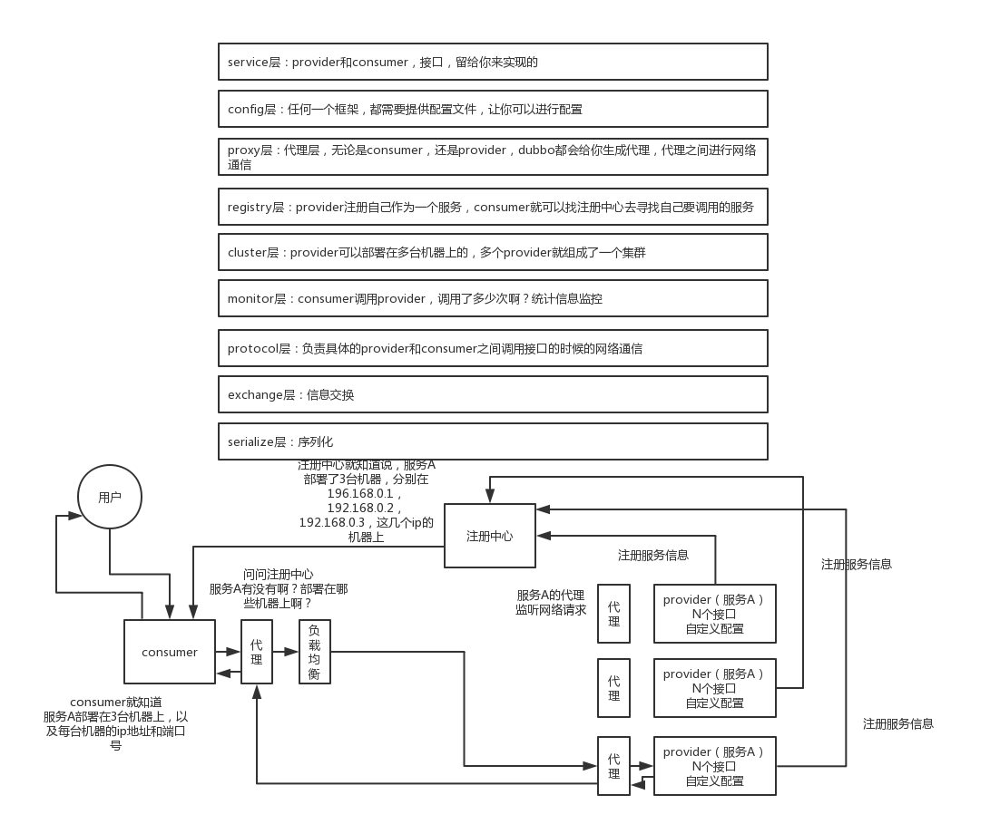
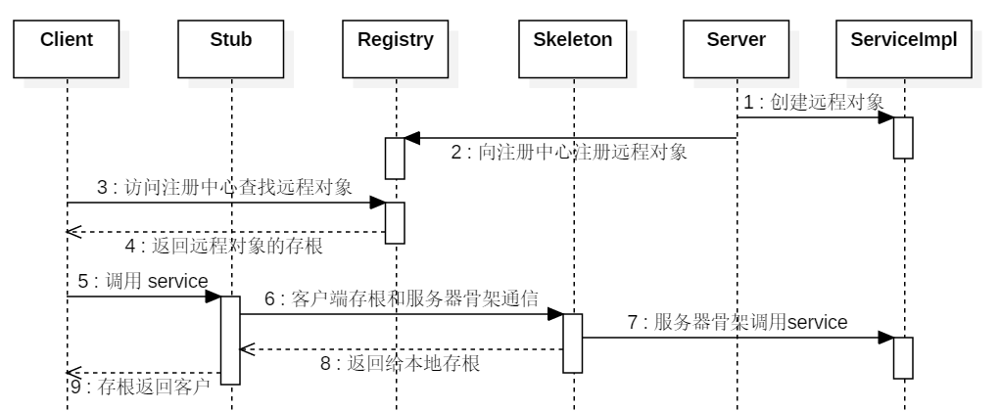

## 架构与工作原理

- 第一层：service 层，接口层，给服务提供者和消费者来实现的
- 第二层：config 层，配置层，主要是对 dubbo 进行各种配置的
- 第三层：proxy 层，服务代理层，无论是 consumer 还是 provider，dubbo 都会给你生成代理，代理之间进行网络通信
- 第四层：registry 层，服务注册层，负责服务的注册与发现
- 第五层：cluster 层，集群层，封装多个服务提供者的路由以及负载均衡，将多个实例组合成一个服务
- 第六层：monitor 层，监控层，对 rpc 接口的调用次数和调用时间进行监控
- 第七层：protocal 层，远程调用层，封装 rpc 调用
- 第八层：exchange 层，信息交换层，封装请求响应模式，同步转异步
- 第九层：transport 层，网络传输层，抽象 mina 和 netty 为统一接口
- 第十层：serialize 层，数据序列化层

1. 第一步：provider 向注册中心去注册
2. 第二步：consumer 从注册中心订阅服务，注册中心会通知 consumer 注册好的服务
3. 第三步：consumer 调用 provider
4. 第四步：consumer 和 provider 都异步通知监控中心



## dubbo和springcloud的区别

Springboot可以离开SpringCloud独立使用开发项目,但是SpringCloud离不开Springboot,属于依赖的关系.

Springboot专注于快速、方便的开发单个微服务个体,SpringCloud关注全局的服务治理框架.

最大区别:的是RPC通信,SpringCloudDubbo采用的是基于HTTP的REST方式.

## 注册中心挂了可以继续通信吗

可以的，消费者本地会缓存从 Zookeeper 拉取的生产者的列表信息，他会按照列表继续工作，但是无法从注册中心去同步最新的服务列表，短期的注册中心挂掉是不要紧的，但一定要尽快修复。

## 支持的通信协议

支持的协议有：Dubbo，RMI，Hessian，Http，WebService，Redis，Rest等。

默认就是走 dubbo 协议，单一长连接，进行的是 NIO 异步通信，基于 hessian 作为序列化协议。使用的场景是：传输数据量小（每次请求在 100kb 以内），但是并发量很高。以及消费者数量远大于提供者数量的情况。不适合传送大数据量的服务，比如传文件，传视频等，除非请求量很低。

### 为什么 Dubbo 协议采用异步单一长链接

是为了支持小数据量高并发场景，一般业务场景是服务提供者就几台机器，但是服务消费者有上百台，可能每天调用量达到上亿次。如果采用短连接，服务提供者很容易就被压跨，通过单一连接，保证单一消费者不会压死提供者，长连接可以减少连接握手验证，并使用异步 IO，复用线程池，防止 C10K 问题。


## 支持的序列化协议

dubbo 支持 hession、Java 二进制序列化、json、SOAP 文本序列化多种序列化协议。但是 **hessian** 是其默认的序列化协议。

## 负载均衡策略

默认情况下，dubbo 是 RandomLoadBalance ，即随机调用实现负载均衡。

### Random（随机负载均衡）

就是从多个 Provider 中随机选择一个。但有一个权重的概念，即按照权重设置随机概率。比如说，有10个 Provider，并不是说，每个 Provider 的概率都是一样的，而是要结合这10个 Provider 的权重来分配概率。

算法：例如有 4 台机器，权重分别是 ABCD。通过 Random.nextInt(A+B+C+D)，从中随机选择一个数。然后再判断该数分布在哪个区域。

### RoundRobin（轮询负载均衡）

就是依次的调用所有的 Provider。也有权重的概念。

这个策略可以让 RPC 调用严格按照我们设置的比例来分配。不管是少量的调用还是大量的调用。但是存在慢的 Provider 累积请求的问题，比如：第二台机器很慢，但没挂，当请求调到第二台时就卡在那，久而久之，所有请求都卡在调到第二台上，导致整个系统变慢。

### LeastActive（最少活跃调用数负载均衡）

最少活跃调用数，相同活跃数的随机。目的是让更慢的机器收到更少的请求。

举个例子：每个服务维护一个活跃数计数器。当 A 机器开始处理请求，该计数器加 1，此时 A 还未处理完成。若处理完毕则计数器减 1。而 B 机器接受到请求后很快处理完毕。那么 A，B 的活跃数分别是 1，0。当又产生了一个新的请求，则选择 B 机器去执行（B 活跃数最小），这样使慢的机器 A 收到少的请求。

算法：处理一个新的请求时，Consumer 会检查所有 Provider 的活跃数，如果具有最小活跃数的 Invoker 只有一个，直接返回该 Invoker。如果最小活跃数的 Invoker 有多个，且权重不相等同时总权重大于 0，这时随机生成一个权重，范围在 (0，totalWeight) 间内。最后根据随机生成的权重，来选择 Invoker。

### ConsistentHash（一致性哈希负载均衡）

相同参数的请求总是落在同一台机器上。

## 集群容错策略

默认的容错方案是配置：Failover Cluster，优先使用消费端配置。

### Failover（失败自动切换）

调用失败时，根据配置的重试次数，自动重试其他机器，默认是重试 2 次。

### Failfast（快速失败）

只发起一次调用，失败立即报错。通常用于非幂等性的写操作，比如新增记录。

### Failsafe（失败安全）

出现异常时，直接忽略，并记录一条日志，同时返回一个空结果，在上游看来调用是成功的。

### Failback（失败自动恢复）

如果调用失败，则此次失败相当于 Failsafe，将返回一个空结果。同时会将这次调用加入内存中的失败列表中，对于这个列表中的失败调用，会有另外的线程进行异步重试。重试如果再发生失败，则会忽略，但即使重试调用成功，原来的调用方也感知不到了。

### Forking（并行调用）

第一次调用的时候就同时发起多个调用，只要其中一个调用成功，就认为成功。通常用于实时性要求较高的读操作，但需要浪费更多服务资源。可通过 forks="2" 来设置最大并行数。

### Broadcast（广播调用）

广播调用所有提供者，逐个调用，任意一台报错则报错 。通常用于通知所有提供者更新缓存或日志等本地资源信息。

## 配置的优先级


- 方法级别优于接口级别，接口级别优于全局配置，即小 Scope 优先。
- Consumer 配置优于 Provider 配置。

    如果 Consumer 超时，而 Provider 未超时，则 Provider 依旧会继续执行。

    建议在 Provider 设置超时时间，因为一个方法需要执行多长时间，Provider 更清楚，如果一个 Consumer 同时引用多个服务，就不需要关心每个服务的超时设置。


## SPI

SPI 就是通过动态加载机制实现面向接口编程，提高了框架和底层实现的分离。

例如你有一个接口 A，A1/A2/A3 分别是接口 A 的不同实现，你通过配置指定接口 A 的实现是 A2，那么在系统实际运行时，就会加载你的配置，实例化 A2 来提供服务。

SPI 机制通常用在插件拓展的场景，比如说你开发了一个给别人使用的开源框架，如果你想让别人自己写个插件，插到你的开源框架里面，从而扩展某个功能，这个时候 SPI 就能用上了。

> 可以描述自己的日志输出和语言过滤器

语言过滤器：

src/main/resources/META-INF/dubbo/com.alibaba.dubbo.rpc.Filter

```
DubboContextLanguageFilter=com.xxx.infrastructure.filter.DubboContextLanguageFilter
```

```
@Activate(group = Constants.PROVIDER)
public class DubboContextLanguageFilter implements Filter {
    private final Logger log = LoggerFactory.getLogger(this.getClass());

    @Override
    public Result invoke(Invoker<?> invoker, Invocation invocation) throws RpcException {
        try {
            String language = RpcContext.getContext().getAttachment("session:org.springframework.web.servlet.i18n.SessionLocaleResolver.LOCALE");
            if ("en".equals(language)) {
                LocaleContextHolder.setDefaultLocale(new Locale("en", "US"));
            } else {
                LocaleContextHolder.setDefaultLocale(new Locale("zh", "CN"));
            }
        } catch (Throwable t) {
            log.error("[DubboContextEnterFilter - invoke - language fail] 获取并设置language失败！", t);
        }

        return invoker.invoke(invocation);
    }
}
```

## RPC

RPC 使得程序能够像访问本地系统资源一样，去访问远端系统资源。

### RPC 的调用过程

- Client（客户端）：服务调用方。
- Client Stub（客户端存根）：存放服务端地址信息，将客户端的请求信息打包成网络信息，再通过网络传输给发送端。
- Server Stub（服务端存根）：接收客户端发送的请求并解包，然后调用本地服务进行处理。
- Server（服务端）：服务提供方。



### RPC 和 HTTP 比有啥优势

- 长链接

    不必每次通信都要像 HTTP 一样去 3 次握手什么的，减少了网络开销。

- 屏蔽了底层细节

    开发人员不需要关心底层细节，比如序列化和反序列化，网络传输协议等细节，让远程调用像调用本地方法一样.

### 设计一个 RPC 框架需要解决的问题

- 应用都基于微服务化，实现资源调用离不开远程调用。
- 一个服务有多个实例，在调用时如何获取这些实例地址？这就需要注册中心，从注册中心获取服务的实例列表，再从中选择一个进行调用。
- 选哪个调用好呢？这时候就需要负载均衡了，于是又得考虑如何实现复杂均衡。
- 总不能每次调用时都去注册中心查询实例列表吧，于是有有了缓存，有了缓存就得考虑缓存更新问题。
- 客户端总不能每次调用完都干等着服务端返回数据吧，于是就要支持异步调用。
- 服务端的接口修改了，老的接口还有人在用怎么办？这就需要版本控制了。
- 服务端总不能每次接到请求都马上启动一个线程去处理吧？于是就需要线程池。


## 服务降级

比如说服务 A 调用服务 B，结果服务 B 挂掉了，服务 A 重试几次调用服务 B，还是不行，那么直接降级，走一个备用的逻辑，给用户返回响应。

服务降级：可以通过 <dubbo:reference> 中设置 mock 值。

可以通过 mock 统一返回 null:

```
<dubbo:reference id="fooService" interface="com.test.service.FooService"  timeout="10000" check="false" mock="return null"></dubbo:reference>
```

mock 的值也可以修改为 true，然后再跟接口同一个路径下实现一个 Mock 类，命名规则是 “接口名称+ Mock ” 后缀。然后在 Mock 类里实现自己的降级逻辑。

```
public class HelloServiceMock implements HelloService {
    public void sayHello() {
        // 降级逻辑
    }
}
```

## 失败重试和超时重试

所谓失败重试，就是 consumer 调用 provider 要是失败了，比如抛异常了，此时应该是可以重试的，或者调用超时了也可以重试。配置如下：

```
<dubbo:reference id="xxxx" interface="xx" check="true" async="false" retries="3" timeout="2000"/>
```

- timeout ：一般设置为 200ms ，我们认为不能超过 200ms 还没返回。
- retries ：设置 retries，一般是在读请求的时候，比如你要查询个数据，你可以设置个 retries，如果第一次没读到，报错，重试指定的次数，尝试再次读取。

## 分布式服务接口请求的顺序性如何保证

设置Dubbo 的一致性 hash 负载均衡策略，将同一唯一性的操作扔一个内存队列里去（如RocketMQ等），强制排队，这样来确保他们的顺序性。

## Dubbo 支持分布式事务

目前暂时不支持，可以自己整合分布式事务框架，例如用 Seata。

## Dubbo 服务调用是阻塞的吗

默认是阻塞的，可以异步调用，没有返回值的可以这么做。

Dubbo 是基于 NIO 的非阻塞实现并行调用，客户端不需要启动多线程即可完成并行调用多个远程服务，相对多线程开销较小，异步调用会返回一个 Future 对象。

## 同一个服务多个注册的情况下可以直连某一个服务吗

可以点对点直连，修改 url 参数配置即可。
