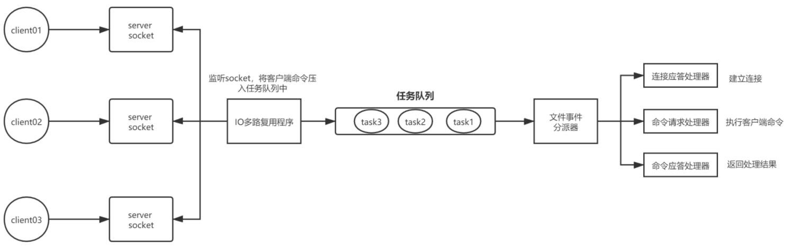
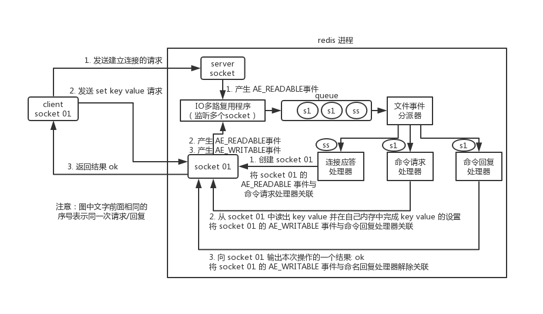
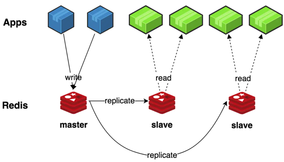
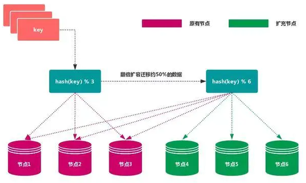

## 为什么要用缓存？

用缓存，主要有两个用途：高性能、高并发。

### 高性能

直接查询Redis缓存比查询数据库要快得多

### 高并发

高并发的时候，可能数据库顶不住会宕机，但Redis承载并发量是 mysql 单机的几十倍。

**缓存是走内存的，内存天然就支撑高并发。**

## 数据类型

目前支持 6 种数据类型：string、hash、list、set、zset、HyperLogLog。

### string 类型

常规 KV 结构，其中 V 可以是 string 或 number 类型。

容量：string 的一个 key 最大能存 512MB。

底层：动态字符串（SDS）。

应用场景：
- 简单值缓存：token，验证码。
- 计数器：登录错误次数计数，产品库存。

### hash 类型

hash 是一个的键值对集合，其中 V 相当于一个 HashMap，适用于存储对象数据。

容量：hash 的一个 key 最大可以存储 2^32 -1 个键值对（40 多亿）。

底层：字典（dict）。

应用场景：对象信息，如用户信息，产品信息。

### list 类型

list 是有序列表，它可以压入头部和尾部，也可以弹出头部和尾部。

容量：list最多可存储 2^32 - 1 个元素元素（40 多亿）。

底层：快速列表（QuickList）。如果列表元素较少，则会使用一块连续的内存空间，即压缩列表。如果列表元素较多，则会使用快速列表，其原理就是双向链表+压缩列表。

应用场景：微博的关注列表，粉丝列表，消息列表

### set 类型

set 是无序集合，其中 value 相当于 HashSet。适用于数据去重、排重、交集，并集，差集等场景。

容量：集合中最多可以存储 2^32 - 1 个元素元素（40 多亿）。

底层：整数集合（IntSet）或字典（dict）。如果集合对象的所有元素都是整数值，并且保存元素小于 512 个时，底层将使用整数集合。否则用字典。

应用场景：共同爱好等。

### zset 类型

zset 是排序集合，其中 value 相当于 TreeSet。适用场景和 set 相似，但数据是有序的。增加了一个权重参数score，使得集合中的元素能够按score进行有序排列。

容量：集合中最多可以存储 2^32 - 1 个元素元素（40 多亿）。

底层：压缩列表或字典+跳跃表。如果元素少于 128 个，且每个元素长度小于 64 字节，使用压缩列表。否则用字典+跳跃表。

应用场景：金额最多的前几位。

## Redis 的线程模型(重要，灵魂之处)

### 线程模型

**Redis内部使用文件事件处理器，这个文件事件处理器是单线程的，所以 Redis 才叫做单线程的模型。它采用 IO 多路复用机制同时监听多个 Socket，将产生文件事件的 Socket 压入内存队列中，同时文件事件分派器每次从队列中取出一个 Socket，根据 Socket 上的文件事件类型来选择对应的事件处理器进行处理。**。



文件事件处理器的结构包含 4 个部分：

- 多个 socket
- IO 多路复用程序
- 文件事件分派器
- 事件处理器（连接应答处理器、命令请求处理器、命令回复处理器）

### 通信过程



首先，Redis 服务端进程初始化的时候，会将 server socket 的 AE_READABLE 事件与连接应答处理器关联。

客户端 socket01 向 Redis 进程的 server socket 请求建立连接，此时 server socket 会产生一个 AE_READABLE 事件，IO 多路复用程序监听到 server socket 产生的事件后，将该 socket 压入队列中。文件事件分派器从队列中获取 socket，交给连接应答处理器。连接应答处理器会创建一个能与客户端通信的 socket01，并将该 socket01 后面产生的 AE_READABLE 事件与命令请求处理器关联。

假设此时客户端发送了一个 set key value 请求，此时 Redis 中的 socket01 会产生 AE_READABLE 事件，IO 多路复用程序将 socket01 压入队列，此时事件分派器从队列中获取到 socket01 产生的 AE_READABLE 事件，由于前面 socket01 的 AE_READABLE 事件已经与命令请求处理器关联，因此事件分派器将事件交给命令请求处理器来处理。命令请求处理器读取 socket01 的 key value 并在自己内存中完成 key value 的设置。操作完成后，它会将 socket01 的 AE_WRITABLE 事件与命令回复处理器关联。

如果此时客户端准备好接收返回结果了，那么 Redis 中的 socket01 会产生一个 AE_WRITABLE 事件，同样压入队列中，事件分派器找到相关联的命令回复处理器，由命令回复处理器对 socket01 输入本次操作的一个结果，比如 ok ，之后解除 socket01 的 AE_WRITABLE 事件与命令回复处理器的关联。

## 为什么 Redis 单线程却能支撑高并发

- 纯内存操作。
- 核心是基于非阻塞的 IO 多路复用机制。
- C 语言实现，一般来说，C 语言实现的程序“距离”操作系统更近，执行速度相对会更快。
- 单线程反而避免了多线程的频繁上下文切换问题，预防了多线程可能产生的竞争问题。

## 过期策略

**Redis 过期策略是：定期删除+惰性删除。**

所谓定期删除，指的是 Redis 默认是每隔 100ms 就**随机**抽取一些设置了过期时间的 key，检查其是否过期，如果过期就删除。

定期删除可能会导致很多过期 key 到了时间并没有被删除掉，那咋办呢？

惰性删除，在获取某个 key 的时候，会检查下这个 key 是否过期了，如果过期就删除。

> 获取 key 的时候，如果此时 key 已经过期，就删除，不会返回任何东西。

如果定期删除漏掉了很多过期 key，然后你又没去获取 key（没走惰性删除），此时就会有大量过期 key 堆积在内存里，就可能导致 Redis 内存块耗尽。如果出现这种问题，就需要走内存淘汰机制。

## 内存淘汰机制

- noeviction: 当内存不足以容纳新写入数据时，新写入操作会报错。（一般没人用）
- allkeys-lru：当内存不足以容纳新写入数据时，在键空间中，移除最近最少使用的 key（这个最常用）。
- allkeys-random：当内存不足以容纳新写入数据时，在键空间中，随机移除某个 key。（一般没人用）
- volatile-lru：当内存不足以容纳新写入数据时，在设置了过期时间的键空间中，移除最近最少使用的 key（一般没人用）。
- volatile-random：当内存不足以容纳新写入数据时，在设置了过期时间的键空间中，随机移除某个 key。（一般没人用）
- volatile-ttl：当内存不足以容纳新写入数据时，在设置了过期时间的键空间中，有更早过期时间的 key 优先移除。（一般没人用）

## 手写一个 LRU 算法

LRU是Least Recently Used的缩写，即最近最少使用，是一种常用的页面置换算法，选择最近最久未使用的数据予以淘汰。

查找快、插入快、删除快，（O(1)时间复杂度）且还需要先后排序---------->什么样的数据结构可以满足这个问题？

LRU的算法核心是哈希链表

```
public class LRUDemo extends LinkedHashMap<Integer, Integer> {
    private int capacity;

    public LRUDemo(int initialCapacity) {
        // true 表示让 linkedHashMap 按照访问顺序来进行排序，最近访问的放在头部，最老访问的放在尾部。
        super(initialCapacity, 0.75F, true);
        this.capacity = initialCapacity;
    }

    @Override
    protected boolean removeEldestEntry(Map.Entry<Integer, Integer> eldest) {
        // 当 map中的数据量大于指定的缓存个数的时候，就自动删除最老的数据。
        return super.size() > capacity;
    }

    // 测试
    public static void main(String[] args) {
        LRUDemo lruDemo = new LRUDemo(3);

        lruDemo.put(1, 1);
        lruDemo.put(2, 2);
        lruDemo.put(3, 3);

        System.out.println(lruDemo.keySet());

        lruDemo.put(4, 4);
        System.out.println(lruDemo.keySet());

        lruDemo.put(3, 3);
        lruDemo.put(3, 3);
        System.out.println(lruDemo.keySet());
    }
}
```

## 持久化机制

- RDB：对数据执行周期性的持久化。
- AOF：对每条写命令都作为日志写入日志文件中，以后可以通过回放日志中的写命令来重新构建整个数据集。

### RDB 优缺点

优点：

- 可以通过配置生成多个时间段的数据文件进行保存，这种方式很适合做冷备。
- 对 Redis 对外提供读写服务影响非常小，只需要 fork 一个子线程来单独进行持久化即可。
- 直接基于 RDB 数据文件来重启恢复 Redis 进程比 AOF 文件更快。

缺点：

- 因为是周期备份，所以在 Redis 故障时会丢失一部分时间的数据。
- 如果生成快照文件的数据特别大，可能会导致客户端提供的服务暂停数毫秒，甚至数秒。

### AOF优缺点

优点：

- 可以更好的保护数据，每隔 1 秒就会执行一次 fsync 操作，最多只会丢失 1 秒钟的数据。
- 日志文件以 Append-Only 模式写入，没有磁盘寻址开销，写入性能高，文件不容易破损。
- 日志文件即使过大的时候，出现后台重写操作时，也不会影响客户端的读写。因为在 rewrite log 的时候，会对其中的指导进行压缩，创建出一份需要恢复数据的最小日志出来。在创建新日志文件的时候，老的日志文件还是照常写入。当新的 merge 后的日志文件 ready 的时候，再交换新老日志文件即可。

缺点：

- 对于同一份数据来说，AOF 日志文件通常比 RDB 数据快照文件更大。
- AOF 开启后，支持的写 QPS 会比 RDB 支持的写 QPS 低，因为 AOF 一般会配置成每秒 fsync 一次日志文件，当然，每秒一次 fsync，性能也还是很高的。

### RDB 和 AOF 到底该如何选择

两个都要用，用 AOF 来保证数据不丢失，作为数据恢复首选项。用 RDB 做多种冷备，在 AOF 文件丢失或损坏的时候，还可以恢复大部分数据。

## 主从架构

### 简述

Redis 虽然读写很快，但是也会产生性能瓶颈（单机最多几万 QPS），特别是在读的压力上（通常写请求是比较少的），为了分担压力，就需要用到主从架构。

其特点是一主多从，由主节点负责写，并且将数据同步到从节点上，由从节点负责读。如果 QPS 暴增，只要增加从节点就可以了。



### Redis replication 的核心机制

- Redis 采用异步方式复制数据到 slave 节点，slave 复制时，不会阻塞 master 的正常工作。
- 一个 master node 是可以配置多个 slave node 的；同时slave node 也可以连接其他的 slave node；
- slave node 在做复制的时候，也不会 block 对自己的查询操作，它会用旧的数据集来提供服务；但是复制完成的时候，需要删除旧数据集，加载新数据集，这个时候就会暂停对外服务了；
- slave node 主要用来进行横向扩容，做读写分离，扩容的 slave node 可以提高读的吞吐量。

### Redis 主从复制的核心原理

当启动一个 slave node 的时候，它会发送一个 PSYNC 命令给 master node。

如果 slave 节点是首次连接 master 节点，那么会触发一次全量复制。

如果 slave 节点是重新连接 master 节点，那么会做增量更新（断点续传）。


#### 全量复制

1. master 会异步 fork 一个子线程生成 RDB 快照文件，同时还会将新收到的所有写命令保存在内存中。
2. RDB 文件生成完毕后，master 会把这个文件发给 slave。
3. slave 会先写入本地磁盘，再从本地磁盘加载到内存中。
4. 接着 master 会把保存在内存中的所有写命令发送到 slave，salve 也会同步这些数据。

#### 断点续传

网络连接断了，连接之后 master node 仅会复制给 slave 部分缺少的数据。

1. master 在接受数据写入后，会写到数据缓冲区，同时也会积压到 backlog 中。
2. master 和 slave 两端都会维护一个 offset 记录当前已经同步过的命令。
3. 如果 slave 断开重连，会发送 psync runid offset 指令，让 master 从 上次的 replication offset 开始复制。
4. 如果没有找到对应的 offset，那么就会执行一次全量复制。

### slave过期key处理

slave 不会过期 key，只会等待 master 过期 key。如果 master 过期了一个 key，或者通过 LRU 淘汰了一个 key，那么会模拟一条 del 命令发送给 slave。

## 哨兵架构

### 哨兵的介绍

sentinel，中文名是哨兵。哨兵是 Redis 集群架构中非常重要的一个组件，主要有以下功能：

- 集群监控：负责监控 Redis master 和 slave 进程是否正常工作。
- 消息通知：如果某个 Redis 实例有故障，那么哨兵负责发送消息作为报警通知给管理员。
- 故障转移：如果 master node 挂掉了，会自动转移到 slave node 上。
- 配置中心：如果故障转移发生了，通知 client 客户端新的 master 地址。

哨兵用于实现 Redis 集群的高可用，本身也是分布式的，作为一个哨兵集群去运行，互相协同工作。

- 故障转移时，判断一个 master node 是否宕机了，需要大部分的哨兵都同意才行，涉及到了分布式选举的问题。
- 即使部分哨兵节点挂掉了，哨兵集群还是能正常工作的，保证自身高可用。

### 哨兵的核心知识

- 哨兵至少需要 3 个实例，来保证自己的健壮性。
- 哨兵 + Redis 主从的部署架构，是不保证数据零丢失的，只能保证 Redis 集群的高可用性。
- 对于哨兵 + Redis 主从这种复杂的部署架构，尽量在测试环境和生产环境，都进行充足的测试和演练。

### 哨兵至少要 3 个实例

哨兵集群如果要做主备切换，至少需要2数量的哨兵认为 odown，才能选举出一个哨兵来做切换。如果你配置2个哨兵实例，如果宕机一个，就只剩1数量的哨兵了。

### 哨兵主备切换的数据丢失问题

Redis 主备切换会有两种数据丢失的情况：异步复制 & 集群脑裂。

#### 异步复制导致的数据丢失

因为 master->slave 的复制是异步的，所以可能有部分数据还没复制到 slave，master 就宕机了，此时这部分数据就丢失了。


#### 脑裂导致的数据丢失

脑裂，也就是说，某个 master 所在机器突然脱离了正常的网络，跟其他 slave 机器不能连接，但是实际上 master 还运行着。此时哨兵可能就会认为 master 宕机了，然后开启选举，将其他 slave 切换成了 master。这个时候，集群里就会有两个 master ，也就是所谓的脑裂。

此时虽然某个 slave 被切换成了 master，但是可能 client 还没来得及切换到新的 master，还继续向旧 master 写数据。因此旧 master 再次恢复的时候，会被作为一个 slave 挂到新的 master 上去，自己的数据会清空，重新从新的 master 复制数据。而新的 master 并没有后来 client 写入的数据，因此，这部分数据也就丢失了。


#### 数据丢失问题的解决方案

加两个配置，核心思想是，如果跟任何一个 slave 丢了连接，在 10 秒后发现没有 slave 给自己 ack，那么就拒绝新的写请求。

```
min-slaves-to-write 1
min-slaves-max-lag 10
```

- 减少异步复制数据的丢失

    有了 min-slaves-max-lag 这个配置，就可以确保说，一旦 slave 复制数据和 ack 延时太长，就认为可能 master 宕机后损失的数据太多了，那么就拒绝写请求，这样可以把 master 宕机时由于部分数据未同步到 slave 导致的数据丢失降低的可控范围内。

- 减少脑裂的数据丢失

    如果一个 master 出现了脑裂，跟其他 slave 丢了连接，那么上面两个配置可以确保说，如果不能继续给指定数量的 slave 发送数据，而且 slave 超过 10 秒没有给自己 ack 消息，那么就直接拒绝客户端的写请求。因此在脑裂场景下，最多就丢失 10 秒的数据。

### sdown 和 odown 转换机制

- sdown 是主观宕机，就一个哨兵如果自己觉得一个 master 宕机了，那么就是主观宕机
- odown 是客观宕机，如果 quorum 数量的哨兵都觉得一个 master 宕机了，那么就是客观宕机

### slave->master 选举算法

如果一个 master 被认为 odown 了，而且 majority 数量的哨兵都允许主备切换，那么某个哨兵就会执行主备切换操作，此时首先要选举一个 slave 来，会考虑 slave 的一些信息：

- 跟 master 断开连接的时长
- slave 优先级
- 复制 offset
- run id

如果一个 slave 跟 master 断开连接的时间已经超过了 down-after-milliseconds 的 10 倍，外加 master 宕机的时长，那么 slave 就被认为不适合选举为 master。

接下来会对 slave 进行排序：

- 按照 slave 优先级进行排序，slave priority 越低，优先级就越高。
- 如果 slave priority 相同，那么看 replica offset，哪个 slave 复制了越多的数据，offset 越靠后，优先级就越高。
- 如果上面两个条件都相同，那么选择一个 run id 比较小的那个 slave。

## 集群架构

Redis-cluster 是官方 3.0 版本后的集群方案，它具有以下特点：

- 多主多从：能支撑多个 master，且每个 master 都可以挂载多个 slave。
- 读写分离：写操作会用 master，读操作会从 master 对应的 slave 去读。
- 横向扩容：自动将数据进行分片，每个 master 都放一部分数据，只要增加 master 节点就能存放更多的数据。
- 高可用：如果 master 挂掉，Redis cluster 这套机制，就会自动将某个 slave 切换成 master。


## 分布式寻址算法

### 最老土的 Hash 算法

设节点数为 N，写一个数据的时候，根据 hash(key) % N 计算出哈希值，用来决定数据映射到哪一个节点上。



一旦某一个 master 节点宕机，所有请求过来，都会基于最新的剩余 master 节点数去取模，尝试去取数据。这会导致大部分的请求过来，全部无法拿到有效的缓存，导致大量的流量涌入数据库。

### 一致性哈希分区

一致性 hash 算法将整个 hash 值空间组织成一个虚拟的圆环，整个空间按顺时针方向组织，下一步将各个 master 节点（使用服务器的 ip 或主机名）进行 hash。这样就能确定每个节点在其哈希环上的位置。

来了一个 key，首先计算 hash 值，并确定此数据在环上的位置，从此位置沿环顺时针“行走”，遇到的第一个 master 节点就是 key 所在位置。

在一致性哈希算法中，如果一个节点挂了，受影响的数据仅仅是此节点到环空间前一个节点（沿着逆时针方向行走遇到的第一个节点）之间的数据，其它不受影响。增加一个节点也同理。

当一致性哈希算法在节点太少时，容易因为节点分布不均匀而造成缓存热点的问题。为了解决这种热点问题，一致性 hash 算法引入了虚拟节点机制，即对每一个节点计算多个 hash，每个计算结果位置都放置一个虚拟节点。这样就实现了数据的均匀分布，负载均衡。


### Redis cluster 的 hash slot 算法

Redis cluster 有固定的 16384 个 hash slot，对每个 key 计算 CRC16 值，然后对 16384 取模，可以获取 key 对应的 hash slot。

Redis cluster 中每个 master 都会持有部分 slot，比如有 3 个 master，那么可能每个 master 持有 5000 多个 hash slot。hash slot 让 node 的增加和移除很简单，增加一个 master，就将其他 master 的 hash slot 移动部分过去，减少一个 master，就将它的 hash slot 移动到其他 master 上去。

任何一台机器宕机，另外两个节点，不影响的。因为 key 找的是 hash slot，不是机器。


## 缓存雪崩

缓存挂了，造成 DB 短时间承受大量请求而崩掉。

- 事前：Redis 高可用，主从+哨兵，Redis cluster，避免全盘崩溃。
- 事中：本地 ehcache 缓存 + hystrix 限流&降级，避免 MySQL 被打死。
- 事后：Redis 持久化，一旦重启，自动从磁盘上加载数据，快速恢复缓存数据。


## 缓存穿透

恶意查询缓存和 DB 都没有的数据，造成数据库短时间内承受大量请求而崩掉。

布隆过滤器：布隆过滤器可以非常方便地判断一个给定数据是否存在于海量数据中。具体是这样做的：把所有可能存在的请求的值都存放在布隆过滤器中，当用户请求过来，我会先判断用户发来的请求的值是否存在于布隆过滤器中。不存在的话，直接返回请求参数错误信息给客户端。


## 缓存击穿

热点数据突然失效，造成 DB  短时间承受大量请求而崩掉。

- 若缓存的数据是基本不会发生更新的，则可尝试将该热点数据设置为永不过期
- 加Redis、zookeeper 等分布式中间件的分布式互斥锁
- 最好在代码中也再上限流，防止DB挂了

## 缓存与数据库的双写一致性

### 初级情况的解决方法

- 读的时候，先读缓存，缓存没有的话，就读数据库，然后取出数据后放入缓存，同时返回响应。
- 更新的时候先删除缓存，再更新数据库

### 比较复杂的数据不一致问题

问题是说数据库修改还没提交，新的请求过来读缓存发现为空，于是查了旧的数据，又放回缓存里，随后数据库修改提交，造成缓存中数据不一致。

- 同一个主键操作放到RocketMQ的同一队列中，一个队列对应一个消费者，可以保证顺序性

## Redis分布式锁

redis支持nx和ex操作是同一原子操作。

```
set resourceName value ex 5 nx
```

- NX：表示只有 key 不存在的时候才会设置成功，如果此时 redis 中存在这个 key，那么设置失败，返回 nil。
- expire()，设置过期时间，防止死锁，假设，如果一个锁set后，一直不删掉，那这个锁相当于一直存在，产生死锁。
- value要唯一，防止删了其他线程的锁

删除锁的时候，先要判断是否是当前锁，再删除，这两个过程涉及原子性问题，所以也只能使用lua脚本

当机器A申请到一把锁之后，如果Redis主宕机了，这个时候从机并没有同步到这一把锁，那么机器B再次申请的时候就会再次申请到这把锁，为了解决这个问题Redis作者提出了RedLock红锁的算法,在Redission中也对RedLock进行了实现。

RedLock基本原理是利用多个Redis集群，用多数的集群加锁成功，减少Redis某个集群出故障，造成分布式锁出现问题的概率。