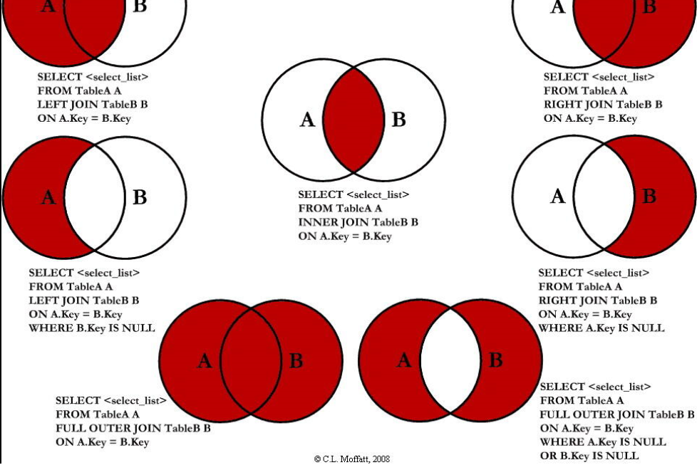
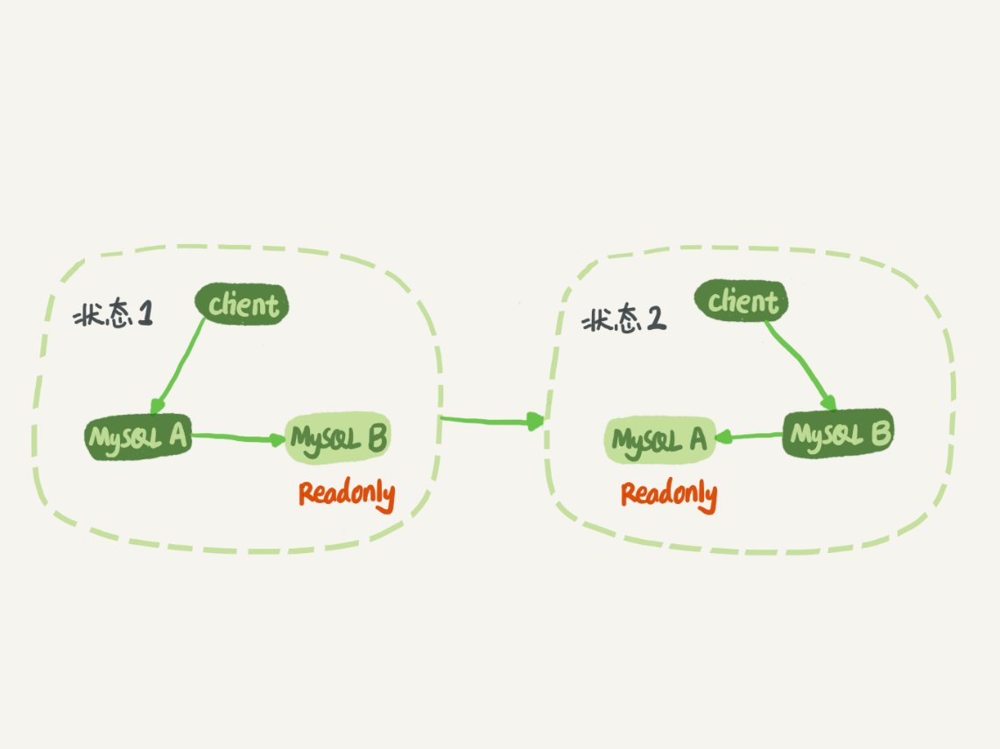

## 基础架构

- mysql分为Server层和引擎层
- Server层：连接器、查询缓存、分析器、优化器、执行器等 以及所有内置的函数（eg:日期、时间、数学和加密函数等）。所有跨存储引擎的功能都在这一层实现，eg：存储过程、触发器、视图
- 连接器：一个用户成功建立连接后，即使你用管理员账号对这个用户的权限做了修改，也不会影响已经存在连接的权限。修改完成后，只有再新建的连接才会使用新的权限设置。
- 查询缓存：mysql拿到一个查询后，先查询缓存，（缓存保存形式KV（K为查询的语句，V为查询的结果）） 。但建议关闭查询缓存（show variables like '%query_cache_type%'; set GLOBAL query_cache_type='OFF';）。失效频繁，而且对于压力大的数据库，命中率非常低。mysql8.0版本取消了查询缓存的整个功能模块。
- 分析器：
    - 词法分析：识别出里面的字符串分别是什么代表什么。
    - 语法分析: 根据词法分析的结果和语法规则，判断是否满足Mysql语法。
- 优化器：分析器知道要做什么，优化器在便利有多个索引时，决定使用哪个索引；在一个语句有多表关联（join）时，决定各个表的连接顺序。
- 执行器：优化器知道怎么做了，执行器进行执行语句。开始执行的时候，要先判断一下你对这个表 T 有没有执行查询的权限

## 存储引擎

### MyISAM和InnoDB区别：

- 锁方面: MyISAM 只有表级锁，而InnoDB 支持行级锁和表级锁,默认为行级锁。
- 事务方面：MyISAM 强调的是性能，每次查询具有原子性,其执行速度比InnoDB类型更快，但是不提供事务支持。InnoDB 支持事务
- 外键方面：MyISAM不支持，而InnoDB支持。
- 索引方面：InnoDB的主键是聚集索引，数据是和主键索引绑在一起的，必须要有主键，通过主键索引效率很高。但是辅助索引需要两次查询，先查询到主键，再回表查询数据。而MyISAM是非聚集索引，数据文件是分离的，索引保存的是数据文件的指针。
- 查询效率方面：Innodb不支持全文索引，而MyISAM支持全文索引，查询效率上MyISAM要高

### 如何选择

如果没有特别的需求，使用默认的 Innodb 即可。

MyISAM：以读写插入为主的应用程序。

Innodb：更新（删除）操作频率也高，或者要保证数据的完整性；并发量高，支持事务和外键。

## 日志系统

- redo log 是 InnoDB 引擎特有的；binlog是 MySQL 的 Server 层实现的，所有引擎都可以使用。
- redo log 是物理日志，记录的是“在某个数据页上做了什么修改”；binlog 是逻辑日志，记录的是这个语句的原始逻辑，比如“给 ID=2 这一行的 c 字段加 1 ”。
- redo log 是循环写的，空间固定会用完；binlog 是可以追加写入的。“追加写”是指 binlog 文件写到一定大小后会切换到下一个，并不会覆盖以前的日志。

## 事物的四大特性(ACID)

- 原子性（Atomicity）： 事务是最小的执行单位，不允许分割。事务的原子性确保动作要么全部完成，要么完全不起作用；
- 一致性（Consistency）： 执行事务前后，数据保持一致，多个事务对同一个数据读取的结果是相同的；
- 隔离性（Isolation）： 并发访问数据库时，一个用户的事务不被其他事务所干扰，各并发事务之间数据库是独立的；
- 持久性（Durability）： 一个事务被提交之后。它对数据库中数据的改变是持久的，即使数据库发生故障也不应该对其有任何影响。

## ACID的原理

- 原子性：redo log(重做日志)和undo log(回滚日志)。redo log用于保证事务持久性；undo log则是事务原子性和隔离性实现的基础。
- 持久性：redo log(重做日志)。当数据修改时，除了修改Buffer Pool中的数据，还会在redo log记录这次操作；当事务提交时，会调用fsync接口对redo log进行刷盘。如果MySQL宕机，重启时可以读取redo log中的数据，对数据库进行恢复。
- 隔离性：(一个事务)写操作对(另一个事务)写操作的影响：锁机制保证隔离性；(一个事务)写操作对(另一个事务)读操作的影响：MVCC(多版本并发控制)保证隔离性。
- 一致性：保证原子性、持久性和隔离性

## 事务隔离级别

- READ-UNCOMMITTED(读未提交)： 一个事务还未提交，它所做的变更就可以被别的事务看到。可能会导致脏读、幻读或不可重复读。
- READ-COMMITTED(读已提交)： 一个事务提交之后，它所做的变更才可以被别的事务看到。可以阻止脏读，但是幻读或不可重复读仍有可能发生。
- REPEATABLE-READ(可重复读)： 一个事务执行过程中看到的数据是一致的。未提交的更改对其他事务是不可见的。可以阻止脏读和不可重复读，但幻读仍有**可能**发生（其他事务插入数据，当前事务进行当前读就会产生幻读情况）。

> 以下情况下，Mysql InnoDB存储引擎在RR隔离级别下，是解决了幻读问题的。
> 使用MVCC解决了快照读情况下的幻读问题。快照读是不会产生幻读情况的。
> 使用Next-Key Lock解决了当前读情况下的幻读问题。如当前事务lock in share mode或for update进行当前读时，其他事务插入数据就会被Next-key Lock阻塞

- SERIALIZABLE(串行化)： 对应一个记录会加读写锁，出现冲突的时候，后访问的事务必须等前一个事务执行完成才能继续执行。该级别可以防止脏读、不可重复读以及幻读。

不可重复读是在查询方面，多次读取一条记录发现其中某些列的值被修改。幻读是在于新增或者删除方面，范围查询发现记录增多或减少了。

## 事务其他知识

- 事务隔离的实现：每条记录在更新的时候都会同时记录一条回滚操作。同一条记录在系统中可以存在多个版本，这就是数据库的多版本并发控制（MVCC）。
- 回滚日志什么时候删除？系统会判断当没有事务需要用到这些回滚日志的时候，回滚日志会被删除。
- 什么时候不需要了？当系统里没有比这个回滚日志更早的read-view的时候。
- 为什么尽量不要使用长事务。长事务意味着系统里面会存在很老的事务视图，在这个事务提交之前，回滚记录都要保留，这会导致大量占用存储空间。除此之外，长事务还占用锁资源，可能会拖垮库。
- 事务启动方式：一、显式启动事务语句，begin或者start transaction,提交commit，回滚rollback；二、set autocommit=0，该命令会把这个线程的自动提交关掉。这样只要执行一个select语句，事务就启动，并不会自动提交，直到主动执行commit或rollback或断开连接。
- 建议使用方法一，如果考虑多一次交互问题，可以使用commit work and chain语法。在autocommit=1的情况下用begin显式启动事务，如果执行commit则提交事务。如果执行commit work and chain则提交事务并自动启动下一个事务。
- InnoDB 的行数据有多个版本，每个数据版本有自己的 row trx_id，每个事务或者语句有自己的一致性视图。普通查询语句是一致性读，一致性读会根据 row trx_id 和一致性视图确定数据版本的可见性。
- 对于可重复读，查询只承认在事务启动前就已经提交完成的数据；
- 对于读提交，查询只承认在语句启动前就已经提交完成的数据；
- 而当前读，总是读取已经提交完成的最新版本。
- 更新数据都是先读后写的，而这个读，只能读当前的值，称为“当前读”（current read）。
- begin/start transaction 命令并不是一个事务的起点，在执行到它们之后的第一个操作 InnoDB 表的语句，事务才真正启动

## innodb是如何实现事物的

innodb 通过buffer pool, logBuffer, Redo Log, Undo Log 来实现事务的, 以update语句举例:

1. innodb 在收到一个update语句后, 会先根据条件找到数据所在的页, 并将该页缓存在buffer pool中
2. 执行update语句, 修改buffer pool中的数据, 即内存中的数据
3. 针对update语句生成一个redoLog对象, 并存入LogBuffer中
4. 针对update语句生成undo Log日志, 用于事务回滚
5. 如果事务提交, 那么则把redo Log对象及逆行持久化, 后续还有其他机制将buffer pool中修改的数据页持久化到磁盘中
6. 如果事务回滚, 则利用undo log 日志进行回滚

## 索引

- 索引类型：主键索引、非主键索引主键索引的叶子节点存的是整行的数据(聚簇索引)，非主键索引的叶子节点内容是主键的值(二级索引)
- 主键索引和普通索引的区别：主键索引只要搜索ID这个B+Tree即可拿到数据。普通索引先搜索索引拿到主键值，再到主键索引树搜索一次(回表)
- 一个数据页满了，按照B+Tree算法，新增加一个数据页，叫做页分裂，会导致性能下降。空间利用率降低大概50%。当相邻的两个数据页利用率很低的时候会做数据页合并，合并的过程是分裂过程的逆过程。
- 索引是排好序的快速查找的数据结构。
- Hash结构：查询速度快，查询时间复杂度为O(1)。但不支持范围查询和排序。
- 二叉树：查询时间复杂度O(log(N))，但容易造成左倾或右倾两边不平衡情况，导致树高过高，磁盘IO成本高。
- 平衡二叉树：自动调节两边平衡。但每个节点只有两个子节点，当数据过多的时候，树高也过高，磁IO成本也相对高。
- B树： 每个节点都存储key和data，要找到具体的数据，需要进行一次中序遍历按序来扫，导致查询效率不稳定。并且查询的最小单位是页，每页默认16K，数据页的大小有限，节点包含数据信息，会导致查询的数据变少，IO读写次数变多。
- B+树：只有叶子节点存储data。每个数据的查询效率稳定相等。非叶子节点不带有数据信息，一次性读入内存的需要查找的关键字也就越多，相对IO读写次数就降低了。
- 覆盖索引：某索引已经覆盖了查询需求，称为覆盖索引，例如：select ID,K from T where k between 3 and 5，K是普通索引
- 最左前缀原则：在MySQL建立联合索引时会遵守最左前缀匹配原则，即最左优先，在检索数据时从联合索引的最左边开始匹配。例如已经有了联合索引（a,b），如果既有联合查询，又有基于 a、b 各自的查询，那么当查询条件里面只有 b 的语句，是无法使用 (a,b) 这个联合索引的，这时候需要同时维护 (a,b)、(b) 这两个索引。
- 索引下推：在MySQL5.6之前，只能从根据最左前缀查询，查到主键后到主键索引上找出数据行，再对比条件字段值。MySQL5.6引入的索引下推优化，可以在索引遍历过程中，对索引中包含的字段先做判断，直接过滤掉不满足条件的记录，减少回表次数。例如mysql> select * from tuser where name like '张%' and age=10 and ismale=1; 在此之前已经建立（name, age）联合索引，此SQL明显可知只用到了name索引，age索引用不到。当没有用到索引下推时，只根据name索引查找出主键，再回表查询数据判断age和ismale条件字段是否符合。当用到索引下推时，会对索引中包含的字段先做判断，判断联合索引值的age=10，只有当索引值name like '张%' && age=10，才找出主键回表查找数据，再判断ismale条件字段是否符合。

## 什么情况下应不建或少建索引

- 表记录太少，因为索引也要存储空间
- 经常插入、删除、修改的表，因为更新表时，不仅要保存数据，还要保存索引文件
- 数据重复且分布平均的表字段，假如一个表有10万行记录，有一个字段A只有T和F两种值，且每个值的分布概率大约为50%，那么对这种表A字段建索引一般不会提高数据库的查询速度。

## 普通索引和唯一索引选择

### 选择普通索引还是唯一索引

- 对于查询过程来说：
a、普通索引，查到满足条件的第一个记录后，继续查找下一个记录，直到第一个不满足条件的记录
b、唯一索引，由于索引唯一性，查到第一个满足条件的记录后，停止检索
但是，两者的性能差距微乎其微。因为InnoDB根据数据页来读写的。
- 对于更新过程来说：
引入概念：change buffer
当需要更新一个数据页，如果数据页在内存中就直接更新，如果不在内存中，在不影响数据一致性的前提下，InnoDB会将这些更新操作缓存在change buffer中。下次查询需要访问这个数据页的时候，将数据页读入内存，然后执行change buffer中的与这个页有关的操作。
change buffer是可以持久化的数据。在内存中有拷贝，也会被写入到磁盘上。
merge:将change buffer中的操作应用到原数据页上，得到最新结果的过程，访问这个数据页会触发merge，系统有后台线程定期merge，在数据库正常关闭的过程中，也会执行merge。
唯一索引的更新不能使用change buffer。对于唯一索引来说，例如插入一条数据，需要将数据页读入内存，判断到没有冲突，插入这个值，都已经读入到内存了，那直接更新内存会更快，就没必要使用 change buffer 了。
change buffer用的是buffer pool里的内存，change buffer的大小，可以通过参数innodb_change_buffer_max_size来动态设置。这个参数设置为50的时候，表示change buffer的大小最多只能占用buffer pool的50%。
将数据从磁盘读入内存涉及随机IO的访问，是数据库里面成本最高的操作之一。
change buffer 因为减少了随机磁盘访问，所以对更新性能的提升很明显。

### change buffer使用场景
在一个数据页做merge之前，change buffer记录的变更越多，收益就越大。
对于写多读少的业务来说，页面在写完以后马上被访问到的概率比较小，此时change buffer的使用效果最好。这种业务模型常见的就是账单类、日志类的系统。
反过来，假设一个业务的更新模式是写入之后马上会做查询，那么即使满足了条件，将更新先记录在change buffer,但之后由于马上要访问这个数据页，会立即触发merge过程。这样随机访问IO的次数不会减少，反而增加了change buffer的维护代价。所以，对于这种业务模式来说，change buffer反而起到了副作用。

### 索引的选择和实践
尽可能使用普通索引。

## MySQL选错索引

- 优化器选择索引的目的，是找到一个最优的执行方案，并用最小的代价去执行语句。在数据库里面，扫描行数是影响执行代价的因素之一。扫描的行数越少，意味着访问磁盘数据的次数越少，消耗的 CPU 资源越少。

- MySQL在真正开始执行语句之前，并不能精确地知道满足这个条件的记录有多少条，而只能根据统计信息来估算记录数。MySQL 采样统计的方法。

- 采样统计的时候，InnoDB 默认会选择 N 个数据页，统计这些页面上的不同值，得到一个平均值，然后乘以这个索引的页面数，就得到了这个索引的基数。

- 对于由于索引统计信息不准确导致的问题，你可以用 analyze table t来解决。

- 而对于其他优化器误判的情况，你可以在应用端用 force index  （select * from t force index(a) where ....）来强行指定索引，也可以通过修改语句来引导优化器，还可以通过增加或者删除索引来绕过这个问题。

## 合理建立索引

ALTER TABLE table_name ADD INDEX index_name (column_list);

- 直接创建完整索引，这样可能比较占用空间；
    这种方式最简单，如果性能没问题，我会这么创建，简单直接且存储空间的费用越来越低

- 创建前缀索引，节省空间，但会增加查询扫描次数，并且不能使用覆盖索引；
    这种方式需要判断出前缀的长度多少合适，需要根据自己的业务来定，主要是看区分度多少合适

- 倒序存储，再创建前缀索引，用于绕过字符串本身前缀的区分度不够的问题；
    这种方式用于前缀区分度不高后缀区分度高的场景，目的还是要提高索引的区分度，使用这种方式不适合范围检索

- 创建 hash 字段索引，查询性能稳定，有额外的存储和计算消耗，不支持范围扫描。

## 为什么索引没用上

字段发生了转换,导致本该使用索引而没有用到索引

### 条件字段函数操作

对索引字段做函数操作，MySQL 无法再使用索引快速定位功能，而只能使用全索引扫描（不使用索引）。

### 隐式类型转换

在 MySQL 中，字符串和数字做比较的话，是将字符串转换成数字。
select * from tradelog where tradeid=110717;
将tradeid从String转换为int，对索引做了函数操作，不走索引；
select * from tradelog where id="83126";
将『83126』String转int，没涉及到索引函数操作，还是走索引

### 隐式字符编码转换

如果驱动表的字符集比被驱动表得字符集小，关联列就能用到索引,如果更大,需要发生隐式编码转换,则不能用到索引,latin<gbk<utf8<utf8mb4

## 锁

根据加锁范围：MySQL里面的锁可以分为：全局锁、表级锁、行级锁

### 全局锁

对整个数据库实例加锁。

MySQL提供加全局读锁的方法：Flush tables with read lock(FTWRL)。这个命令可以使整个库处于只读状态。使用该命令之后，数据更新语句、数据定义语句和更新类事务的提交语句等操作都会被阻塞。

使用场景：

- 全库逻辑备份。

风险：

- 如果在主库备份，在备份期间不能更新，业务停摆；
- 如果在从库备份，备份期间不能执行主库同步的binlog，导致主从延迟。

如果要全库只读，为什么不使用set global readonly=true的方式？

- 在有些系统中，readonly的值会被用来做其他逻辑，比如判断主备库。所以修改global变量的方式影响太大；
- 在异常处理机制上有差异。如果执行FTWRL命令之后由于客户端发生异常断开，那么MySQL会自动释放这个全局锁，整个库回到可以正常更新的状态。而将整个库设置为readonly之后，如果客户端发生异常，则数据库就会一直保持readonly状态，这样会导致整个库长时间处于不可写状态，风险较高。

### 表级锁

MySQL里面表级锁有两种，一种是表锁，一种是元数据锁(meta data lock,MDL)

表锁的语法是:lock tables ... read/write

可以用unlock tables主动释放锁，也可以在客户端断开的时候自动释放。lock tables语法除了会限制别的线程的读写外，也限定了本线程接下来的操作对象。

对于InnoDB这种支持行锁的引擎，一般不使用lock tables命令来控制并发，毕竟锁住整个表的影响面还是太大。

### 行锁

在 InnoDB 事务中，行锁是在需要的时候才加上的，但并不是不需要了就立刻释放， 而是要等到事务结束时才释放。建议：如果你的事务中需要锁多个行，要把最可能造成锁冲突、最可能影响并发度的锁尽量往后放。

死锁：当并发系统中不同线程出现循环资源依赖，涉及的线程都在等待别的线程释放资源时，就会导致这几个线程都进入无限等待的状态。解决方案：

- 通过参数 innodb_lock_wait_timeout 根据实际业务场景来设置超时时间，InnoDB引擎默认值是50s。
- 发起死锁检测，发现死锁后，主动回滚死锁链条中的某一个事务，让其他事务得以继续执行。将参数 innodb_deadlock_detect 设置为 on，表示开启这个逻辑（默认是开启状态）。

**innodb行级锁是通过锁索引记录实现的，如果操作的列没建索引是会锁住整个表的。**

### 间隙锁

### 幻读

幻读是指在同一个事务中，存在前后两次查询同一个范围的数据，但是第二次查询却看到了第一次查询没看到的行。

出现场景：

- 事务的隔
- 幻读仅专指新插入的行

### 怎么避免幻读？

存储引擎采用加间隙锁的方式来避免出现幻读

### 为啥会出现幻读？

行锁只能锁定存在的行，针对新插入的操作没有限定

### 间隙锁

间隙锁，是专门用于解决幻读这种问题的锁，它锁的了行与行之间的间隙，能够阻塞新插入的操作

间隙锁的引入也带来了一些新的问题，比如：降低并发度，可能导致死锁。

注意，读读不互斥，读写/写读/写写是互斥的，但是间隙锁之间是不冲突的，间隙锁会阻塞插入操作

**间隙锁在可重复读级别下才是有效的**

举个栗子：有三个字段id,c,d，其中c为索引，d不建立索引，现在有三条数据（0，0，0），（5，5，5），（10，10，10），总共有四个区间(-∞,0）、(0,5）、(5,10）、（10，+∞）。一个事务中select * from t where d（c） = 6 for update或者update t set c = 6 where id = 6，查询中的条件d的情况会全表扫描，产生所有区间，查询条件c的情况和update情况会产生（5，10）区间间隙锁，其他事务无法在区间插入新数据。

RR模式下，在一个事务中，select * from t where d = 4 for update，如果d为索引，则锁住这行数据，如果d不为索引，则锁住全表遍历的行数据。**innodb行级锁是通过锁索引记录实现的，如果操作的列没建索引是会锁住整个表的。**

## next-key lock

间隙锁和行锁合称 next-key lock

- 原则 1：加锁的基本单位是 next-key lock，next-key lock 是前开后闭区间。间隙锁是前开后开区间。
- 原则 2：查找过程中访问到的对象才会加锁。
- 优化 1：索引上的等值查询，给唯一索引加锁的时候，next-key lock 退化为行锁。
- 优化 2：索引上的等值查询，向右遍历时且最后一个值不满足等值条件的时候，next-key lock 退化为间隙锁。
- 一个 bug：唯一索引上的范围查询会访问到不满足条件的第一个值为止。
- **delete后面加limit可以减小next-key lock的范围。**因为没有继续往下访问，所以后面的区间没有加锁。

## 慢查询

1. 查看慢SQL是否启用，查看命令：show variables like 'log_slow_queries'; 
2. 开启慢查询命令：set global log_slow_queries = on;  
3. 查看慢查询参数，即设置超过多少秒的查询归为了慢查询。参数为：long_query_time，查询命令： show global  variables like 'long_query_time';
4. 这里设置时间为1秒，即超过1秒就会被认为慢查询。设置命令：set global long_query_time =1;用命令设置的，会立即生效，不用重启mysql服务。但重启mysql服务后就会失效。
5. 查看慢查询存放日志，命令： show variables like 'slow_query_log_file';去相应目录下查看即可。

## EXPLAIN参数

explain + SQL语句即可分析SQL性能

### id

id代表执行select子句或操作表的顺序,id分别有三种不同的执行结果,分别如下: 

- id相同,执行顺序由上至下

- id不同,如果是子查询,id的序号会递增,id值越大,优先级越高,越先被执行

- id相同和不同,同时存在,遵从优先级高的优先执行,优先级相同的按照由上至下的顺序执行

### select_type

查询的类型,主要用于区别普通查询,联合查询,子查询等复杂查询

- simple:简单的select查询,查询中不包含子查询或union查询
- primary:查询中若包含任何复杂的子部分,最外层查询则被标记为primary
- subquery 在select 或where 列表中包含了子查询
- derived 在from列表中包含的子查询被标记为derived,mysql会递归这些子查询,把结果放在临时表里
- union 做第二个select出现在union之后,则被标记为union,若union包含在from子句的子查询中,外层select将被标记为derived
- union result 从union表获取结果的select

### table

显示一行的数据时关于哪张表的

### type

**查询类型从最好到最差依次是:system>const>eq_ref>ref>range>index>All,一般情况下,得至少保证达到range级别,最好能达到ref**

- system:表只有一行记录,这是const类型的特例,平时不会出现
- const:表示通过索引一次就找到了,const即常量,它用于比较primary key或unique索引,因为只匹配一行数据,所以效率很快,如将主键置于where条件中,mysql就能将该查询转换为一个常量

    

- eq_ref:唯一性索引扫描,对于每个索引键,表中只有一条记录与之匹配,常见于主键或唯一索引扫描
- ref:非唯一性索引扫描,返回匹配某个单独值的行,它可能会找到多个符合条件的行,所以他应该属于查找和扫描的混合体
- range:只检索给定范围的行,使用一个索引来选择行,如where语句中出现了between,<,>,in等查询,这种范围扫描索引比全表扫描要好，因为它只需要开始于索引的某一点，而结束于另一点，不用扫描全部索引。
- index:index类型只遍历索引树,这通常比All快,因为索引文件通常比数据文件小,index是从索引中读取,all从硬盘中读取
- all:全表扫描,是最差的一种查询类型

### possible_keys

显示可能应用在这张表中的索引,一个或多个,查询到的索引不一定是真正被用到的

### key

实际使用的索引,如果为null,则没有使用索引,因此会出现possible_keys列有可能被用到的索引,但是key列为null,表示实际没用索引。

### key_len

表示索引中使用的字节数,而通过该列计算查询中使用的 索引长度,在不损失精确性的情况下,长度越短越好,key_len显示的值为索引字段的最大可能长度,并非实际使用长度,即,key_len是根据表定义计算而得么不是通过表内检索出的

### ref

显示索引的哪一列被使用了,如果可能的话是一个常数,哪些列或常量被用于查找索引列上的值

### rows

根据表统计信息及索引选用情况,大只估算出找到所需的记录所需要读取的行数

### Extra

- Using filesort:说明mysql会对数据使用一个外部的索引排序,而不是按照表内的索引顺序进行读取,mysql中无法利用索引完成的排序操作称为"文件排序"
- Using temporary :使用了临时表保存中间结果,mysql在对查询结果排序时使用临时表,常见于order by和分组查询group by
- Using index:表示相应的select操作中使用了覆盖索引（Covering Index），避免访问了表的数据行，效率不错。如果同时出现using where，表明索引被用来执行索引键值的查找；如果没有同时出现using where，表明索引用来读取数据而非执行查找动作。 其中的覆盖索引含义是所查询的列是和建立的索引字段和个数是一一对应的
- Using where:表明使用了where过滤
- Using join buffer:表明使用了连接缓存,如在查询的时候会有多次join,则可能会产生临时表
- impossible where:表示where子句的值总是false,不能用来获取任何元祖
- select tables optimized away:在没有GROUPBY子句的情况下，基于索引优化MIN/MAX操作或者对于MyISAM存储引擎优化COUNT(*)操作，不必等到执行阶段再进行计算，查询执行计划生成的阶段即完成优化。
- distinct:优化distinct操作，在找到第一匹配的元组后即停止找同样值的动作

## sql的执行顺序

## 查询性能不稳定

### MySQL为什么会查询不稳定

因为运行的不正常，或者不稳定，需要花费更多的资源处理别的事情，会使SQL语句的执行效率明显变慢。

针对innoDB导致MySQL查询性能不稳定的原因，主要是InnoDB 会在后台刷脏页，而刷脏页的过程是要将内存页写入磁盘。所以，无论是你的查询语句在需要内存的时候可能要求淘汰一个脏页，还是由于刷脏页的逻辑会占用 IO 资源并可能影响到了你的更新语句，都可能是造成你从业务端感知MySQL突然慢的原因。

### 什么是脏页

当内存数据页跟磁盘数据页内容不一致的时候，我们称这个内存页为“脏页”。

按照这个定义感觉脏页是不可避免的，写的时候总会先写内存再写磁盘

### 什么是干净页

内存数据写入到磁盘后，内存和磁盘上的数据页的内容就一致了，称为“干净页”。

### 怎么让MySQL查询性能稳定

设置合理参数配配置，尤其是设置好innodb_io_capacity 的值，并且平时要多关注脏页比例，不要让它经常接近 75%

## 删数据但表文件大小不变

- delete 命令其实只是把记录的位置，或者数据页标记为了“可复用”，但磁盘文件的大小是不会变的。也就是说，通过 delete 命令是不能回收表空间的。

- 如果要收缩一个表，只是 delete 掉表里面不用的数据的话，表文件的大小是不会变的，你还要通过 alter table A engine=InnoDB 命令重建表，才能达到表文件变小的目的。

## join语法

## join

### NLJ（Index Nested-Loop Join）

驱动表选出一行行数据到被驱动表中查找（被驱动表上有可用的索引）

### BNL（Block Nested-Loop Join）

把驱动表的数据分段读入join buffer中，然后和被驱动表join（被驱动表上没有可用的索引）

### 能不能使用 join 语句？

- 如果可以使用 Index Nested-Loop Join 算法，也就是说可以用上被驱动表上的索引，其实是没问题的；
- 如果使用 Block Nested-Loop Join 算法，扫描行数就会过多。尤其是在大表上的 join 操作，这样可能要扫描被驱动表很多次，会占用大量的系统资源。所以这种 join 尽量不要用。
    
### 应该选择大表做驱动表还是选择小表做驱动表？

- 如果是 Index Nested-Loop Join 算法，应该选择小表做驱动表；
- 如果是 Block Nested-Loop Join 算法：

    - 在 join_buffer_size 足够大的时候，是一样的；
    - 在 join_buffer_size 不够大的时候（这种情况更常见），应该选择小表做驱动表。

## drop、delete与truncate的区别

delete和truncate只删除表的数据不删除表的结构

速度,一般来说: drop> truncate >delete 

delete语句是dml,这个操作会放到rollback segement中,事务提交之后才生效;

## count()

- 按照效率排序的话，count(字段)<count(主键 id)<count(1)≈count(*)，建议尽量使用 count(*)

- MyISAM 引擎把一个表的总行数存在了磁盘上，因此执行 count(*) 的时候会直接返回这个数，效率很高；

- 而 InnoDB 引擎就麻烦了，它执行 count(*) 的时候，需要把数据一行一行地从引擎里面读出来，然后累积计数。

- count() 是一个聚合函数，对于返回的结果集，一行行地判断，如果 count 函数的参数不是 NULL，累计值就加 1，否则不加，最后返回累计值。

- 如果这个“字段”是定义为 not null 的话，一行行地从记录里面读出这个字段，判断不能为 null，按行累加；

- 如果这个“字段”定义允许为 null，那么执行的时候，判断到有可能是 null，还要把值取出来再判断一下，不是 null 才累加。

- 从引擎返回的字段会涉及到解析数据行，以及拷贝字段值的操作。

- 对于 count(主键 id) 来说，InnoDB 引擎会遍历整张表，把每一行的 id 值都取出来，返回给 server 层。server 层拿到 id 后，判断是不可能为空的，就按行累加。从引擎返回的 主键id 会涉及到解析数据行，以及拷贝字段值的操作。

- 对于 count(1) 来说，InnoDB 引擎遍历整张表，但不取值。server 层对于返回的每一行，放一个数字“1”进去，判断是不可能为空的，按行累加。

- 对于count(*)来说，并不会把全部字段取出来，而是专门做了优化，不取值。count(*) 肯定不是 null，按行累加。

## order by

- MySQL会为每个线程分配一个内存（sort_buffer）用于排序该内存大小为sort_buffer_size
    - 如果排序的数据量小于sort_buffer_size，排序将会在内存中完成
    - 如果排序数据量很大，内存中无法存下这么多数据，则会使用磁盘临时文件来辅助排序，也称外部排序
    - 在使用外部排序时，MySQL会分成好几份单独的临时文件用来存放排序后的数据，然后在将这些文件合并成一个大文件
    - 按照情况建立联合索引来避免排序所带来的性能损耗，允许的情况下也可以建立覆盖索引来避免回表

- 全字段排序
    - 通过索引将所查询的字段全部读取到sort_buffer中
    - 按照排序字段进行排序
    - 将结果集返回给客户端
    缺点：
    - 造成sort_buffer中存放不下很多数据，因为除了排序字段还存放其他字段，对sort_buffer的利用效率不高
    - 当所需排序数据量很大时，会有很多的临时文件，排序性能也会很差
    优点：MySQL认为内存足够大时会优先选择全字段排序，因为这种方式比rowid 排序避免了一次回表操作

- rowid排序
    - 通过控制排序的行数据的长度来让sort_buffer中尽可能多的存放数据，max_length_for_sort_data
    - 只将需要排序的字段和主键读取到sort_buffer中，并按照排序字段进行排序
    - 按照排序后的顺序，取id进行回表取出想要获取的数据
    - 将结果集返回给客户端
    优点：更好的利用内存的sort_buffer进行排序操作，尽量减少对磁盘的访问
    缺点：回表的操作是随机IO，会造成大量的随机读，不一定就比全字段排序减少对磁盘的访问

- 全字段排序 VS rowid 排序
    - 如果 MySQL 实在是担心排序内存太小，会影响排序效率，才会采用 rowid 排序算法，这样排序过程中一次可以排序更多行，但是需要再回到原表去取数据。
    - 如果 MySQL 认为内存足够大，会优先选择全字段排序，把需要的字段都放到 sort_buffer 中，这样排序后就会直接从内存里面返回查询结果了，不用再回到原表去取数据。

- 如果遇到order by，尽量使用索引，因为索引本来就已经排好序了的。甚至可以利用覆盖索引，减少回表查询，提高查询效率。

- 创建的表没有主键，或者把一个表的主键删掉了，那么 InnoDB 会自己生成一个长度为 6 字节的 rowid 来作为主键。这也就是排序模式里面，rowid 名字的来历。实际上它表示的是：每个引擎用来唯一标识数据行的信息。
- order by rand() 使用了内存临时表，内存临时表排序的时候使用了 rowid 排序方法。

## 主备一致

### 主从复制

备库 B 跟主库 A 之间维持了一个长连接。主库 A 内部有一个线程，专门用于服务备库 B 的这个长连接。一个事务日志同步的完整过程是这样的：

1. 在备库 B 上通过 change master 命令，设置主库 A 的 IP、端口、用户名、密码，以及要从哪个位置开始请求 binlog，这个位置包含文件名和日志偏移量。
2. 在备库 B 上执行 start slave 命令，这时候备库会启动两个线程，就是图中的 io_thread 和 sql_thread。其中 io_thread 负责与主库建立连接。
3. 主库 A 校验完用户名、密码后，开始按照备库 B 传过来的位置，从本地读取 binlog，发给 B。
4. 备库 B 拿到 binlog 后，写到本地文件，称为中转日志（relay log）。
5. sql_thread 读取中转日志，解析出日志里的命令，并执行。

### binlog有三种格式：

- statement，记录数据操作的命令，
    优点：对人友好，直接记录原命令，数据量小
    缺点：可能会导导致主备数据不一致
- row 记录数据的操作，推荐的格式
    优点：会明确操作那一行，不会出现主备数据不一致的情况；会记录原数据的整行信息，数据恢复小能手。
    缺点：数据量大，传输带宽和性能有损。例如删除10W行数据，statement数据仅仅记录命令，而row就要把这 10 万条记录都写到 binlog 中。这样做，不仅会占用更大的空间，同时写 binlog 也要耗费 IO 资源，影响执行速度。
- mixed 自行判断使用statement格式还是row格式
    优点：MySQL 自己会判断这条 SQL 语句是否可能引起主备不一致，如果有可能，就用 row 格式，否则就用 statement 格式。
    缺点：有些情况和常识相冲，其日志不能简单的拿来用于数据恢复

### 双 M 结构

根据server id来解决循环复制问题

- 规定两个库的 server id 必须不同，如果相同，则它们之间不能设定为主备关系；
- 一个备库接到 binlog 并在重放的过程中，生成与原 binlog 的 server id 相同的新的 binlog；
- 每个库在收到从自己的主库发过来的日志后，先判断 server id，如果跟自己的相同，表示这个日志是自己生成的，就直接丢弃这个日志。

## 高可用

### 主备延迟

在同一个事务在备库执行完成的时间和主库执行完成的时间之间的差值，包括主库事务执行完成时间和将binlog发送给备库，备库事务的执行完成时间的差值。每个事务的seconds_behind_master延迟时间，每个事务的 binlog 里面都有一个时间字段，用于记录主库上的写入时间，备库取出当前正在执行的事务的时间字段的值，计算它与当前系统时的差值。在备库上执行 show slave status，采集 seconds_behind_master 的值。

### 主备延迟的来源
- 备库所在机器的性能要比主库所在的机器性能差：有些部署条件下，备库所在机器的性能要比主库所在的机器性能差，原因多个备库部署在同一台机器上，大量的查询会导致io资源的竞争，解决办法是配置”双1“，redo log和binlog都只write fs page cache
- 备库的压力大：产生的原因大量的查询操作在备库操作，耗费了大量的cpu，导致同步延迟，解决办法，使用一主多从，多个从减少备的查询压力
- 大事务：因为如果一个大的事务的dml操作导致执行时间过长，将其事务binlog发送给备库，备库也需执行那么长时间，导致主备延迟，解决办法尽量减少大事务，比如delete操作，使用limit分批删除，可以防止大事务也可以减少锁的范围。
- 大表的ddl：会导致主库将其ddl binlog发送给备库，备库解析中转日志，同步，后续的dml binlog发送过来，需等待ddl的mdl写锁释放，导致主备延迟。

### 可靠性优先策略
- 判断备库 B 现在的 seconds_behind_master如果小于某个值（比如 5 秒）继续下一步，否则持续重试这一步
- 把主库 A 改成只读状态，即把 readonly 设置为 true
- 判断备库 B 的 seconds_behind_master的值，直到这个值变成 0 为止； 
- 把备库 B 改成可读写也就是把 readonly 设置为 false；
- 把业务请求切换到备库.
    
个人理解如果发送过来的binlog在中转日志中有多个事务，只能readonly，业务不能更新的时间，就是多个事务被运用的总时间，因为要等到seconds_behind_master等于0才能切换主备。如果非正常情况下，主库掉电，会导致出现的问题，如果备库和主库的延迟时间短，在中转日志运用完成，业务才能正常使用（造成一定时间内不可用，不能操作数据库）；如果在中转日志还未运用完成，备库切换为主库会导致之前完成的事务还没同步完成，造成查询数据丢失，随着中转日志的继续应用，这些数据会恢复回来，再次查询又有数据让人感觉很诡异。

### 可用性策略

出现的问题：在双m，且binlog_format=mixed，会导致主备数据不一致。使用使用 row 格式的 binlog 时，数据不一致的问题更容易发现，因为binlog row会记录字段的所有值。

使用 row 格式的 binlog 时，数据不一致的问题更容易被发现。而使用 mixed 或者 statement 格式的 binlog 时，数据很可能悄悄地就不一致了。如果你过了很久才发现数据不一致的问题，很可能这时的数据不一致已经不可查，或者连带造成了更多的数据逻辑不一致。

### 用哪个策略

主备切换的可用性优先策略会导致数据不一致。因此，大多数情况下，我都建议你使用可靠性优先策略。毕竟对数据服务来说的话，数据的可靠性一般还是要优于可用性的。

## 大表优化

### 限定数据的范围
  
添加查询条件或者范围查询，减少查询的数量。

### 垂直分区
    
根据数据库里面数据表的相关性进行拆分。 例如，用户表中既有用户的登录信息又有用户的基本信息，可以将用户表拆分成两个单独的表，甚至放到单独的库做分库。

        
- 垂直拆分的优点： 可以使得列数据变小，在查询时减少读取的Block数，减少I/O次数。此外，垂直分区可以简化表的结构，易于维护。
- 垂直拆分的缺点： 主键会出现冗余，需要管理冗余列，并会引起Join操作，可以通过在应用层进行Join来解决。此外，垂直分区会让事务变得更加复杂；

### 水平分区
    
保持数据表结构不变，通过某种策略存储数据分片。这样每一片数据分散到不同的表或者库中，达到了分布式的目的。 水平拆分可以支撑非常大的数据量。
        

        
水平拆分能够 支持非常大的数据量存储，应用端改造也少，但 分片事务难以解决 ，跨节点Join性能较差，逻辑复杂。
        
数据库分片的两种常见方案：
    
- 客户端代理： 分片逻辑在应用端，封装在jar包中，通过修改或者封装JDBC层来实现。 当当网的 Sharding-JDBC 、阿里的TDDL是两种比较常用的实现。
- 中间件代理： 在应用和数据中间加了一个代理层。分片逻辑统一维护在中间件服务中。 我们现在谈的 **Mycat** 、360的Atlas、网易的DDB等等都是这种架构的实现。